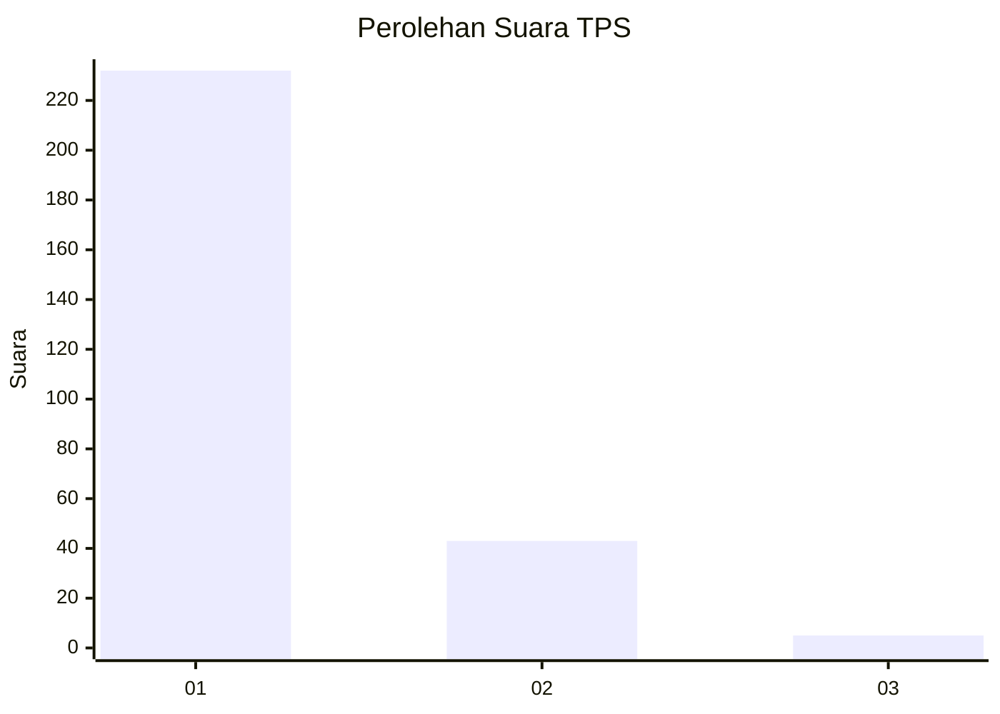
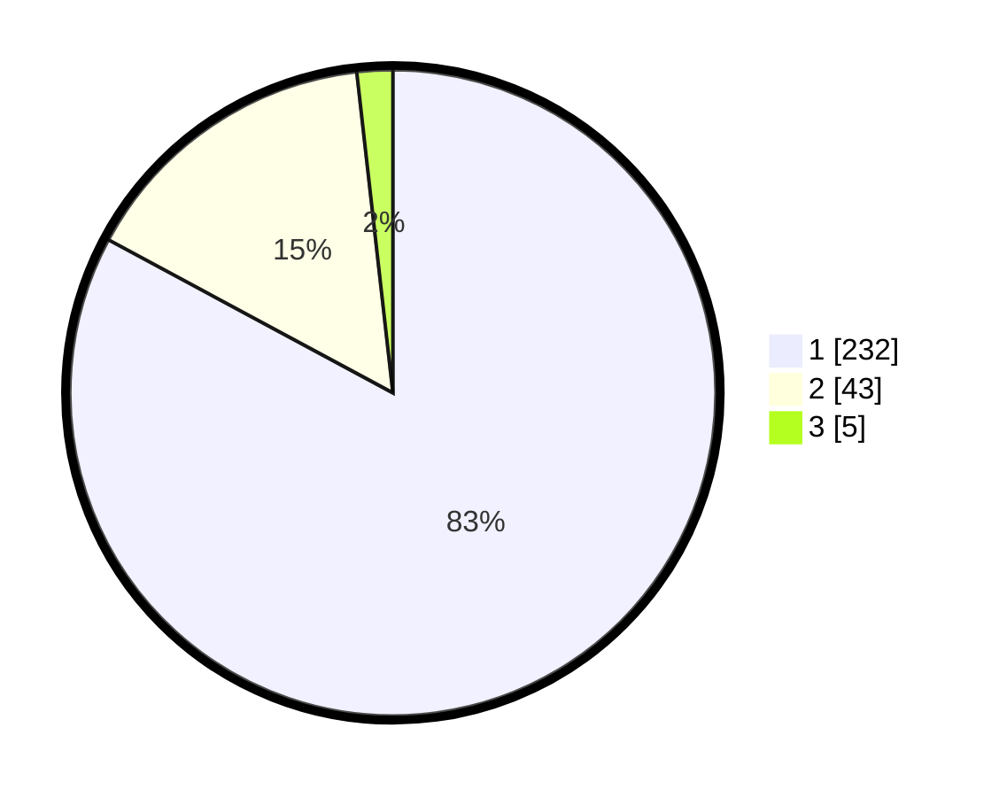

# Hasil

## Grafik

## Tabel

| No. | Nama Paslon    | Suara | Suara (raw) | Persentase |
|:--- |:-------------- | -----:| -----------:| ----------:|
| 1   | ANIES MUHAIMIN | 232   | [232][p-1]  | 82,86      |
| 2   | PRABOWO GIBRAN | 43    | [43][p-2]   | 15,36      |
| 3   | GANJAR MAHFUD  | 5     | [5][p-3]    | 1,79       |

[p-1]: https://github.com/gigit-pemilu/pemilu-2024/blob/main/pilpres/hitung-suara/sub/35-jawa-timur/sub/27-sampang/sub/11-sokobanah/sub/2003-tobai-timur/sub/001-tps/sub/paslon-1.txt
[p-2]: https://github.com/gigit-pemilu/pemilu-2024/blob/main/pilpres/hitung-suara/sub/35-jawa-timur/sub/27-sampang/sub/11-sokobanah/sub/2003-tobai-timur/sub/001-tps/sub/paslon-2.txt
[p-3]: https://github.com/gigit-pemilu/pemilu-2024/blob/main/pilpres/hitung-suara/sub/35-jawa-timur/sub/27-sampang/sub/11-sokobanah/sub/2003-tobai-timur/sub/001-tps/sub/paslon-3.txt

## Foto C Plano

https://sirekap-obj-formc.kpu.go.id/cbea/pemilu/ppwp/35/27/11/20/03/3527112003001-20240214-201843--2fb78264-4020-4ba0-a89d-354c2fff39eb.jpg

https://sirekap-obj-formc.kpu.go.id/cbea/pemilu/ppwp/35/27/11/20/03/3527112003001-20240214-202015--0b66fe49-a34d-4855-9b7a-6a5a045119d9.jpg

## Metadata

| Key        | Value               |
| ---------- | ------------------- |
| Time Stamp | 2024-02-25 16:00:00 |

