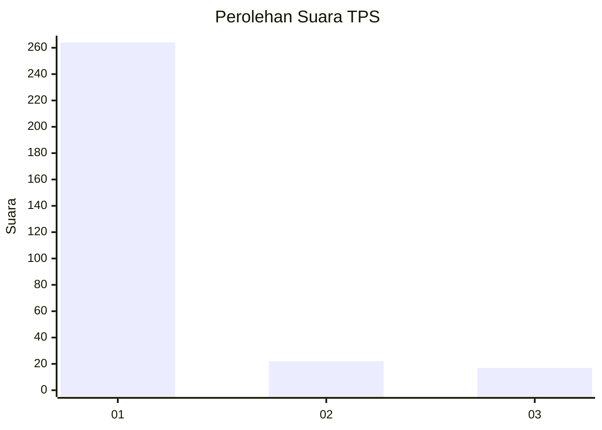
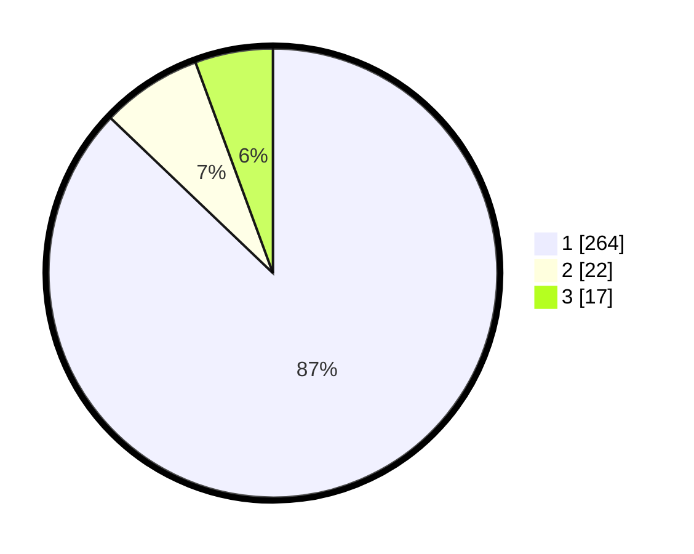

# Hasil

## Grafik

## Tabel

| No. | Nama Paslon    | Suara | Suara (raw) | Persentase |
|:--- |:-------------- | -----:| -----------:| ----------:|
| 1   | ANIES MUHAIMIN | 264   | [264][p-1]  | 87,13      |
| 2   | PRABOWO GIBRAN | 22    | [22][p-2]   | 7,26       |
| 3   | GANJAR MAHFUD  | 17    | [17][p-3]   | 5,61       |

[p-1]: https://github.com/gigit-pemilu/pemilu-2024-35-jawa-timur/blob/main/pilpres/hitung-suara/sub/35-jawa-timur/sub/27-sampang/sub/11-sokobanah/sub/2003-tobai-timur/sub/006-tps/sub/paslon-1.txt
[p-2]: https://github.com/gigit-pemilu/pemilu-2024-35-jawa-timur/blob/main/pilpres/hitung-suara/sub/35-jawa-timur/sub/27-sampang/sub/11-sokobanah/sub/2003-tobai-timur/sub/006-tps/sub/paslon-2.txt
[p-3]: https://github.com/gigit-pemilu/pemilu-2024-35-jawa-timur/blob/main/pilpres/hitung-suara/sub/35-jawa-timur/sub/27-sampang/sub/11-sokobanah/sub/2003-tobai-timur/sub/006-tps/sub/paslon-3.txt

## Foto C Plano

https://sirekap-obj-formc.kpu.go.id/dd5e/pemilu/ppwp/35/27/11/20/03/3527112003006-20240214-223306--ca0db7fb-1cf5-4436-ae0a-39e74dedc0b1.jpg

https://sirekap-obj-formc.kpu.go.id/dd5e/pemilu/ppwp/35/27/11/20/03/3527112003006-20240214-223439--bfd6ffd5-ed81-4dab-8640-c1c8c7c91e54.jpg

https://sirekap-obj-formc.kpu.go.id/dd5e/pemilu/ppwp/35/27/11/20/03/3527112003006-20240214-223554--d307a376-17b3-447e-931b-f340dfdb64d5.jpg

## Metadata

| Key        | Value               |
| ---------- | ------------------- |
| Time Stamp | 2024-02-16 10:00:28 |

