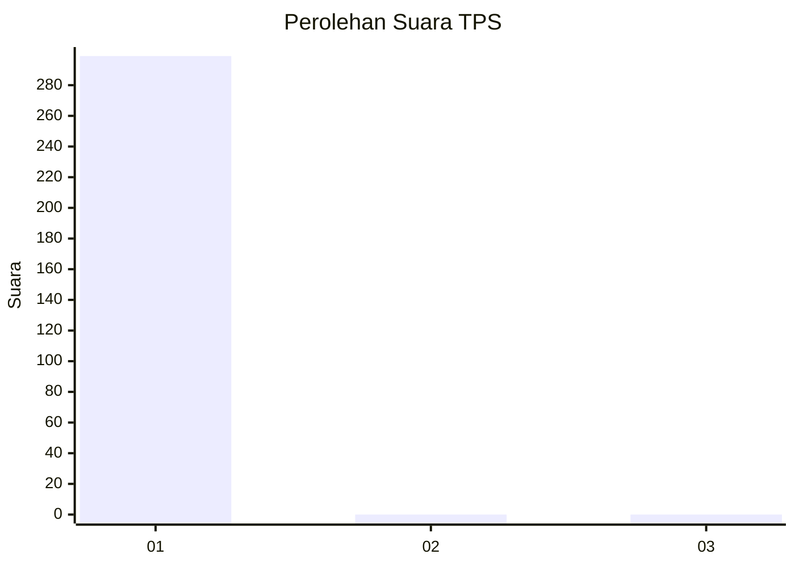
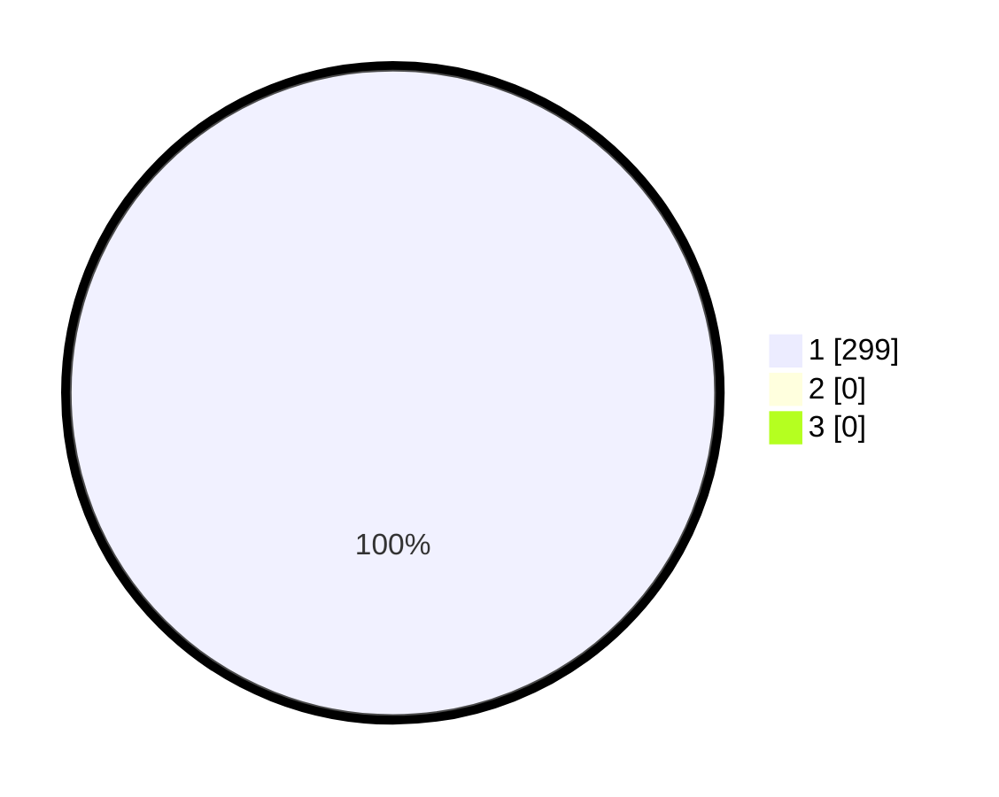

# Hasil

## Grafik

## Tabel

| No. | Nama Paslon    | Suara | Suara (raw) | Persentase |
|:--- |:-------------- | -----:| -----------:| ----------:|
| 1   | ANIES MUHAIMIN | 299   | [299][p-1]  | 100,00     |
| 2   | PRABOWO GIBRAN | 0     | [0][p-2]    | 0,00       |
| 3   | GANJAR MAHFUD  | 0     | [0][p-3]    | 0,00       |

[p-1]: https://github.com/gigit-pemilu/pemilu-2024/blob/main/pilpres/hitung-suara/sub/35-jawa-timur/sub/27-sampang/sub/11-sokobanah/sub/2005-bira-timur/sub/012-tps/sub/paslon-1.txt
[p-2]: https://github.com/gigit-pemilu/pemilu-2024/blob/main/pilpres/hitung-suara/sub/35-jawa-timur/sub/27-sampang/sub/11-sokobanah/sub/2005-bira-timur/sub/012-tps/sub/paslon-2.txt
[p-3]: https://github.com/gigit-pemilu/pemilu-2024/blob/main/pilpres/hitung-suara/sub/35-jawa-timur/sub/27-sampang/sub/11-sokobanah/sub/2005-bira-timur/sub/012-tps/sub/paslon-3.txt

## Foto C Plano

https://sirekap-obj-formc.kpu.go.id/96d0/pemilu/ppwp/35/27/11/20/05/3527112005012-20240214-223222--dd4c5f8b-d184-4738-ac53-a8a41b934cfe.jpg

https://sirekap-obj-formc.kpu.go.id/96d0/pemilu/ppwp/35/27/11/20/05/3527112005012-20240214-223248--267d5c05-4731-40b7-912b-0061b32d6f50.jpg

https://sirekap-obj-formc.kpu.go.id/96d0/pemilu/ppwp/35/27/11/20/05/3527112005012-20240214-223300--f2753a50-ee4e-4b9e-bffd-a3d29a680753.jpg

## Metadata

| Key        | Value               |
| ---------- | ------------------- |
| Time Stamp | 2024-02-17 10:00:02 |

