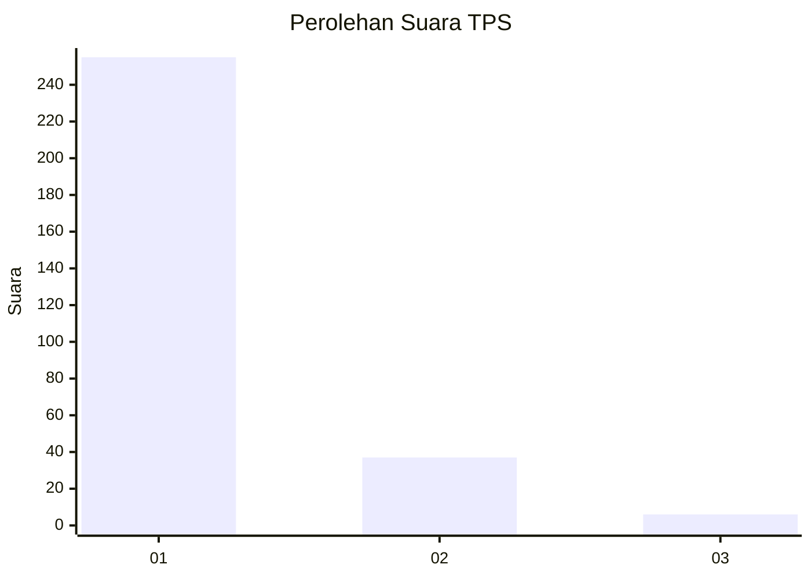
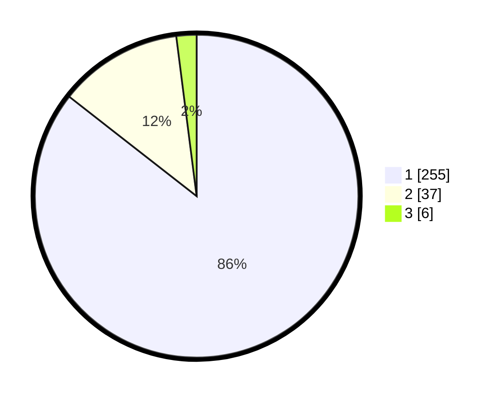

# Hasil

## Grafik

## Tabel

| No. | Nama Paslon    | Suara | Suara (raw) | Persentase |
|:--- |:-------------- | -----:| -----------:| ----------:|
| 1   | ANIES MUHAIMIN | 255   | [255][p-1]  | 85,57      |
| 2   | PRABOWO GIBRAN | 37    | [37][p-2]   | 12,42      |
| 3   | GANJAR MAHFUD  | 6     | [6][p-3]    | 2,01       |

[p-1]: https://github.com/gigit-pemilu/pemilu-2024/blob/main/pilpres/hitung-suara/sub/35-jawa-timur/sub/27-sampang/sub/11-sokobanah/sub/2006-sokobanah-laok/sub/001-tps/sub/paslon-1.txt
[p-2]: https://github.com/gigit-pemilu/pemilu-2024/blob/main/pilpres/hitung-suara/sub/35-jawa-timur/sub/27-sampang/sub/11-sokobanah/sub/2006-sokobanah-laok/sub/001-tps/sub/paslon-2.txt
[p-3]: https://github.com/gigit-pemilu/pemilu-2024/blob/main/pilpres/hitung-suara/sub/35-jawa-timur/sub/27-sampang/sub/11-sokobanah/sub/2006-sokobanah-laok/sub/001-tps/sub/paslon-3.txt

## Foto C Plano

https://sirekap-obj-formc.kpu.go.id/0df6/pemilu/ppwp/35/27/11/20/06/3527112006001-20240214-230234--35afba22-226e-4656-a5d0-7d2856863f13.jpg

https://sirekap-obj-formc.kpu.go.id/0df6/pemilu/ppwp/35/27/11/20/06/3527112006001-20240214-193313--cf910da2-4a46-469e-a910-b8f1db4dacf7.jpg

https://sirekap-obj-formc.kpu.go.id/0df6/pemilu/ppwp/35/27/11/20/06/3527112006001-20240214-230429--d1bbbf24-3f8a-4cd0-98f2-298fb3e7ca13.jpg

## Metadata

| Key        | Value               |
| ---------- | ------------------- |
| Time Stamp | 2024-02-21 21:00:04 |

