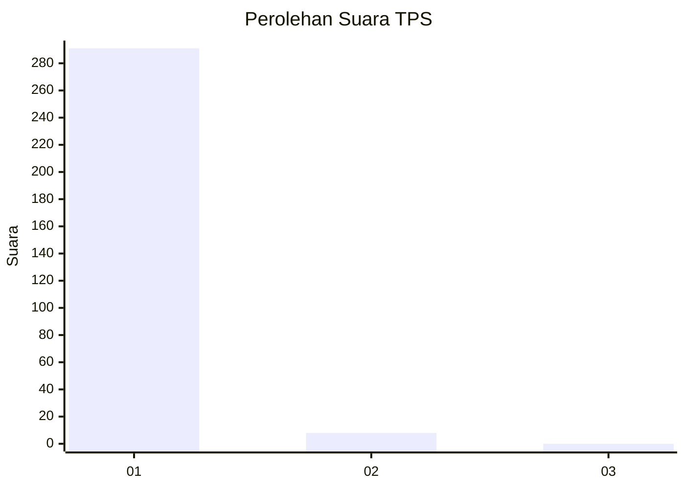
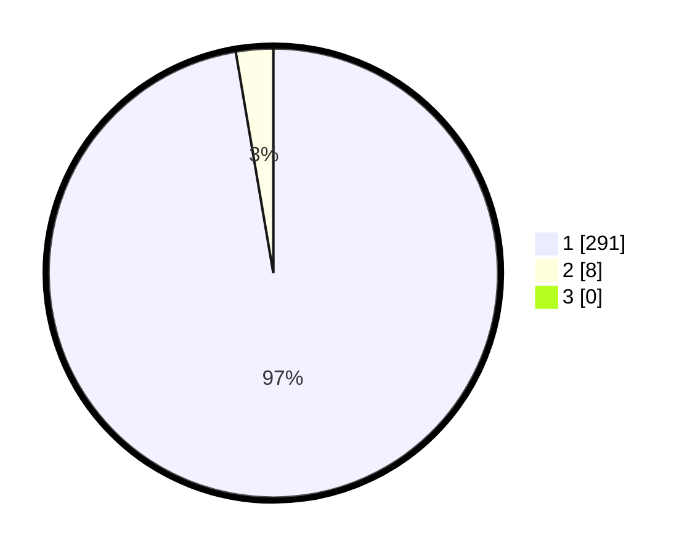

# Hasil

## Grafik

## Tabel

| No. | Nama Paslon    | Suara | Suara (raw) | Persentase |
|:--- |:-------------- | -----:| -----------:| ----------:|
| 1   | ANIES MUHAIMIN | 291   | [291][p-1]  | 97,32      |
| 2   | PRABOWO GIBRAN | 8     | [8][p-2]    | 2,68       |
| 3   | GANJAR MAHFUD  | 0     | [0][p-3]    | 0,00       |

[p-1]: https://github.com/gigit-pemilu/pemilu-2024/blob/main/pilpres/hitung-suara/sub/35-jawa-timur/sub/27-sampang/sub/11-sokobanah/sub/2006-sokobanah-laok/sub/002-tps/sub/paslon-1.txt
[p-2]: https://github.com/gigit-pemilu/pemilu-2024/blob/main/pilpres/hitung-suara/sub/35-jawa-timur/sub/27-sampang/sub/11-sokobanah/sub/2006-sokobanah-laok/sub/002-tps/sub/paslon-2.txt
[p-3]: https://github.com/gigit-pemilu/pemilu-2024/blob/main/pilpres/hitung-suara/sub/35-jawa-timur/sub/27-sampang/sub/11-sokobanah/sub/2006-sokobanah-laok/sub/002-tps/sub/paslon-3.txt

## Foto C Plano

https://sirekap-obj-formc.kpu.go.id/7d79/pemilu/ppwp/35/27/11/20/06/3527112006002-20240215-081533--0162097f-60dd-4e92-b86d-6eee51e76c4e.jpg

https://sirekap-obj-formc.kpu.go.id/7d79/pemilu/ppwp/35/27/11/20/06/3527112006002-20240215-081614--c9265ae8-7c69-4f23-8e99-b85a8df51bd5.jpg

https://sirekap-obj-formc.kpu.go.id/7d79/pemilu/ppwp/35/27/11/20/06/3527112006002-20240215-081921--916fbc98-a062-4fb5-93a0-087ef4dd026b.jpg

## Metadata

| Key        | Value               |
| ---------- | ------------------- |
| Time Stamp | 2024-02-15 22:00:27 |

