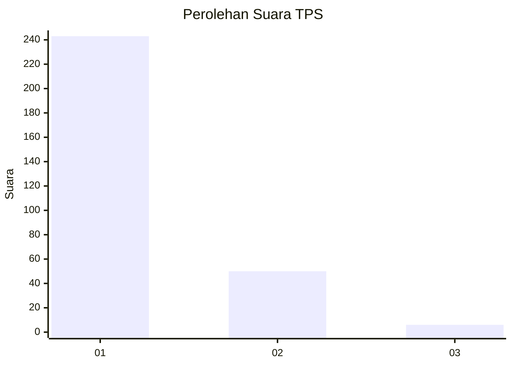
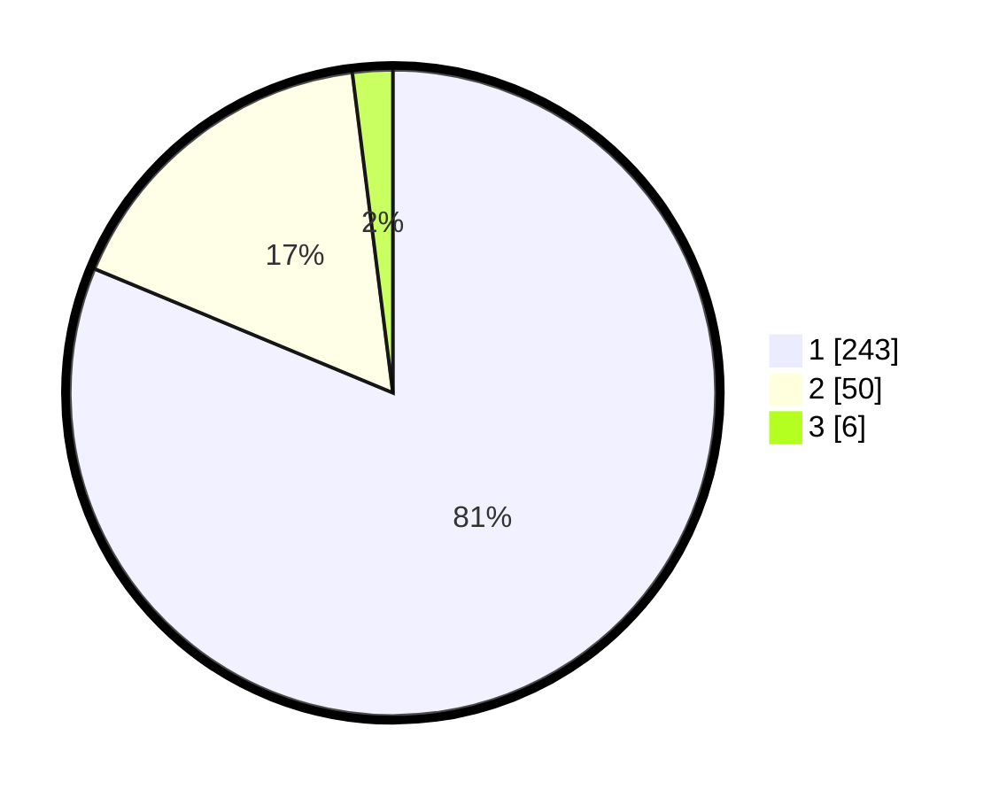

# Hasil

## Grafik

## Tabel

| No. | Nama Paslon    | Suara | Suara (raw) | Persentase |
|:--- |:-------------- | -----:| -----------:| ----------:|
| 1   | ANIES MUHAIMIN | 243   | [243][p-1]  | 81,27      |
| 2   | PRABOWO GIBRAN | 50    | [50][p-2]   | 16,72      |
| 3   | GANJAR MAHFUD  | 6     | [6][p-3]    | 2,01       |

[p-1]: https://github.com/gigit-pemilu/pemilu-2024/blob/main/pilpres/hitung-suara/sub/35-jawa-timur/sub/27-sampang/sub/11-sokobanah/sub/2006-sokobanah-laok/sub/005-tps/sub/paslon-1.txt
[p-2]: https://github.com/gigit-pemilu/pemilu-2024/blob/main/pilpres/hitung-suara/sub/35-jawa-timur/sub/27-sampang/sub/11-sokobanah/sub/2006-sokobanah-laok/sub/005-tps/sub/paslon-2.txt
[p-3]: https://github.com/gigit-pemilu/pemilu-2024/blob/main/pilpres/hitung-suara/sub/35-jawa-timur/sub/27-sampang/sub/11-sokobanah/sub/2006-sokobanah-laok/sub/005-tps/sub/paslon-3.txt

## Foto C Plano

https://sirekap-obj-formc.kpu.go.id/f721/pemilu/ppwp/35/27/11/20/06/3527112006005-20240214-234131--81a41bf4-6435-4838-a63e-1a48fa8a8558.jpg

https://sirekap-obj-formc.kpu.go.id/f721/pemilu/ppwp/35/27/11/20/06/3527112006005-20240214-234228--ca9d2e07-36d4-4485-a460-c8341be206f8.jpg

https://sirekap-obj-formc.kpu.go.id/f721/pemilu/ppwp/35/27/11/20/06/3527112006005-20240214-234328--6e642681-0e1e-4265-a2fb-608dce5d90fd.jpg

## Metadata

| Key        | Value               |
| ---------- | ------------------- |
| Time Stamp | 2024-02-17 10:00:02 |

