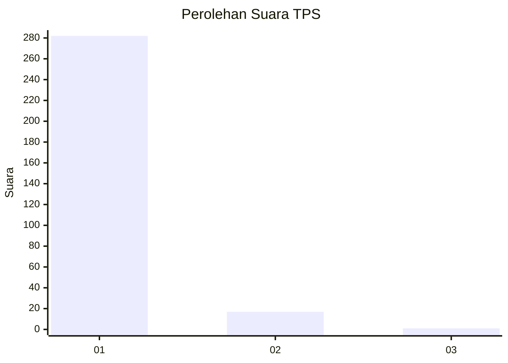
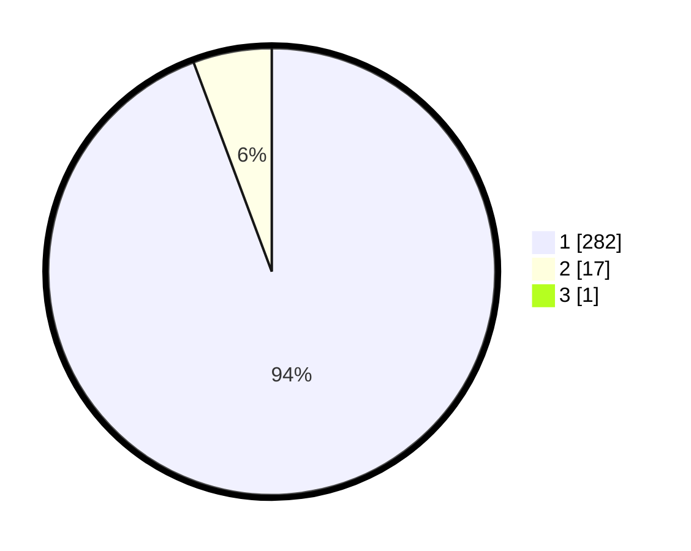

# Hasil

## Grafik

## Tabel

| No. | Nama Paslon    | Suara | Suara (raw) | Persentase |
|:--- |:-------------- | -----:| -----------:| ----------:|
| 1   | ANIES MUHAIMIN | 282   | [282][p-1]  | 94,00      |
| 2   | PRABOWO GIBRAN | 17    | [17][p-2]   | 5,67       |
| 3   | GANJAR MAHFUD  | 1     | [1][p-3]    | 0,33       |

[p-1]: https://github.com/gigit-pemilu/pemilu-2024/blob/main/pilpres/hitung-suara/sub/35-jawa-timur/sub/27-sampang/sub/11-sokobanah/sub/2006-sokobanah-laok/sub/009-tps/sub/paslon-1.txt
[p-2]: https://github.com/gigit-pemilu/pemilu-2024/blob/main/pilpres/hitung-suara/sub/35-jawa-timur/sub/27-sampang/sub/11-sokobanah/sub/2006-sokobanah-laok/sub/009-tps/sub/paslon-2.txt
[p-3]: https://github.com/gigit-pemilu/pemilu-2024/blob/main/pilpres/hitung-suara/sub/35-jawa-timur/sub/27-sampang/sub/11-sokobanah/sub/2006-sokobanah-laok/sub/009-tps/sub/paslon-3.txt

## Foto C Plano

https://sirekap-obj-formc.kpu.go.id/1f37/pemilu/ppwp/35/27/11/20/06/3527112006009-20240215-104138--6a42dd52-919b-4dc3-a0f7-e80112dae6f8.jpg

https://sirekap-obj-formc.kpu.go.id/1f37/pemilu/ppwp/35/27/11/20/06/3527112006009-20240215-104250--c84165b5-ce73-4c62-9b14-f97d03f1901f.jpg

https://sirekap-obj-formc.kpu.go.id/1f37/pemilu/ppwp/35/27/11/20/06/3527112006009-20240215-104624--eea98122-7a54-4878-a634-5836d7376c56.jpg

## Metadata

| Key        | Value               |
| ---------- | ------------------- |
| Time Stamp | 2024-02-16 12:51:22 |

