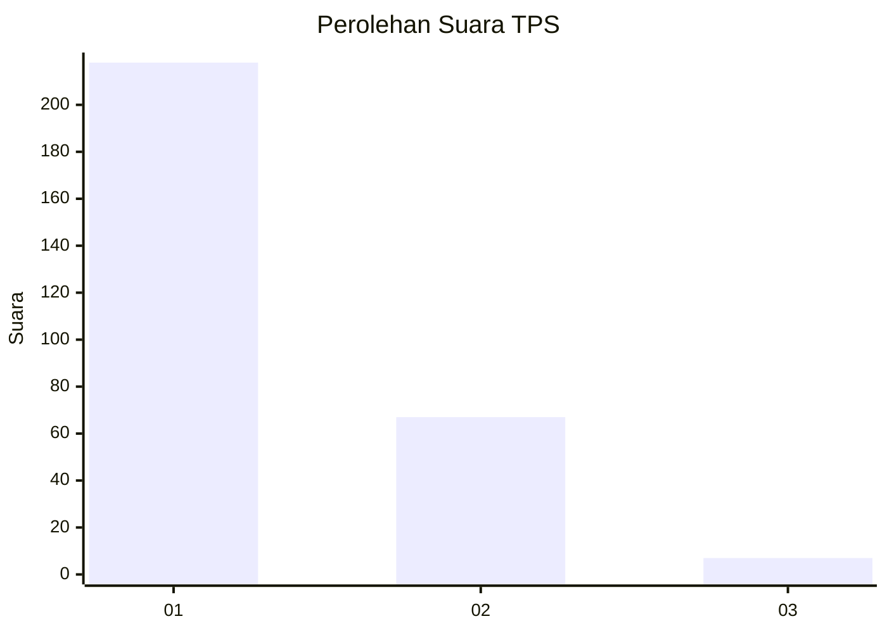
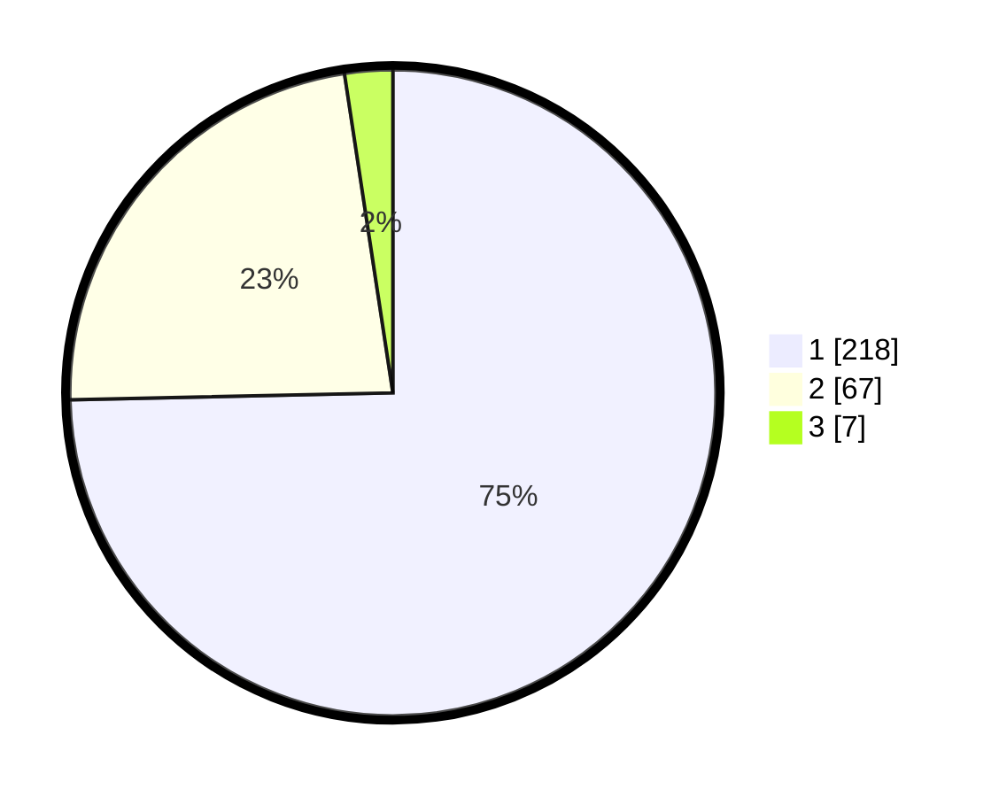

# Hasil

## Grafik

## Tabel

| No. | Nama Paslon    | Suara | Suara (raw) | Persentase |
|:--- |:-------------- | -----:| -----------:| ----------:|
| 1   | ANIES MUHAIMIN | 218   | [218][p-1]  | 74,66      |
| 2   | PRABOWO GIBRAN | 67    | [67][p-2]   | 22,95      |
| 3   | GANJAR MAHFUD  | 7     | [7][p-3]    | 2,40       |

[p-1]: https://github.com/gigit-pemilu/pemilu-2024/blob/main/pilpres/hitung-suara/sub/35-jawa-timur/sub/27-sampang/sub/11-sokobanah/sub/2006-sokobanah-laok/sub/011-tps/sub/paslon-1.txt
[p-2]: https://github.com/gigit-pemilu/pemilu-2024/blob/main/pilpres/hitung-suara/sub/35-jawa-timur/sub/27-sampang/sub/11-sokobanah/sub/2006-sokobanah-laok/sub/011-tps/sub/paslon-2.txt
[p-3]: https://github.com/gigit-pemilu/pemilu-2024/blob/main/pilpres/hitung-suara/sub/35-jawa-timur/sub/27-sampang/sub/11-sokobanah/sub/2006-sokobanah-laok/sub/011-tps/sub/paslon-3.txt

## Foto C Plano

https://sirekap-obj-formc.kpu.go.id/1897/pemilu/ppwp/35/27/11/20/06/3527112006011-20240215-104048--55f1d8a3-3dc5-4831-b041-ee618fdff7b2.jpg

https://sirekap-obj-formc.kpu.go.id/1897/pemilu/ppwp/35/27/11/20/06/3527112006011-20240215-104134--07c58f66-a862-4624-aa5c-7c8aeeaccf9a.jpg

https://sirekap-obj-formc.kpu.go.id/1897/pemilu/ppwp/35/27/11/20/06/3527112006011-20240215-104302--33fd8316-c982-485b-88c5-9565793a9092.jpg

## Metadata

| Key        | Value               |
| ---------- | ------------------- |
| Time Stamp | 2024-02-16 23:00:00 |

