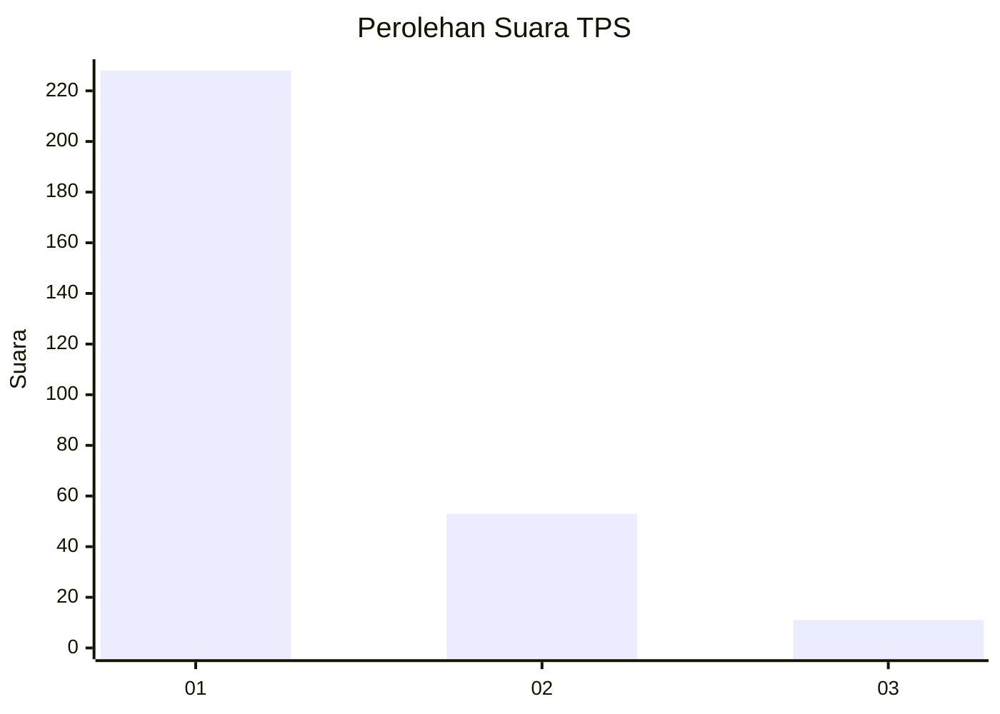
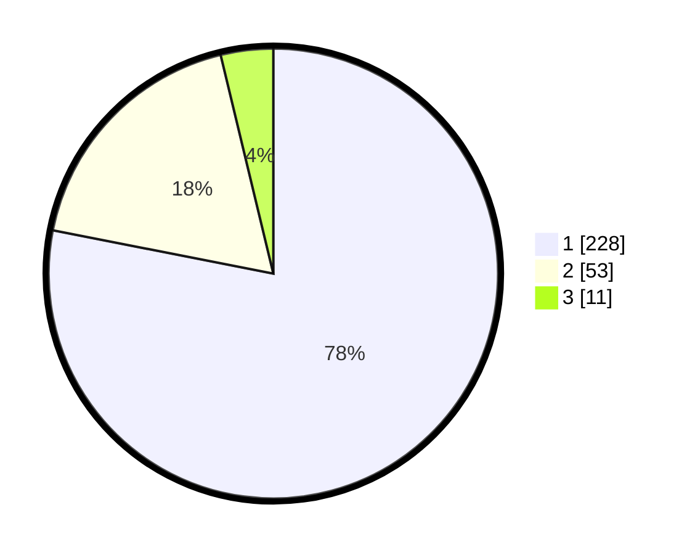

# Hasil

## Grafik

## Tabel

| No. | Nama Paslon    | Suara | Suara (raw) | Persentase |
|:--- |:-------------- | -----:| -----------:| ----------:|
| 1   | ANIES MUHAIMIN | 228   | [228][p-1]  | 78,08      |
| 2   | PRABOWO GIBRAN | 53    | [53][p-2]   | 18,15      |
| 3   | GANJAR MAHFUD  | 11    | [11][p-3]   | 3,77       |

[p-1]: https://github.com/gigit-pemilu/pemilu-2024/blob/main/pilpres/hitung-suara/sub/35-jawa-timur/sub/27-sampang/sub/11-sokobanah/sub/2006-sokobanah-laok/sub/014-tps/sub/paslon-1.txt
[p-2]: https://github.com/gigit-pemilu/pemilu-2024/blob/main/pilpres/hitung-suara/sub/35-jawa-timur/sub/27-sampang/sub/11-sokobanah/sub/2006-sokobanah-laok/sub/014-tps/sub/paslon-2.txt
[p-3]: https://github.com/gigit-pemilu/pemilu-2024/blob/main/pilpres/hitung-suara/sub/35-jawa-timur/sub/27-sampang/sub/11-sokobanah/sub/2006-sokobanah-laok/sub/014-tps/sub/paslon-3.txt

## Foto C Plano

https://sirekap-obj-formc.kpu.go.id/1b92/pemilu/ppwp/35/27/11/20/06/3527112006014-20240214-195120--f681e565-9df9-4c9d-9ba3-2a7c70141957.jpg

https://sirekap-obj-formc.kpu.go.id/1b92/pemilu/ppwp/35/27/11/20/06/3527112006014-20240214-195232--b3f0a4f2-3c86-4c5b-adb4-9dbcadd63ec4.jpg

https://sirekap-obj-formc.kpu.go.id/1b92/pemilu/ppwp/35/27/11/20/06/3527112006014-20240214-234311--9e2b88d8-1e4a-4ac3-8866-655fa4b83e56.jpg

## Metadata

| Key        | Value               |
| ---------- | ------------------- |
| Time Stamp | 2024-02-15 22:00:27 |

