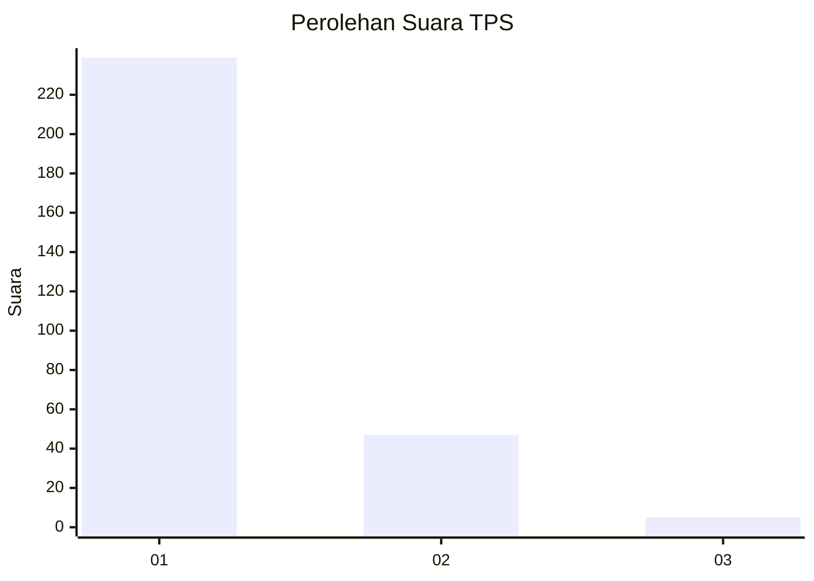
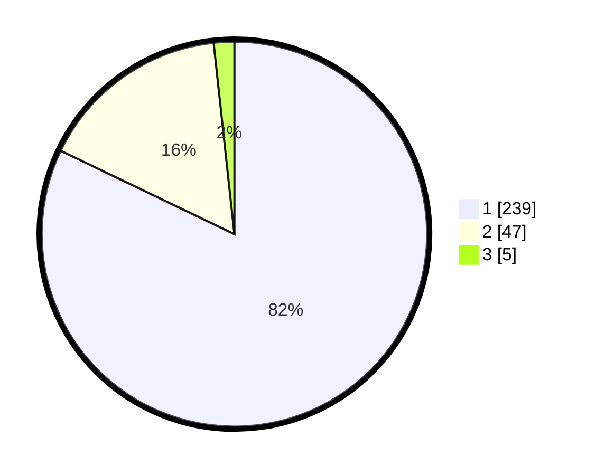

# Hasil

## Grafik

## Tabel

| No. | Nama Paslon    | Suara | Suara (raw) | Persentase |
|:--- |:-------------- | -----:| -----------:| ----------:|
| 1   | ANIES MUHAIMIN | 239   | [239][p-1]  | 82,13      |
| 2   | PRABOWO GIBRAN | 47    | [47][p-2]   | 16,15      |
| 3   | GANJAR MAHFUD  | 5     | [5][p-3]    | 1,72       |

[p-1]: https://github.com/gigit-pemilu/pemilu-2024-35-jawa-timur/blob/main/pilpres/hitung-suara/sub/35-jawa-timur/sub/27-sampang/sub/11-sokobanah/sub/2006-sokobanah-laok/sub/015-tps/sub/paslon-1.txt
[p-2]: https://github.com/gigit-pemilu/pemilu-2024-35-jawa-timur/blob/main/pilpres/hitung-suara/sub/35-jawa-timur/sub/27-sampang/sub/11-sokobanah/sub/2006-sokobanah-laok/sub/015-tps/sub/paslon-2.txt
[p-3]: https://github.com/gigit-pemilu/pemilu-2024-35-jawa-timur/blob/main/pilpres/hitung-suara/sub/35-jawa-timur/sub/27-sampang/sub/11-sokobanah/sub/2006-sokobanah-laok/sub/015-tps/sub/paslon-3.txt

## Foto C Plano

https://sirekap-obj-formc.kpu.go.id/815b/pemilu/ppwp/35/27/11/20/06/3527112006015-20240215-080013--3163e3f5-4143-4bfc-b8e4-e050a5ad044b.jpg

https://sirekap-obj-formc.kpu.go.id/815b/pemilu/ppwp/35/27/11/20/06/3527112006015-20240215-080107--d7cb0fc9-c0e2-41e2-9950-5fc5760d5c4f.jpg

https://sirekap-obj-formc.kpu.go.id/815b/pemilu/ppwp/35/27/11/20/06/3527112006015-20240215-080148--8f98689b-f90f-40ae-b46c-613b2a4b1fe3.jpg

## Metadata

| Key        | Value               |
| ---------- | ------------------- |
| Time Stamp | 2024-02-16 23:00:00 |

