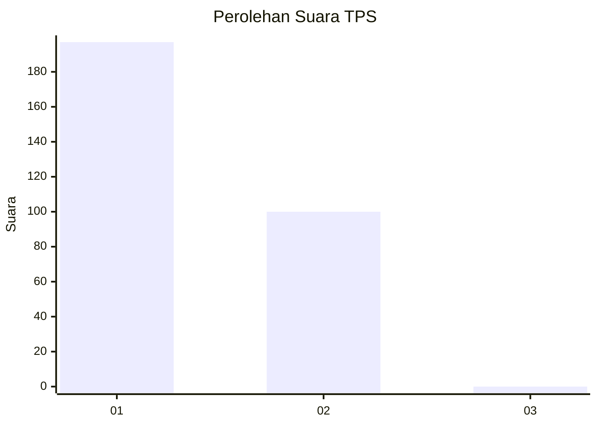
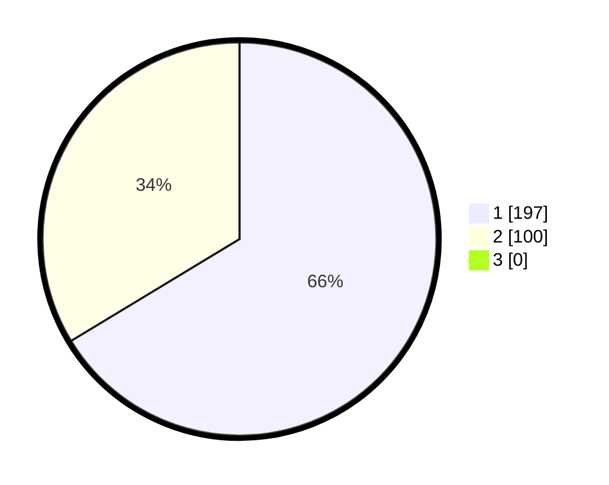

# Hasil

## Grafik

## Tabel

| No. | Nama Paslon    | Suara | Suara (raw) | Persentase |
|:--- |:-------------- | -----:| -----------:| ----------:|
| 1   | ANIES MUHAIMIN | 197   | [197][p-1]  | 66,33      |
| 2   | PRABOWO GIBRAN | 100   | [100][p-2]  | 33,67      |
| 3   | GANJAR MAHFUD  | 0     | [0][p-3]    | 0,00       |

[p-1]: https://github.com/gigit-pemilu/pemilu-2024/blob/main/pilpres/hitung-suara/sub/35-jawa-timur/sub/27-sampang/sub/11-sokobanah/sub/2007-tamberu-laok/sub/004-tps/sub/paslon-1.txt
[p-2]: https://github.com/gigit-pemilu/pemilu-2024/blob/main/pilpres/hitung-suara/sub/35-jawa-timur/sub/27-sampang/sub/11-sokobanah/sub/2007-tamberu-laok/sub/004-tps/sub/paslon-2.txt
[p-3]: https://github.com/gigit-pemilu/pemilu-2024/blob/main/pilpres/hitung-suara/sub/35-jawa-timur/sub/27-sampang/sub/11-sokobanah/sub/2007-tamberu-laok/sub/004-tps/sub/paslon-3.txt

## Foto C Plano

https://sirekap-obj-formc.kpu.go.id/f8af/pemilu/ppwp/35/27/11/20/07/3527112007004-20240215-172246--22242e56-1f77-4577-9531-1b111a7aa7ab.jpg

https://sirekap-obj-formc.kpu.go.id/f8af/pemilu/ppwp/35/27/11/20/07/3527112007004-20240215-093203--bc41020a-b76c-4eee-a836-b44655fa0a38.jpg

https://sirekap-obj-formc.kpu.go.id/f8af/pemilu/ppwp/35/27/11/20/07/3527112007004-20240215-093227--d33ed6ee-fe86-468c-b3f5-dbbfcf3b1fcf.jpg

## Metadata

| Key        | Value               |
| ---------- | ------------------- |
| Time Stamp | 2024-02-15 22:30:27 |

