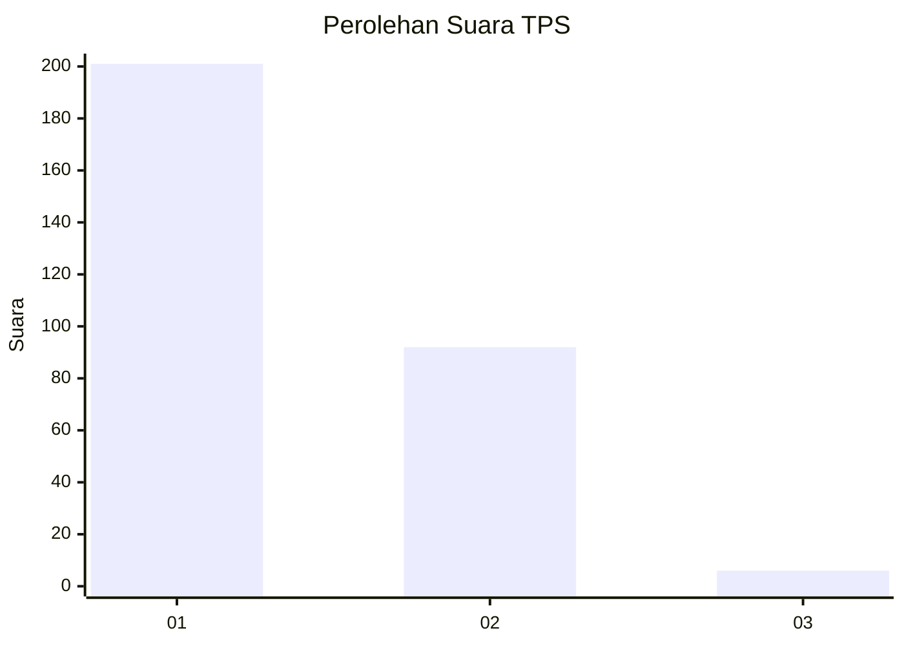
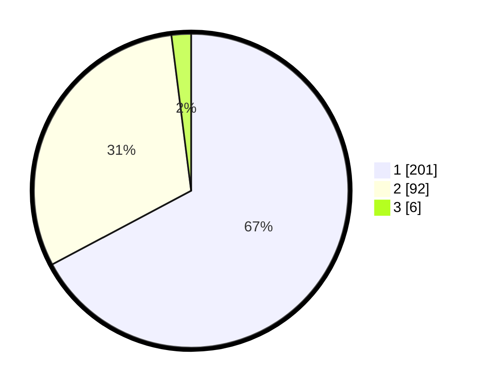

# Hasil

## Grafik

## Tabel

| No. | Nama Paslon    | Suara | Suara (raw) | Persentase |
|:--- |:-------------- | -----:| -----------:| ----------:|
| 1   | ANIES MUHAIMIN | 201   | [201][p-1]  | 67,22      |
| 2   | PRABOWO GIBRAN | 92    | [92][p-2]   | 30,77      |
| 3   | GANJAR MAHFUD  | 6     | [6][p-3]    | 2,01       |

[p-1]: https://github.com/gigit-pemilu/pemilu-2024/blob/main/pilpres/hitung-suara/sub/35-jawa-timur/sub/27-sampang/sub/11-sokobanah/sub/2007-tamberu-laok/sub/007-tps/sub/paslon-1.txt
[p-2]: https://github.com/gigit-pemilu/pemilu-2024/blob/main/pilpres/hitung-suara/sub/35-jawa-timur/sub/27-sampang/sub/11-sokobanah/sub/2007-tamberu-laok/sub/007-tps/sub/paslon-2.txt
[p-3]: https://github.com/gigit-pemilu/pemilu-2024/blob/main/pilpres/hitung-suara/sub/35-jawa-timur/sub/27-sampang/sub/11-sokobanah/sub/2007-tamberu-laok/sub/007-tps/sub/paslon-3.txt

## Foto C Plano

https://sirekap-obj-formc.kpu.go.id/9ecc/pemilu/ppwp/35/27/11/20/07/3527112007007-20240215-101248--6bc366f4-72c8-41b0-a3a9-5eaf28c87524.jpg

https://sirekap-obj-formc.kpu.go.id/9ecc/pemilu/ppwp/35/27/11/20/07/3527112007007-20240215-101423--8a467e26-f3b5-48a6-8e55-5f57e17cab00.jpg

https://sirekap-obj-formc.kpu.go.id/9ecc/pemilu/ppwp/35/27/11/20/07/3527112007007-20240215-101624--fbb84387-fafe-4b5a-826a-deb6a781e02f.jpg

## Metadata

| Key        | Value               |
| ---------- | ------------------- |
| Time Stamp | 2024-02-16 23:00:00 |

