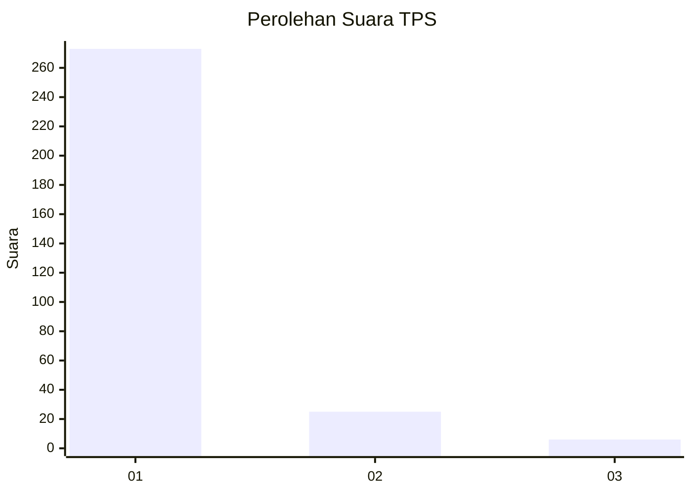
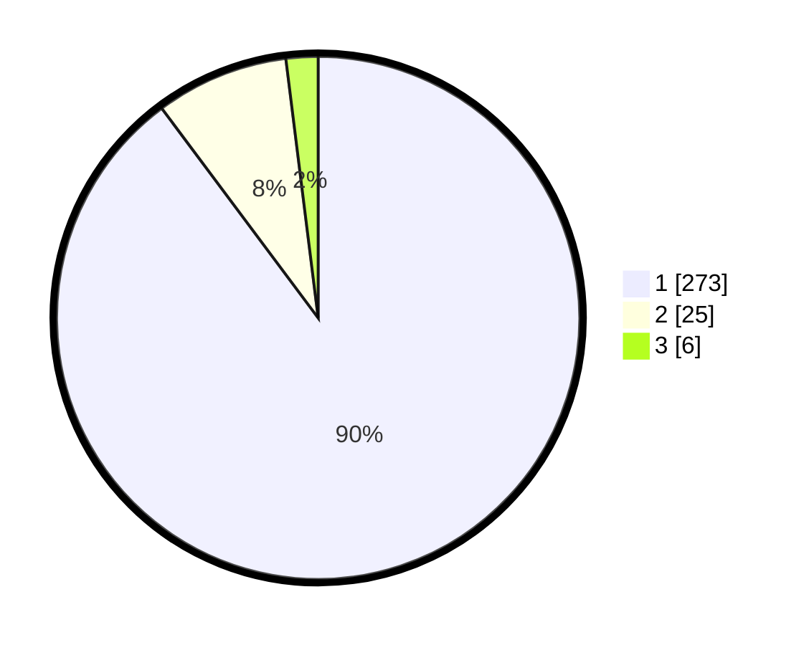

# Hasil

## Grafik

## Tabel

| No. | Nama Paslon    | Suara | Suara (raw) | Persentase |
|:--- |:-------------- | -----:| -----------:| ----------:|
| 1   | ANIES MUHAIMIN | 273   | [273][p-1]  | 89,80      |
| 2   | PRABOWO GIBRAN | 25    | [25][p-2]   | 8,22       |
| 3   | GANJAR MAHFUD  | 6     | [6][p-3]    | 1,97       |

[p-1]: https://github.com/gigit-pemilu/pemilu-2024-35-jawa-timur/blob/main/pilpres/hitung-suara/sub/35-jawa-timur/sub/27-sampang/sub/11-sokobanah/sub/2007-tamberu-laok/sub/010-tps/sub/paslon-1.txt
[p-2]: https://github.com/gigit-pemilu/pemilu-2024-35-jawa-timur/blob/main/pilpres/hitung-suara/sub/35-jawa-timur/sub/27-sampang/sub/11-sokobanah/sub/2007-tamberu-laok/sub/010-tps/sub/paslon-2.txt
[p-3]: https://github.com/gigit-pemilu/pemilu-2024-35-jawa-timur/blob/main/pilpres/hitung-suara/sub/35-jawa-timur/sub/27-sampang/sub/11-sokobanah/sub/2007-tamberu-laok/sub/010-tps/sub/paslon-3.txt

## Foto C Plano

https://sirekap-obj-formc.kpu.go.id/d235/pemilu/ppwp/35/27/11/20/07/3527112007010-20240215-072622--24c03364-366e-43cf-b747-a61c779dd716.jpg

https://sirekap-obj-formc.kpu.go.id/d235/pemilu/ppwp/35/27/11/20/07/3527112007010-20240215-030951--842d5b51-c79e-4286-8dae-274ea5aa432e.jpg

## Metadata

| Key        | Value               |
| ---------- | ------------------- |
| Time Stamp | 2024-02-24 22:31:28 |

