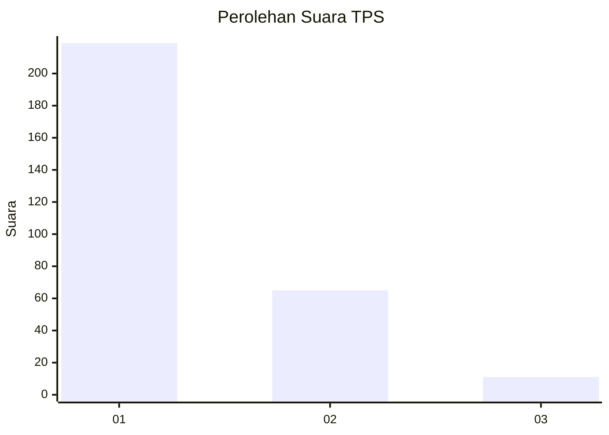
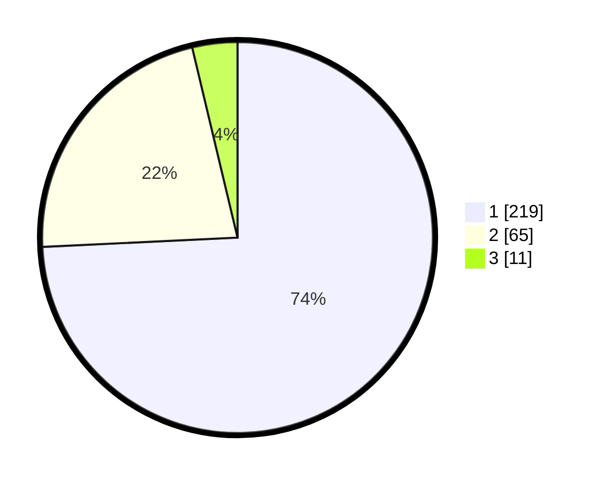

# Hasil

## Grafik

## Tabel

| No. | Nama Paslon    | Suara | Suara (raw) | Persentase |
|:--- |:-------------- | -----:| -----------:| ----------:|
| 1   | ANIES MUHAIMIN | 219   | [219][p-1]  | 74,24      |
| 2   | PRABOWO GIBRAN | 65    | [65][p-2]   | 22,03      |
| 3   | GANJAR MAHFUD  | 11    | [11][p-3]   | 3,73       |

[p-1]: https://github.com/gigit-pemilu/pemilu-2024/blob/main/pilpres/hitung-suara/sub/35-jawa-timur/sub/27-sampang/sub/11-sokobanah/sub/2007-tamberu-laok/sub/012-tps/sub/paslon-1.txt
[p-2]: https://github.com/gigit-pemilu/pemilu-2024/blob/main/pilpres/hitung-suara/sub/35-jawa-timur/sub/27-sampang/sub/11-sokobanah/sub/2007-tamberu-laok/sub/012-tps/sub/paslon-2.txt
[p-3]: https://github.com/gigit-pemilu/pemilu-2024/blob/main/pilpres/hitung-suara/sub/35-jawa-timur/sub/27-sampang/sub/11-sokobanah/sub/2007-tamberu-laok/sub/012-tps/sub/paslon-3.txt

## Foto C Plano

https://sirekap-obj-formc.kpu.go.id/0ea6/pemilu/ppwp/35/27/11/20/07/3527112007012-20240215-094604--2d42efa0-fc8f-4d9a-ba92-2ef2ac02f466.jpg

https://sirekap-obj-formc.kpu.go.id/0ea6/pemilu/ppwp/35/27/11/20/07/3527112007012-20240215-094620--8b1a3284-f7a7-4d9d-8b6d-1d669b4222e1.jpg

https://sirekap-obj-formc.kpu.go.id/0ea6/pemilu/ppwp/35/27/11/20/07/3527112007012-20240215-090611--b2129443-0452-4667-b492-c800d089e50e.jpg

## Metadata

| Key        | Value               |
| ---------- | ------------------- |
| Time Stamp | 2024-02-16 23:00:00 |

