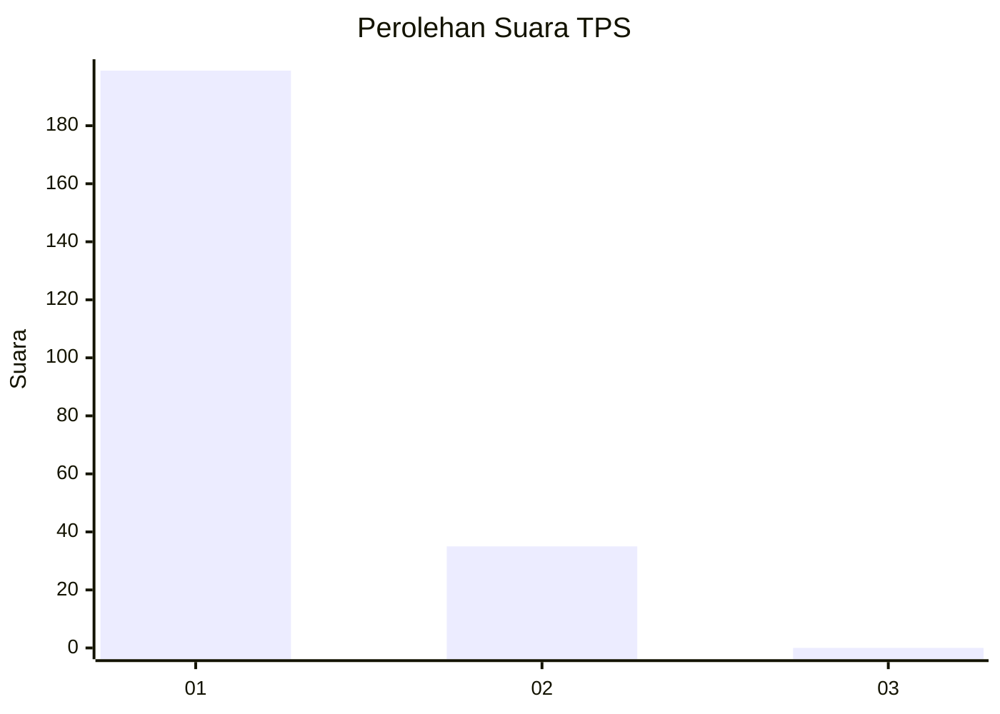
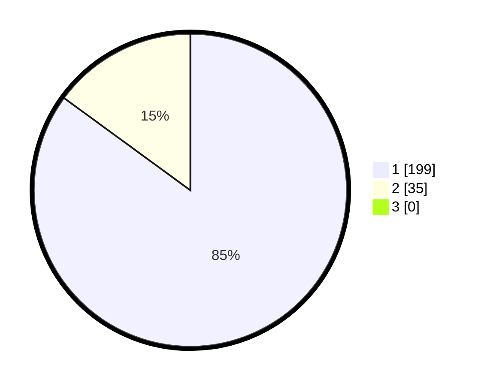

# Hasil

## Grafik

## Tabel

| No. | Nama Paslon    | Suara | Suara (raw) | Persentase |
|:--- |:-------------- | -----:| -----------:| ----------:|
| 1   | ANIES MUHAIMIN | 199   | [199][p-1]  | 85,04      |
| 2   | PRABOWO GIBRAN | 35    | [35][p-2]   | 14,96      |
| 3   | GANJAR MAHFUD  | 0     | [0][p-3]    | 0,00       |

[p-1]: https://github.com/gigit-pemilu/pemilu-2024-35-jawa-timur/blob/main/pilpres/hitung-suara/sub/35-jawa-timur/sub/27-sampang/sub/11-sokobanah/sub/2007-tamberu-laok/sub/014-tps/sub/paslon-1.txt
[p-2]: https://github.com/gigit-pemilu/pemilu-2024-35-jawa-timur/blob/main/pilpres/hitung-suara/sub/35-jawa-timur/sub/27-sampang/sub/11-sokobanah/sub/2007-tamberu-laok/sub/014-tps/sub/paslon-2.txt
[p-3]: https://github.com/gigit-pemilu/pemilu-2024-35-jawa-timur/blob/main/pilpres/hitung-suara/sub/35-jawa-timur/sub/27-sampang/sub/11-sokobanah/sub/2007-tamberu-laok/sub/014-tps/sub/paslon-3.txt

## Foto C Plano

https://sirekap-obj-formc.kpu.go.id/f3d1/pemilu/ppwp/35/27/11/20/07/3527112007014-20240215-093734--6b36f537-ba39-4875-9709-55c27b4a4019.jpg

https://sirekap-obj-formc.kpu.go.id/f3d1/pemilu/ppwp/35/27/11/20/07/3527112007014-20240215-073515--3cc92242-daf7-47e4-a39c-f925e073d587.jpg

https://sirekap-obj-formc.kpu.go.id/f3d1/pemilu/ppwp/35/27/11/20/07/3527112007014-20240215-073705--12a953ce-b0a6-48a2-8658-dfb2cc7e7c45.jpg

## Metadata

| Key        | Value               |
| ---------- | ------------------- |
| Time Stamp | 2024-02-16 23:00:00 |

