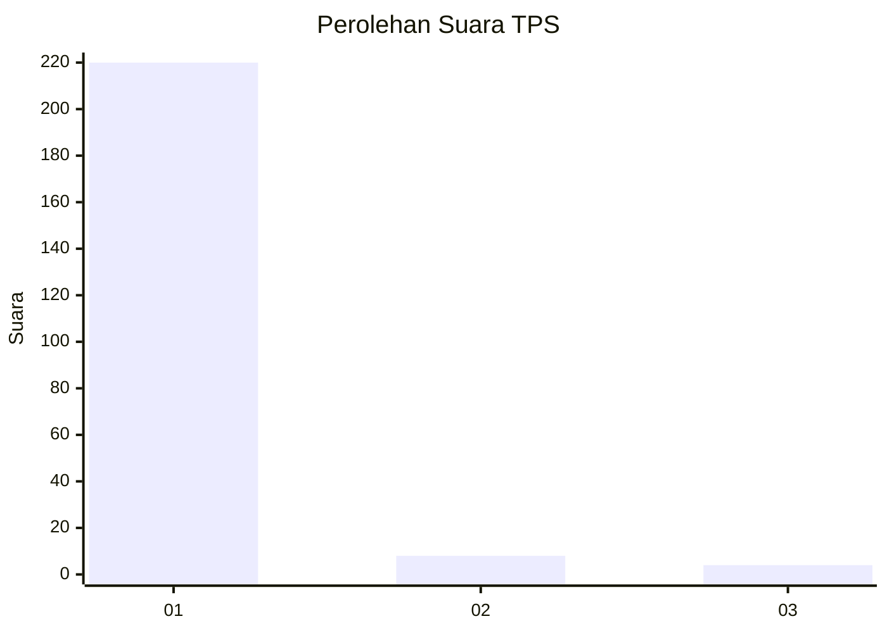
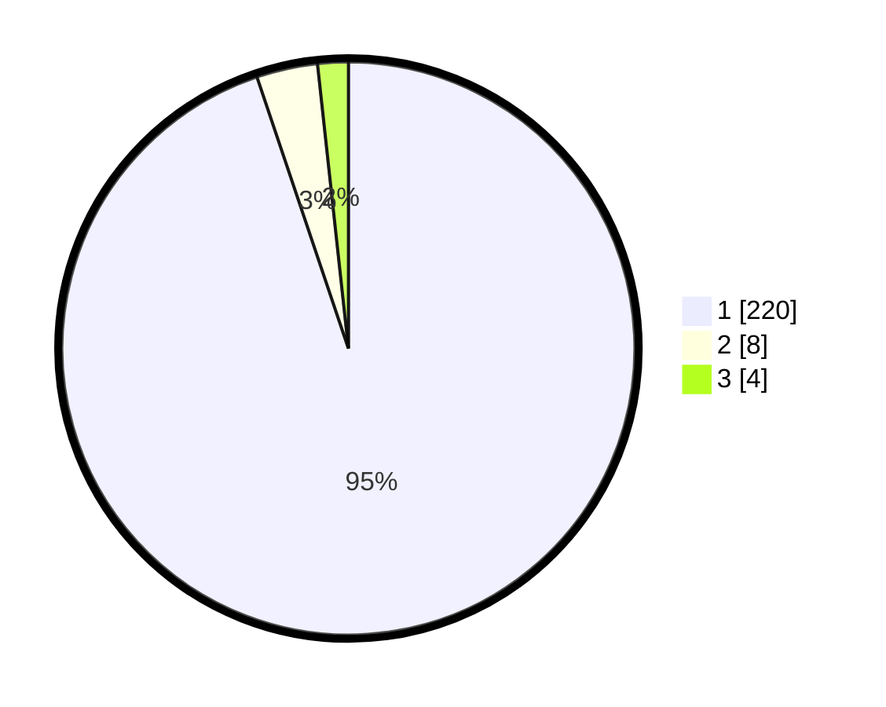

# Hasil

## Grafik

## Tabel

| No. | Nama Paslon    | Suara | Suara (raw) | Persentase |
|:--- |:-------------- | -----:| -----------:| ----------:|
| 1   | ANIES MUHAIMIN | 220   | [220][p-1]  | 94,83      |
| 2   | PRABOWO GIBRAN | 8     | [8][p-2]    | 3,45       |
| 3   | GANJAR MAHFUD  | 4     | [4][p-3]    | 1,72       |

[p-1]: https://github.com/gigit-pemilu/pemilu-2024/blob/main/pilpres/hitung-suara/sub/35-jawa-timur/sub/27-sampang/sub/11-sokobanah/sub/2007-tamberu-laok/sub/015-tps/sub/paslon-1.txt
[p-2]: https://github.com/gigit-pemilu/pemilu-2024/blob/main/pilpres/hitung-suara/sub/35-jawa-timur/sub/27-sampang/sub/11-sokobanah/sub/2007-tamberu-laok/sub/015-tps/sub/paslon-2.txt
[p-3]: https://github.com/gigit-pemilu/pemilu-2024/blob/main/pilpres/hitung-suara/sub/35-jawa-timur/sub/27-sampang/sub/11-sokobanah/sub/2007-tamberu-laok/sub/015-tps/sub/paslon-3.txt

## Foto C Plano

https://sirekap-obj-formc.kpu.go.id/fec5/pemilu/ppwp/35/27/11/20/07/3527112007015-20240215-094724--d80b757f-fcaf-4f32-a43d-abdad06553d0.jpg

https://sirekap-obj-formc.kpu.go.id/fec5/pemilu/ppwp/35/27/11/20/07/3527112007015-20240215-094956--ab6040b7-f5b4-4c66-bb1f-3b985c6a049e.jpg

https://sirekap-obj-formc.kpu.go.id/fec5/pemilu/ppwp/35/27/11/20/07/3527112007015-20240215-095130--2465f3cf-3b10-45c2-a9cc-1a8e060489f1.jpg

## Metadata

| Key        | Value               |
| ---------- | ------------------- |
| Time Stamp | 2024-02-16 23:00:00 |

