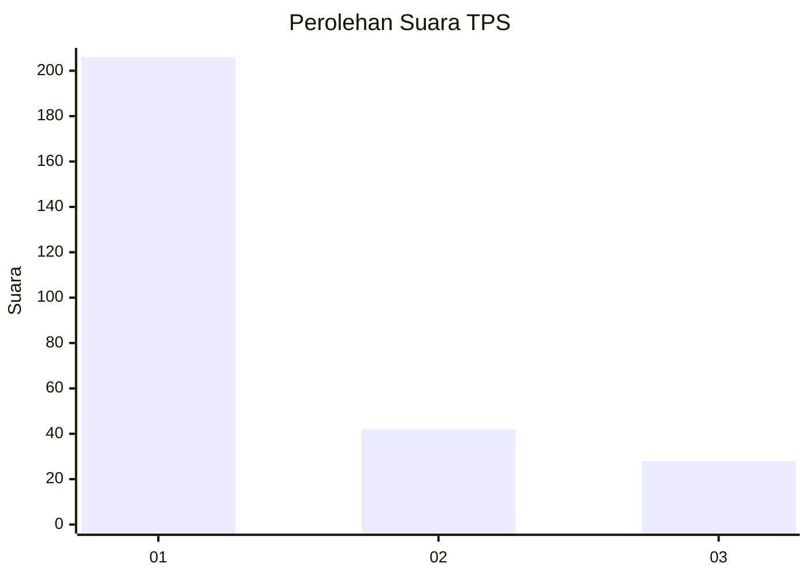
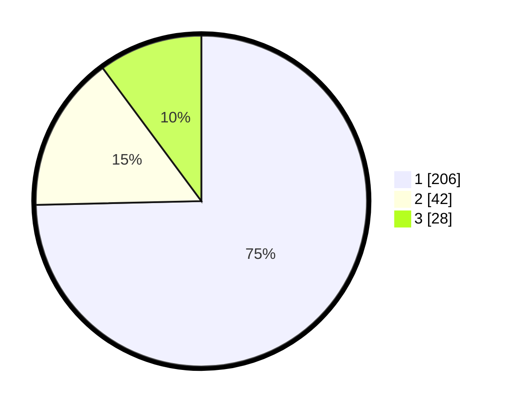

# Hasil

## Grafik

## Tabel

| No. | Nama Paslon    | Suara | Suara (raw) | Persentase |
|:--- |:-------------- | -----:| -----------:| ----------:|
| 1   | ANIES MUHAIMIN | 206   | [206][p-1]  | 74,64      |
| 2   | PRABOWO GIBRAN | 42    | [42][p-2]   | 15,22      |
| 3   | GANJAR MAHFUD  | 28    | [28][p-3]   | 10,14      |

[p-1]: https://github.com/gigit-pemilu/pemilu-2024-35-jawa-timur/blob/main/pilpres/hitung-suara/sub/35-jawa-timur/sub/27-sampang/sub/11-sokobanah/sub/2008-tamberu-daya/sub/002-tps/sub/paslon-1.txt
[p-2]: https://github.com/gigit-pemilu/pemilu-2024-35-jawa-timur/blob/main/pilpres/hitung-suara/sub/35-jawa-timur/sub/27-sampang/sub/11-sokobanah/sub/2008-tamberu-daya/sub/002-tps/sub/paslon-2.txt
[p-3]: https://github.com/gigit-pemilu/pemilu-2024-35-jawa-timur/blob/main/pilpres/hitung-suara/sub/35-jawa-timur/sub/27-sampang/sub/11-sokobanah/sub/2008-tamberu-daya/sub/002-tps/sub/paslon-3.txt

## Foto C Plano

https://sirekap-obj-formc.kpu.go.id/3a6b/pemilu/ppwp/35/27/11/20/08/3527112008002-20240215-161351--9e9c5194-f9d0-4554-89f8-b2660087e2cf.jpg

https://sirekap-obj-formc.kpu.go.id/3a6b/pemilu/ppwp/35/27/11/20/08/3527112008002-20240215-161214--70922ed7-e2a7-4b8d-bf56-4fdef242b486.jpg

https://sirekap-obj-formc.kpu.go.id/3a6b/pemilu/ppwp/35/27/11/20/08/3527112008002-20240215-162142--98c1a889-025a-4462-99b0-7e0917a93a27.jpg

## Metadata

| Key        | Value               |
| ---------- | ------------------- |
| Time Stamp | 2024-02-16 23:00:00 |

