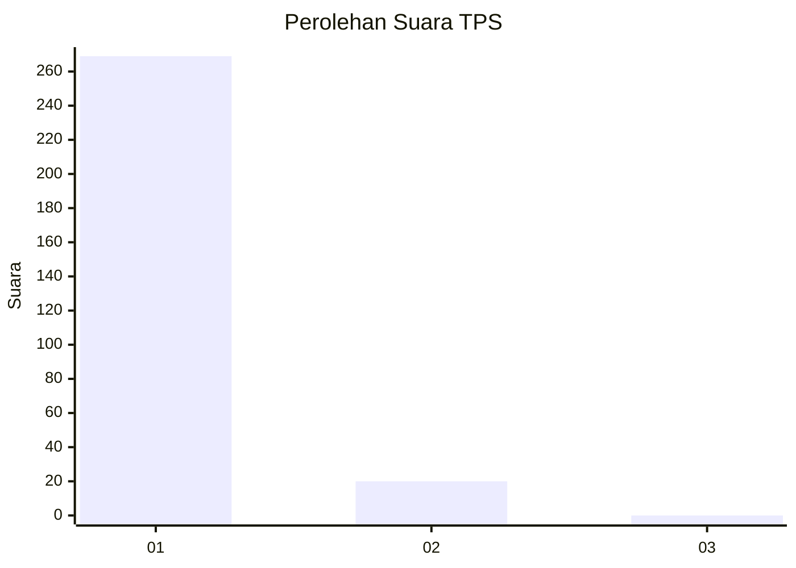
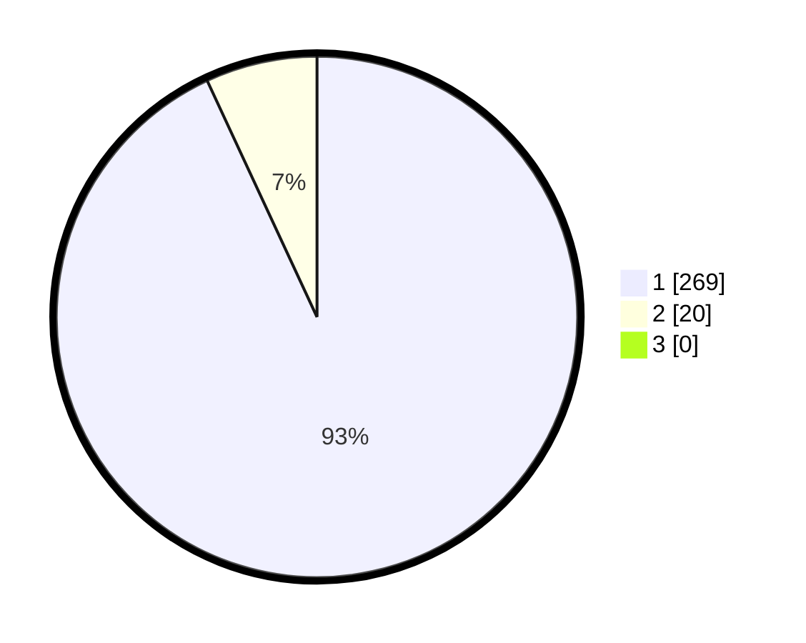

# Hasil

## Grafik

## Tabel

| No. | Nama Paslon    | Suara | Suara (raw) | Persentase |
|:--- |:-------------- | -----:| -----------:| ----------:|
| 1   | ANIES MUHAIMIN | 269   | [269][p-1]  | 93,08      |
| 2   | PRABOWO GIBRAN | 20    | [20][p-2]   | 6,92       |
| 3   | GANJAR MAHFUD  | 0     | [0][p-3]    | 0,00       |

[p-1]: https://github.com/gigit-pemilu/pemilu-2024/blob/main/pilpres/hitung-suara/sub/35-jawa-timur/sub/27-sampang/sub/11-sokobanah/sub/2008-tamberu-daya/sub/005-tps/sub/paslon-1.txt
[p-2]: https://github.com/gigit-pemilu/pemilu-2024/blob/main/pilpres/hitung-suara/sub/35-jawa-timur/sub/27-sampang/sub/11-sokobanah/sub/2008-tamberu-daya/sub/005-tps/sub/paslon-2.txt
[p-3]: https://github.com/gigit-pemilu/pemilu-2024/blob/main/pilpres/hitung-suara/sub/35-jawa-timur/sub/27-sampang/sub/11-sokobanah/sub/2008-tamberu-daya/sub/005-tps/sub/paslon-3.txt

## Foto C Plano

https://sirekap-obj-formc.kpu.go.id/32d6/pemilu/ppwp/35/27/11/20/08/3527112008005-20240214-221341--f44dacec-3a53-4a0d-a8ed-627e00e5a66c.jpg

https://sirekap-obj-formc.kpu.go.id/32d6/pemilu/ppwp/35/27/11/20/08/3527112008005-20240214-221514--8b17b8bd-84ee-45e1-b11d-d7882f1225b9.jpg

https://sirekap-obj-formc.kpu.go.id/32d6/pemilu/ppwp/35/27/11/20/08/3527112008005-20240214-221555--1e87a224-b0e7-4dfb-8cea-6b036331721a.jpg

## Metadata

| Key        | Value               |
| ---------- | ------------------- |
| Time Stamp | 2024-02-17 00:28:35 |

