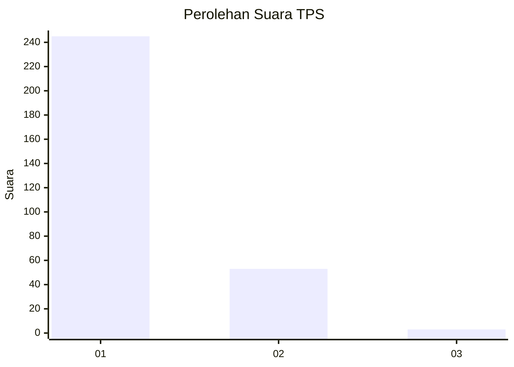
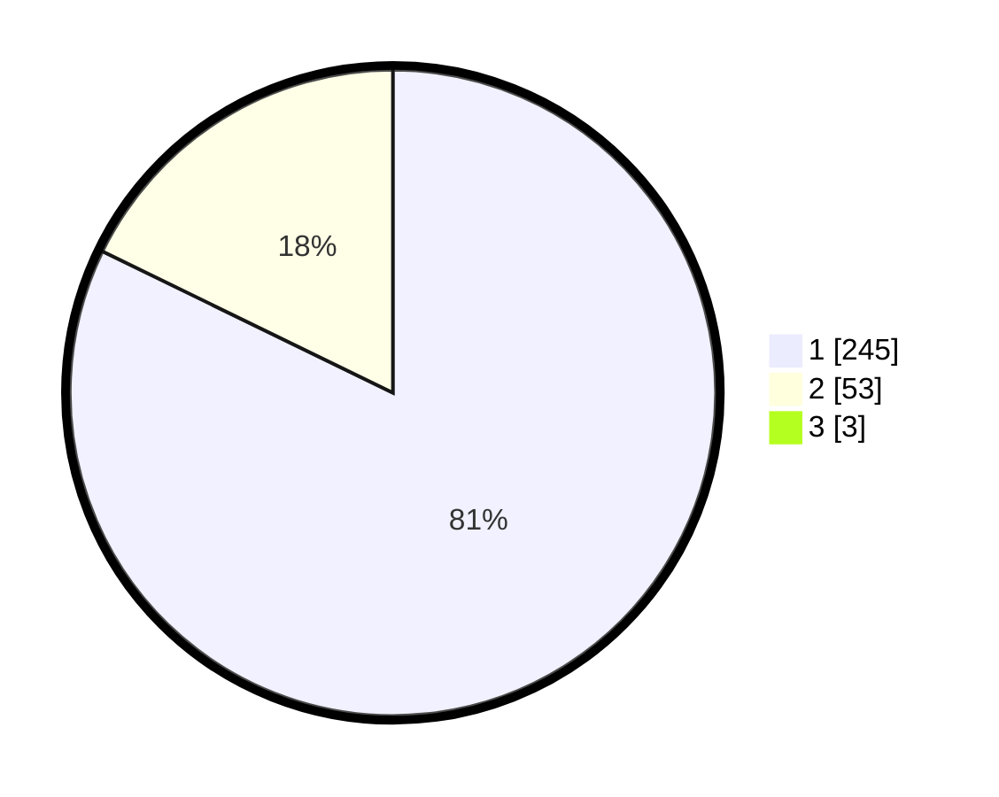

# Hasil

## Grafik

## Tabel

| No. | Nama Paslon    | Suara | Suara (raw) | Persentase |
|:--- |:-------------- | -----:| -----------:| ----------:|
| 1   | ANIES MUHAIMIN | 245   | [245][p-1]  | 81,40      |
| 2   | PRABOWO GIBRAN | 53    | [53][p-2]   | 17,61      |
| 3   | GANJAR MAHFUD  | 3     | [3][p-3]    | 1,00       |

[p-1]: https://github.com/gigit-pemilu/pemilu-2024/blob/main/pilpres/hitung-suara/sub/35-jawa-timur/sub/27-sampang/sub/11-sokobanah/sub/2008-tamberu-daya/sub/012-tps/sub/paslon-1.txt
[p-2]: https://github.com/gigit-pemilu/pemilu-2024/blob/main/pilpres/hitung-suara/sub/35-jawa-timur/sub/27-sampang/sub/11-sokobanah/sub/2008-tamberu-daya/sub/012-tps/sub/paslon-2.txt
[p-3]: https://github.com/gigit-pemilu/pemilu-2024/blob/main/pilpres/hitung-suara/sub/35-jawa-timur/sub/27-sampang/sub/11-sokobanah/sub/2008-tamberu-daya/sub/012-tps/sub/paslon-3.txt

## Foto C Plano

https://sirekap-obj-formc.kpu.go.id/753b/pemilu/ppwp/35/27/11/20/08/3527112008012-20240215-133255--b81ee2b7-6199-411f-90f6-a6278aa09940.jpg

https://sirekap-obj-formc.kpu.go.id/753b/pemilu/ppwp/35/27/11/20/08/3527112008012-20240215-133558--0f5e0b9c-18e4-4456-b3d1-d61c9db5fd11.jpg

https://sirekap-obj-formc.kpu.go.id/753b/pemilu/ppwp/35/27/11/20/08/3527112008012-20240215-133754--0e16413a-187b-4b7c-81d9-4da6e4b7cbcb.jpg

## Metadata

| Key        | Value               |
| ---------- | ------------------- |
| Time Stamp | 2024-02-16 23:00:00 |

