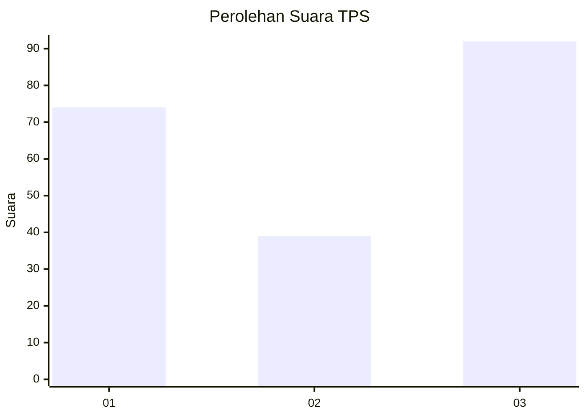
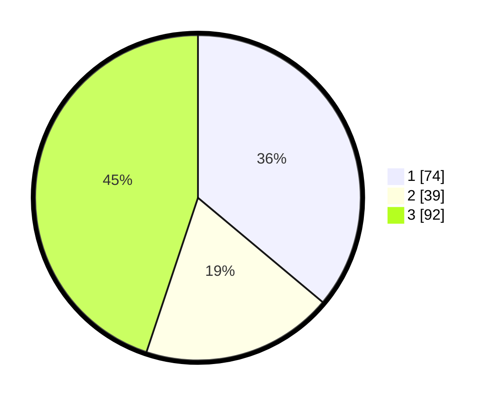

# Hasil

## Grafik

## Tabel

| No. | Nama Paslon    | Suara | Suara (raw) | Persentase |
|:--- |:-------------- | -----:| -----------:| ----------:|
| 1   | ANIES MUHAIMIN | 74    | [74][p-1]   | 36,10      |
| 2   | PRABOWO GIBRAN | 39    | [39][p-2]   | 19,02      |
| 3   | GANJAR MAHFUD  | 92    | [92][p-3]   | 44,88      |

[p-1]: https://github.com/gigit-pemilu/pemilu-2024-35-jawa-timur/blob/main/pilpres/hitung-suara/sub/35-jawa-timur/sub/27-sampang/sub/11-sokobanah/sub/2008-tamberu-daya/sub/017-tps/sub/paslon-1.txt
[p-2]: https://github.com/gigit-pemilu/pemilu-2024-35-jawa-timur/blob/main/pilpres/hitung-suara/sub/35-jawa-timur/sub/27-sampang/sub/11-sokobanah/sub/2008-tamberu-daya/sub/017-tps/sub/paslon-2.txt
[p-3]: https://github.com/gigit-pemilu/pemilu-2024-35-jawa-timur/blob/main/pilpres/hitung-suara/sub/35-jawa-timur/sub/27-sampang/sub/11-sokobanah/sub/2008-tamberu-daya/sub/017-tps/sub/paslon-3.txt

## Foto C Plano

https://sirekap-obj-formc.kpu.go.id/963e/pemilu/ppwp/35/27/11/20/08/3527112008017-20240215-072922--1a94da06-77c0-494e-96d6-34e641513fb1.jpg

https://sirekap-obj-formc.kpu.go.id/963e/pemilu/ppwp/35/27/11/20/08/3527112008017-20240215-073346--acdc1e1b-6165-469d-9e75-449a4675c65d.jpg

https://sirekap-obj-formc.kpu.go.id/963e/pemilu/ppwp/35/27/11/20/08/3527112008017-20240215-073659--7092234b-f207-4032-bc61-52f4ef0680aa.jpg

## Metadata

| Key        | Value               |
| ---------- | ------------------- |
| Time Stamp | 2024-02-16 23:00:00 |

