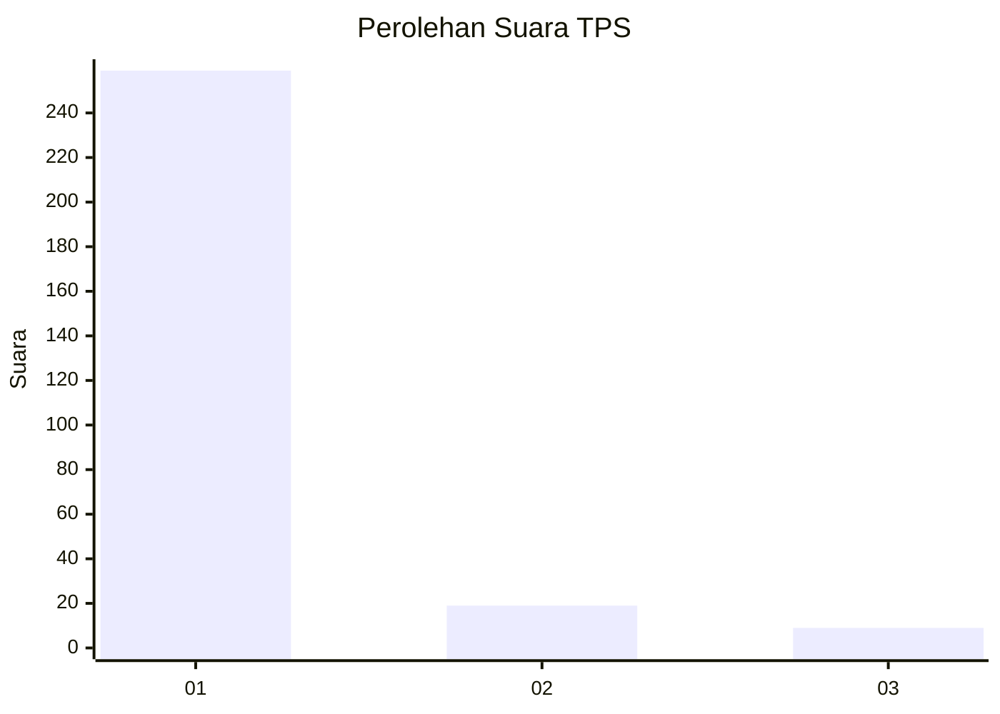
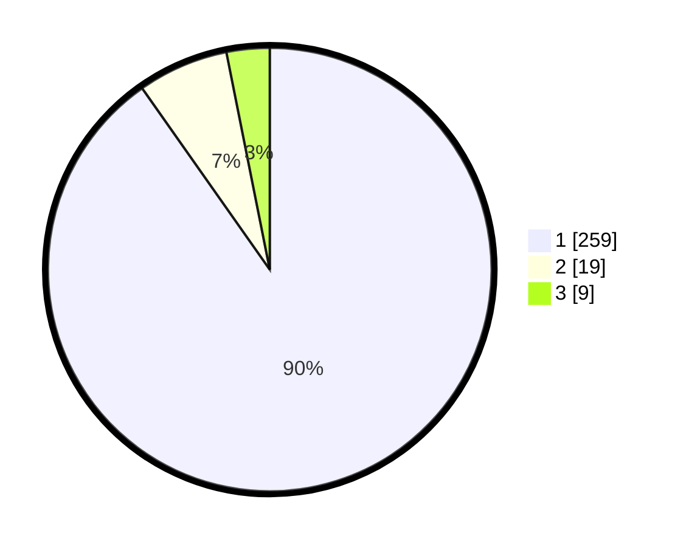

# Hasil

## Grafik

## Tabel

| No. | Nama Paslon    | Suara | Suara (raw) | Persentase |
|:--- |:-------------- | -----:| -----------:| ----------:|
| 1   | ANIES MUHAIMIN | 259   | [259][p-1]  | 90,24      |
| 2   | PRABOWO GIBRAN | 19    | [19][p-2]   | 6,62       |
| 3   | GANJAR MAHFUD  | 9     | [9][p-3]    | 3,14       |

[p-1]: https://github.com/gigit-pemilu/pemilu-2024/blob/main/pilpres/hitung-suara/sub/35-jawa-timur/sub/27-sampang/sub/11-sokobanah/sub/2009-sokobanah-tengah/sub/005-tps/sub/paslon-1.txt
[p-2]: https://github.com/gigit-pemilu/pemilu-2024/blob/main/pilpres/hitung-suara/sub/35-jawa-timur/sub/27-sampang/sub/11-sokobanah/sub/2009-sokobanah-tengah/sub/005-tps/sub/paslon-2.txt
[p-3]: https://github.com/gigit-pemilu/pemilu-2024/blob/main/pilpres/hitung-suara/sub/35-jawa-timur/sub/27-sampang/sub/11-sokobanah/sub/2009-sokobanah-tengah/sub/005-tps/sub/paslon-3.txt

## Foto C Plano

https://sirekap-obj-formc.kpu.go.id/4d7b/pemilu/ppwp/35/27/11/20/09/3527112009005-20240215-015505--004a9583-e107-4a41-8a44-988d5c56b5ef.jpg

https://sirekap-obj-formc.kpu.go.id/4d7b/pemilu/ppwp/35/27/11/20/09/3527112009005-20240215-034929--a0435817-8335-43b9-aed0-f1f2605a767f.jpg

https://sirekap-obj-formc.kpu.go.id/4d7b/pemilu/ppwp/35/27/11/20/09/3527112009005-20240215-020445--4f7bda90-ff91-4b7b-b5c1-79d363218428.jpg

## Metadata

| Key        | Value               |
| ---------- | ------------------- |
| Time Stamp | 2024-02-17 00:28:35 |

