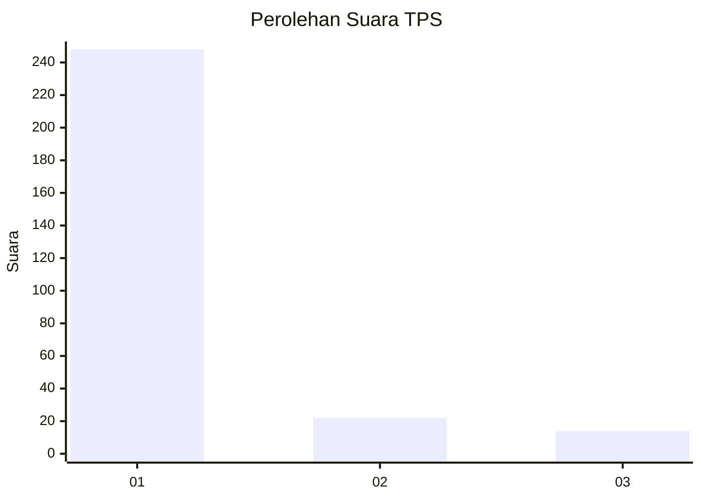
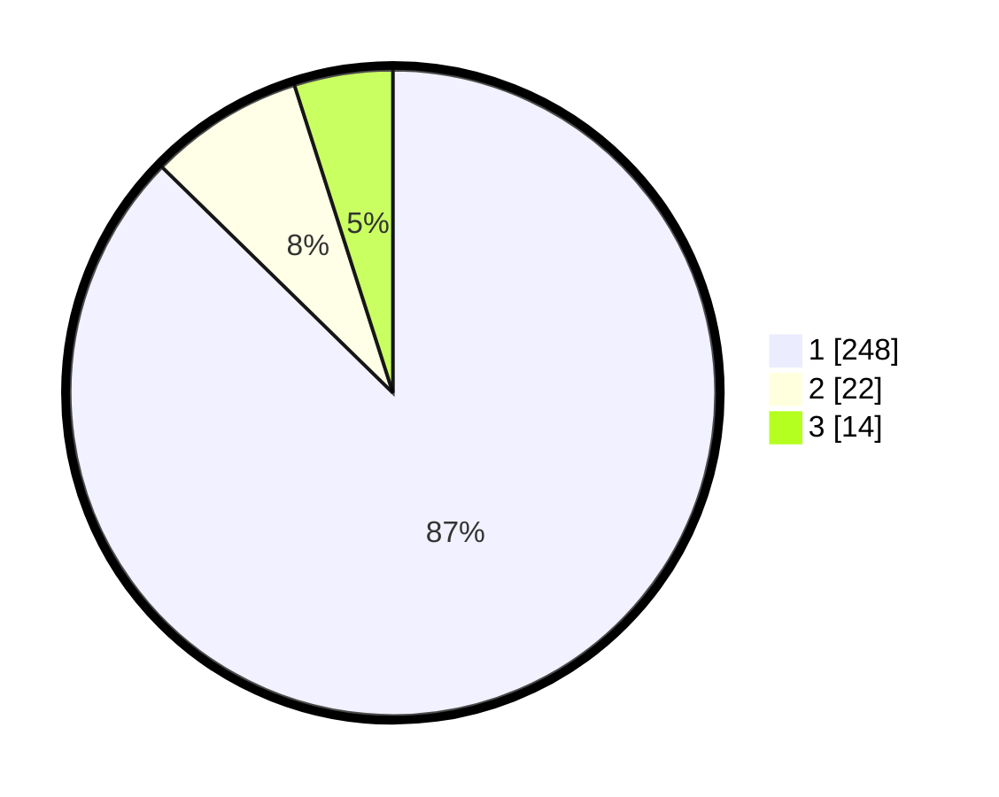

# Hasil

## Grafik

## Tabel

| No. | Nama Paslon    | Suara | Suara (raw) | Persentase |
|:--- |:-------------- | -----:| -----------:| ----------:|
| 1   | ANIES MUHAIMIN | 248   | [248][p-1]  | 87,32      |
| 2   | PRABOWO GIBRAN | 22    | [22][p-2]   | 7,75       |
| 3   | GANJAR MAHFUD  | 14    | [14][p-3]   | 4,93       |

[p-1]: https://github.com/gigit-pemilu/pemilu-2024/blob/main/pilpres/hitung-suara/sub/35-jawa-timur/sub/27-sampang/sub/11-sokobanah/sub/2009-sokobanah-tengah/sub/006-tps/sub/paslon-1.txt
[p-2]: https://github.com/gigit-pemilu/pemilu-2024/blob/main/pilpres/hitung-suara/sub/35-jawa-timur/sub/27-sampang/sub/11-sokobanah/sub/2009-sokobanah-tengah/sub/006-tps/sub/paslon-2.txt
[p-3]: https://github.com/gigit-pemilu/pemilu-2024/blob/main/pilpres/hitung-suara/sub/35-jawa-timur/sub/27-sampang/sub/11-sokobanah/sub/2009-sokobanah-tengah/sub/006-tps/sub/paslon-3.txt

## Foto C Plano

https://sirekap-obj-formc.kpu.go.id/e31e/pemilu/ppwp/35/27/11/20/09/3527112009006-20240215-011522--be00796a-0e2d-4643-8f4a-17f4e7203e5e.jpg

https://sirekap-obj-formc.kpu.go.id/e31e/pemilu/ppwp/35/27/11/20/09/3527112009006-20240215-011900--bf327474-3a20-489a-9a39-58afd3fda3cf.jpg

https://sirekap-obj-formc.kpu.go.id/e31e/pemilu/ppwp/35/27/11/20/09/3527112009006-20240215-012348--df2bf2ab-38ad-4814-a76b-f99103f95372.jpg

## Metadata

| Key        | Value               |
| ---------- | ------------------- |
| Time Stamp | 2024-02-17 10:00:02 |

