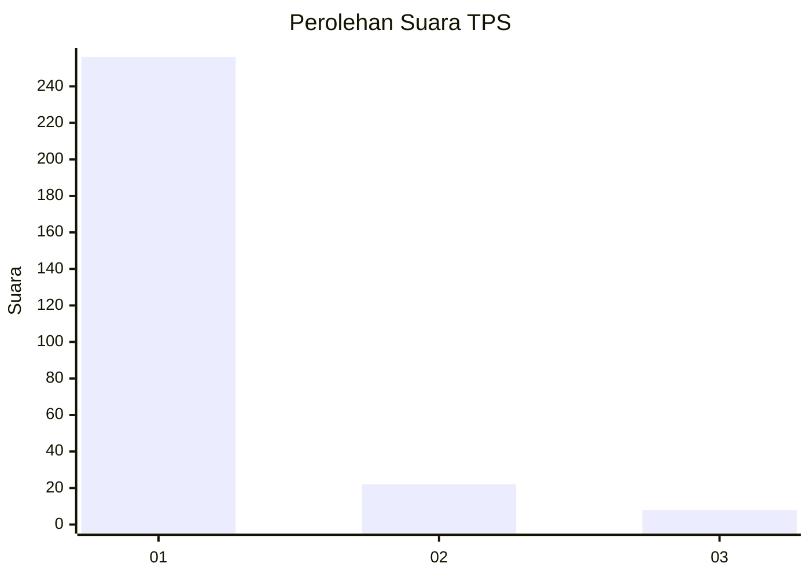
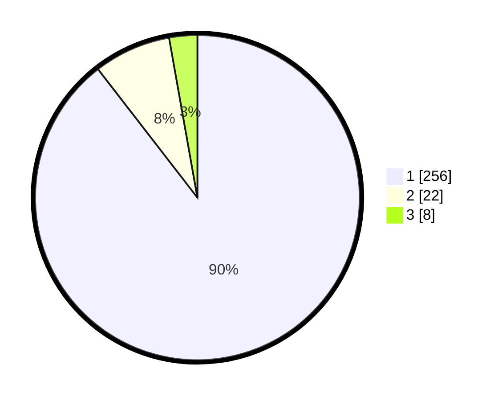

# Hasil

## Grafik

## Tabel

| No. | Nama Paslon    | Suara | Suara (raw) | Persentase |
|:--- |:-------------- | -----:| -----------:| ----------:|
| 1   | ANIES MUHAIMIN | 256   | [256][p-1]  | 89,51      |
| 2   | PRABOWO GIBRAN | 22    | [22][p-2]   | 7,69       |
| 3   | GANJAR MAHFUD  | 8     | [8][p-3]    | 2,80       |

[p-1]: https://github.com/gigit-pemilu/pemilu-2024/blob/main/pilpres/hitung-suara/sub/35-jawa-timur/sub/27-sampang/sub/11-sokobanah/sub/2009-sokobanah-tengah/sub/010-tps/sub/paslon-1.txt
[p-2]: https://github.com/gigit-pemilu/pemilu-2024/blob/main/pilpres/hitung-suara/sub/35-jawa-timur/sub/27-sampang/sub/11-sokobanah/sub/2009-sokobanah-tengah/sub/010-tps/sub/paslon-2.txt
[p-3]: https://github.com/gigit-pemilu/pemilu-2024/blob/main/pilpres/hitung-suara/sub/35-jawa-timur/sub/27-sampang/sub/11-sokobanah/sub/2009-sokobanah-tengah/sub/010-tps/sub/paslon-3.txt

## Foto C Plano

https://sirekap-obj-formc.kpu.go.id/78d3/pemilu/ppwp/35/27/11/20/09/3527112009010-20240215-111624--1681811c-73e6-4cb3-bd96-c166af46f2a5.jpg

https://sirekap-obj-formc.kpu.go.id/78d3/pemilu/ppwp/35/27/11/20/09/3527112009010-20240215-111815--02aa9549-64e2-4ab0-be17-b9a6c1c385e4.jpg

https://sirekap-obj-formc.kpu.go.id/78d3/pemilu/ppwp/35/27/11/20/09/3527112009010-20240215-112028--0c500146-74ad-4d22-82b6-d008261fa5fa.jpg

## Metadata

| Key        | Value               |
| ---------- | ------------------- |
| Time Stamp | 2024-02-17 00:28:35 |

