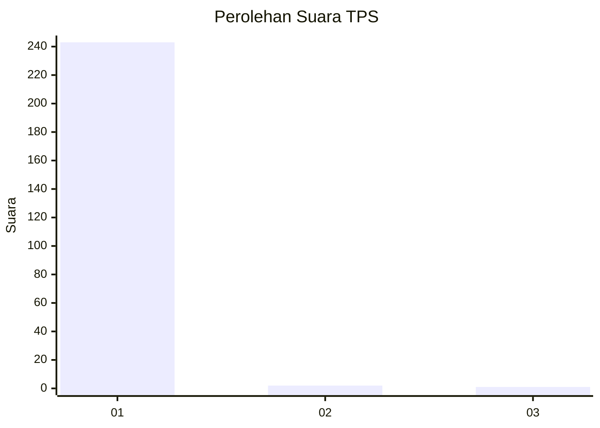
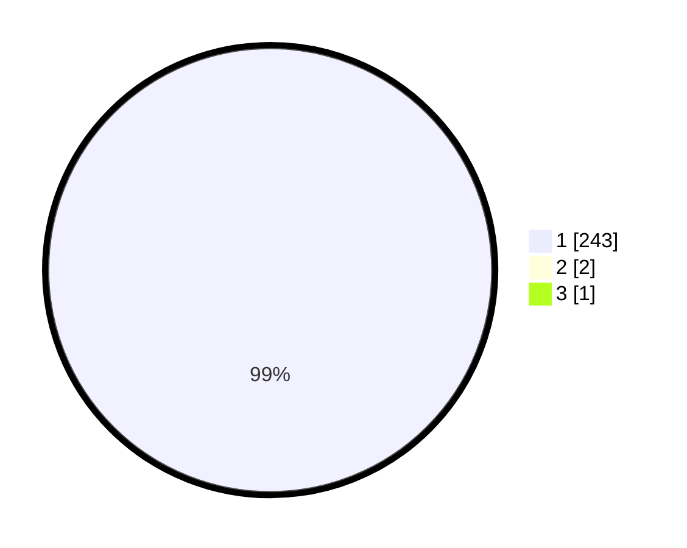

# Hasil

## Grafik

## Tabel

| No. | Nama Paslon    | Suara | Suara (raw) | Persentase |
|:--- |:-------------- | -----:| -----------:| ----------:|
| 1   | ANIES MUHAIMIN | 243   | [243][p-1]  | 98,78      |
| 2   | PRABOWO GIBRAN | 2     | [2][p-2]    | 0,81       |
| 3   | GANJAR MAHFUD  | 1     | [1][p-3]    | 0,41       |

[p-1]: https://github.com/gigit-pemilu/pemilu-2024/blob/main/pilpres/hitung-suara/sub/35-jawa-timur/sub/27-sampang/sub/11-sokobanah/sub/2009-sokobanah-tengah/sub/014-tps/sub/paslon-1.txt
[p-2]: https://github.com/gigit-pemilu/pemilu-2024/blob/main/pilpres/hitung-suara/sub/35-jawa-timur/sub/27-sampang/sub/11-sokobanah/sub/2009-sokobanah-tengah/sub/014-tps/sub/paslon-2.txt
[p-3]: https://github.com/gigit-pemilu/pemilu-2024/blob/main/pilpres/hitung-suara/sub/35-jawa-timur/sub/27-sampang/sub/11-sokobanah/sub/2009-sokobanah-tengah/sub/014-tps/sub/paslon-3.txt

## Foto C Plano

https://sirekap-obj-formc.kpu.go.id/b523/pemilu/ppwp/35/27/11/20/09/3527112009014-20240215-073945--f502fcc0-21f3-47f3-a6c4-11253ab76d3d.jpg

https://sirekap-obj-formc.kpu.go.id/b523/pemilu/ppwp/35/27/11/20/09/3527112009014-20240215-002402--0fe230ef-9386-4a73-8320-57672d361ebd.jpg

https://sirekap-obj-formc.kpu.go.id/b523/pemilu/ppwp/35/27/11/20/09/3527112009014-20240215-002518--5a4f21ab-5e2e-43f1-968a-9ac5a7b2bc4d.jpg

## Metadata

| Key        | Value               |
| ---------- | ------------------- |
| Time Stamp | 2024-02-17 10:00:02 |

