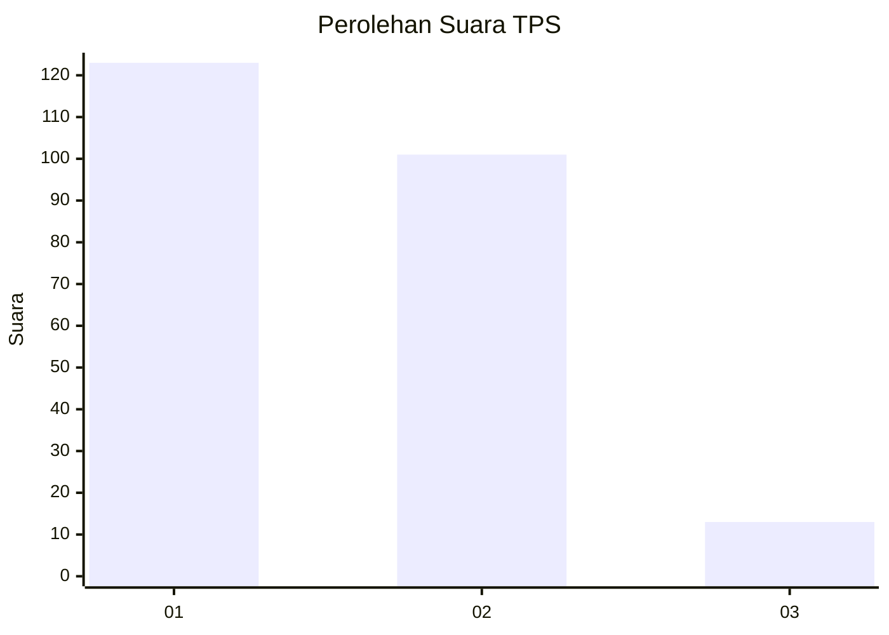
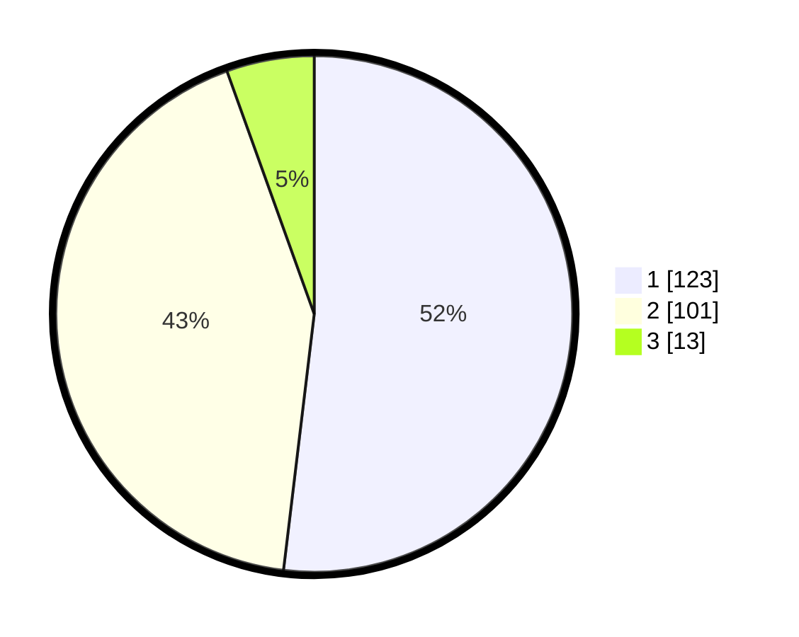

# Hasil

## Grafik

## Tabel

| No. | Nama Paslon    | Suara | Suara (raw) | Persentase |
|:--- |:-------------- | -----:| -----------:| ----------:|
| 1   | ANIES MUHAIMIN | 123   | [123][p-1]  | 51,90      |
| 2   | PRABOWO GIBRAN | 101   | [101][p-2]  | 42,62      |
| 3   | GANJAR MAHFUD  | 13    | [13][p-3]   | 5,49       |

[p-1]: https://github.com/gigit-pemilu/pemilu-2024/blob/main/pilpres/hitung-suara/sub/35-jawa-timur/sub/27-sampang/sub/11-sokobanah/sub/2009-sokobanah-tengah/sub/020-tps/sub/paslon-1.txt
[p-2]: https://github.com/gigit-pemilu/pemilu-2024/blob/main/pilpres/hitung-suara/sub/35-jawa-timur/sub/27-sampang/sub/11-sokobanah/sub/2009-sokobanah-tengah/sub/020-tps/sub/paslon-2.txt
[p-3]: https://github.com/gigit-pemilu/pemilu-2024/blob/main/pilpres/hitung-suara/sub/35-jawa-timur/sub/27-sampang/sub/11-sokobanah/sub/2009-sokobanah-tengah/sub/020-tps/sub/paslon-3.txt

## Foto C Plano

https://sirekap-obj-formc.kpu.go.id/2baf/pemilu/ppwp/35/27/11/20/09/3527112009020-20240214-221638--0db9c9ba-cfb0-4aae-afa9-bfedfe33f0ab.jpg

https://sirekap-obj-formc.kpu.go.id/2baf/pemilu/ppwp/35/27/11/20/09/3527112009020-20240214-221736--c1d81242-c60c-4721-a7f0-a625ff0a9fdc.jpg

https://sirekap-obj-formc.kpu.go.id/2baf/pemilu/ppwp/35/27/11/20/09/3527112009020-20240214-222024--0d6a74c3-91b3-41f8-ae3c-abb9fb5fb998.jpg

## Metadata

| Key        | Value               |
| ---------- | ------------------- |
| Time Stamp | 2024-02-17 00:28:35 |

