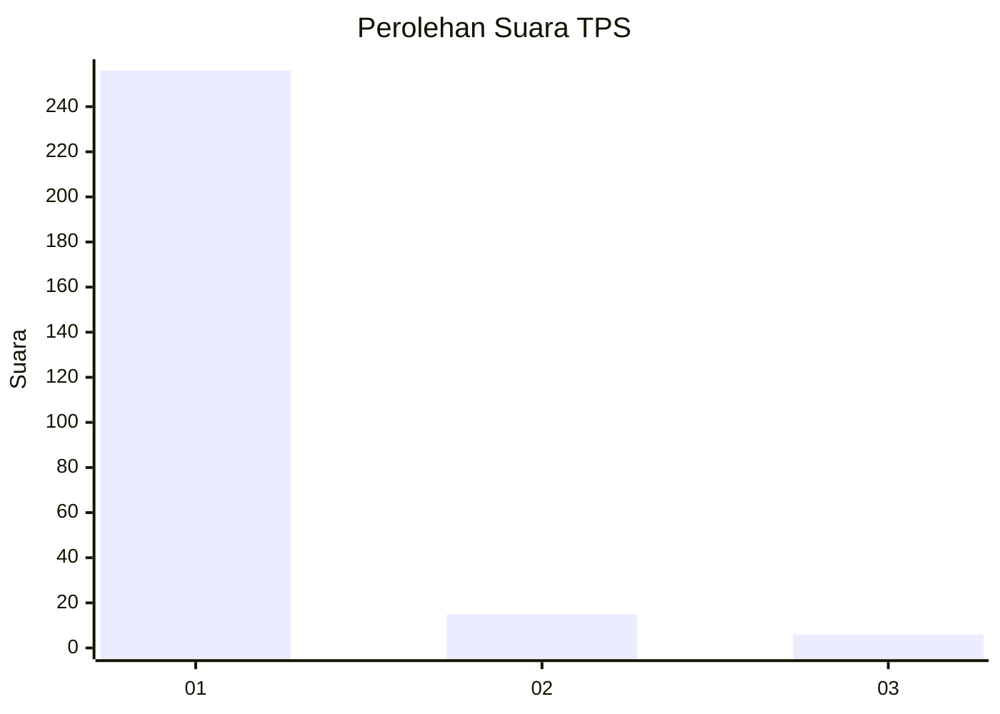
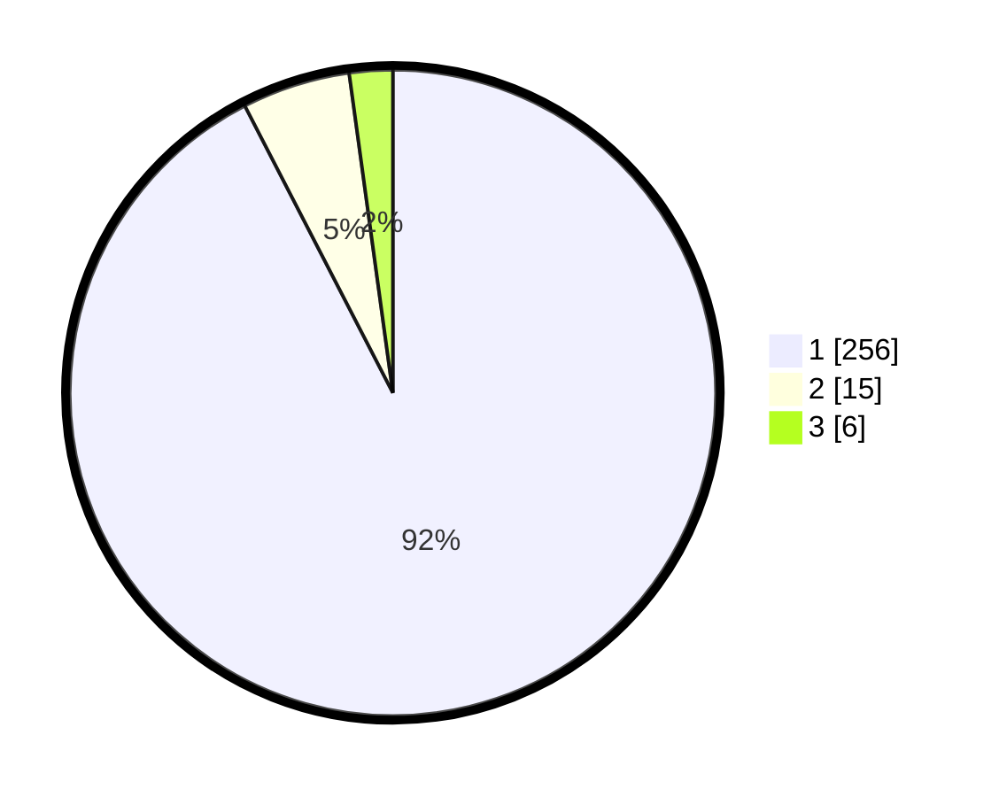

# Hasil

## Grafik

## Tabel

| No. | Nama Paslon    | Suara | Suara (raw) | Persentase |
|:--- |:-------------- | -----:| -----------:| ----------:|
| 1   | ANIES MUHAIMIN | 256   | [256][p-1]  | 92,42      |
| 2   | PRABOWO GIBRAN | 15    | [15][p-2]   | 5,42       |
| 3   | GANJAR MAHFUD  | 6     | [6][p-3]    | 2,17       |

[p-1]: https://github.com/gigit-pemilu/pemilu-2024/blob/main/pilpres/hitung-suara/sub/35-jawa-timur/sub/27-sampang/sub/11-sokobanah/sub/2009-sokobanah-tengah/sub/022-tps/sub/paslon-1.txt
[p-2]: https://github.com/gigit-pemilu/pemilu-2024/blob/main/pilpres/hitung-suara/sub/35-jawa-timur/sub/27-sampang/sub/11-sokobanah/sub/2009-sokobanah-tengah/sub/022-tps/sub/paslon-2.txt
[p-3]: https://github.com/gigit-pemilu/pemilu-2024/blob/main/pilpres/hitung-suara/sub/35-jawa-timur/sub/27-sampang/sub/11-sokobanah/sub/2009-sokobanah-tengah/sub/022-tps/sub/paslon-3.txt

## Foto C Plano

https://sirekap-obj-formc.kpu.go.id/d14c/pemilu/ppwp/35/27/11/20/09/3527112009022-20240214-191715--51b70026-fdb4-482b-8848-9cf090c21ef9.jpg

https://sirekap-obj-formc.kpu.go.id/d14c/pemilu/ppwp/35/27/11/20/09/3527112009022-20240214-192019--04bd5650-caf1-427e-9c4f-60eefd454115.jpg

https://sirekap-obj-formc.kpu.go.id/d14c/pemilu/ppwp/35/27/11/20/09/3527112009022-20240214-192118--f2293467-3e8a-4ae7-98f8-ecc026036cf6.jpg

## Metadata

| Key        | Value               |
| ---------- | ------------------- |
| Time Stamp | 2024-02-17 00:28:35 |

