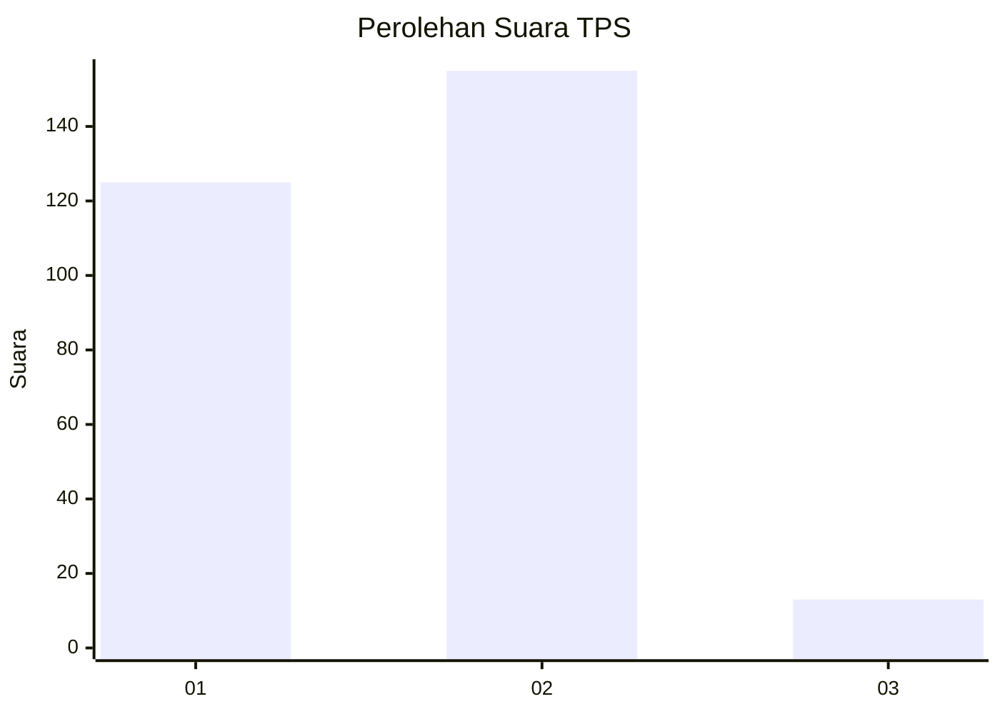
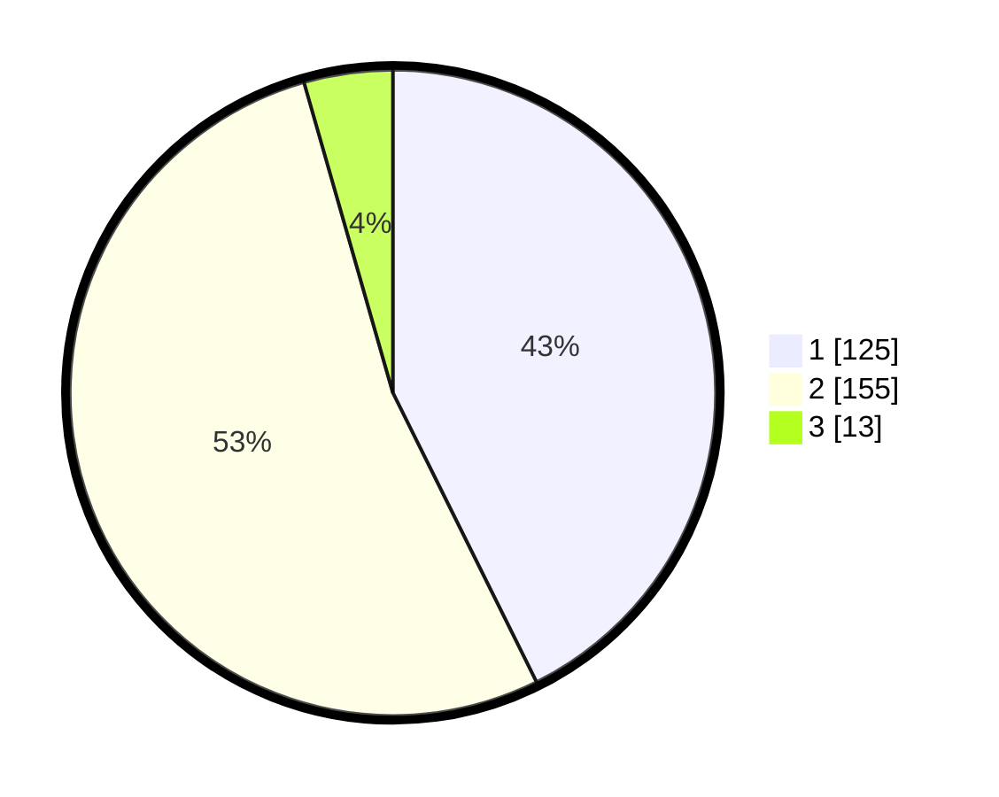

# Hasil

## Grafik

## Tabel

| No. | Nama Paslon    | Suara | Suara (raw) | Persentase |
|:--- |:-------------- | -----:| -----------:| ----------:|
| 1   | ANIES MUHAIMIN | 125   | [125][p-1]  | 42,66      |
| 2   | PRABOWO GIBRAN | 155   | [155][p-2]  | 52,90      |
| 3   | GANJAR MAHFUD  | 13    | [13][p-3]   | 4,44       |

[p-1]: https://github.com/gigit-pemilu/pemilu-2024/blob/main/pilpres/hitung-suara/sub/35-jawa-timur/sub/27-sampang/sub/11-sokobanah/sub/2010-sokobanah-daya/sub/016-tps/sub/paslon-1.txt
[p-2]: https://github.com/gigit-pemilu/pemilu-2024/blob/main/pilpres/hitung-suara/sub/35-jawa-timur/sub/27-sampang/sub/11-sokobanah/sub/2010-sokobanah-daya/sub/016-tps/sub/paslon-2.txt
[p-3]: https://github.com/gigit-pemilu/pemilu-2024/blob/main/pilpres/hitung-suara/sub/35-jawa-timur/sub/27-sampang/sub/11-sokobanah/sub/2010-sokobanah-daya/sub/016-tps/sub/paslon-3.txt

## Foto C Plano

https://sirekap-obj-formc.kpu.go.id/d448/pemilu/ppwp/35/27/11/20/10/3527112010016-20240214-200557--fc5f9ad7-cbef-46b8-96d9-96e46c24af50.jpg

https://sirekap-obj-formc.kpu.go.id/d448/pemilu/ppwp/35/27/11/20/10/3527112010016-20240214-200703--b1d65c61-66c5-4da0-9b67-a653967fdac6.jpg

https://sirekap-obj-formc.kpu.go.id/d448/pemilu/ppwp/35/27/11/20/10/3527112010016-20240214-200744--c001d77d-328a-41bf-8b4a-8de66b6d6ac5.jpg

## Metadata

| Key        | Value               |
| ---------- | ------------------- |
| Time Stamp | 2024-02-17 00:30:00 |

