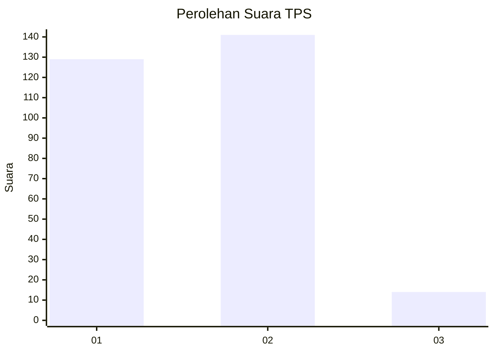
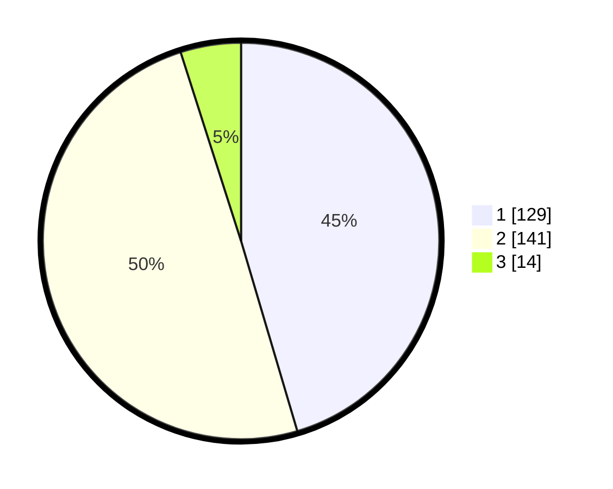

# Hasil

## Grafik

## Tabel

| No. | Nama Paslon    | Suara | Suara (raw) | Persentase |
|:--- |:-------------- | -----:| -----------:| ----------:|
| 1   | ANIES MUHAIMIN | 129   | [129][p-1]  | 45,42      |
| 2   | PRABOWO GIBRAN | 141   | [141][p-2]  | 49,65      |
| 3   | GANJAR MAHFUD  | 14    | [14][p-3]   | 4,93       |

[p-1]: https://github.com/gigit-pemilu/pemilu-2024/blob/main/pilpres/hitung-suara/sub/35-jawa-timur/sub/27-sampang/sub/11-sokobanah/sub/2010-sokobanah-daya/sub/017-tps/sub/paslon-1.txt
[p-2]: https://github.com/gigit-pemilu/pemilu-2024/blob/main/pilpres/hitung-suara/sub/35-jawa-timur/sub/27-sampang/sub/11-sokobanah/sub/2010-sokobanah-daya/sub/017-tps/sub/paslon-2.txt
[p-3]: https://github.com/gigit-pemilu/pemilu-2024/blob/main/pilpres/hitung-suara/sub/35-jawa-timur/sub/27-sampang/sub/11-sokobanah/sub/2010-sokobanah-daya/sub/017-tps/sub/paslon-3.txt

## Foto C Plano

https://sirekap-obj-formc.kpu.go.id/2b31/pemilu/ppwp/35/27/11/20/10/3527112010017-20240214-202329--62b692ee-39ee-4884-bfb1-da71931a35b7.jpg

https://sirekap-obj-formc.kpu.go.id/2b31/pemilu/ppwp/35/27/11/20/10/3527112010017-20240214-202741--c5bc11a6-b892-4dde-bc7e-ad272f591e83.jpg

https://sirekap-obj-formc.kpu.go.id/2b31/pemilu/ppwp/35/27/11/20/10/3527112010017-20240214-202543--7dc911f2-e386-43a6-969f-cc4cf9edc9ea.jpg

## Metadata

| Key        | Value               |
| ---------- | ------------------- |
| Time Stamp | 2024-02-17 00:30:00 |

