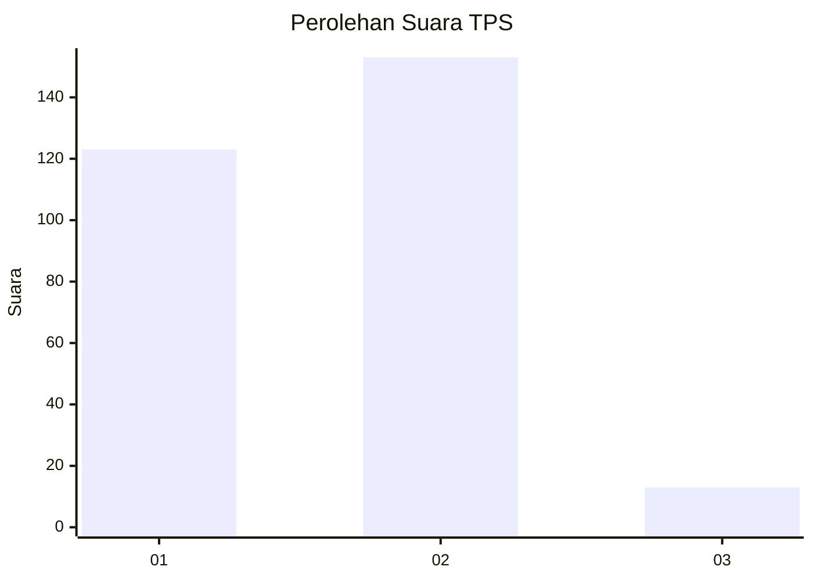
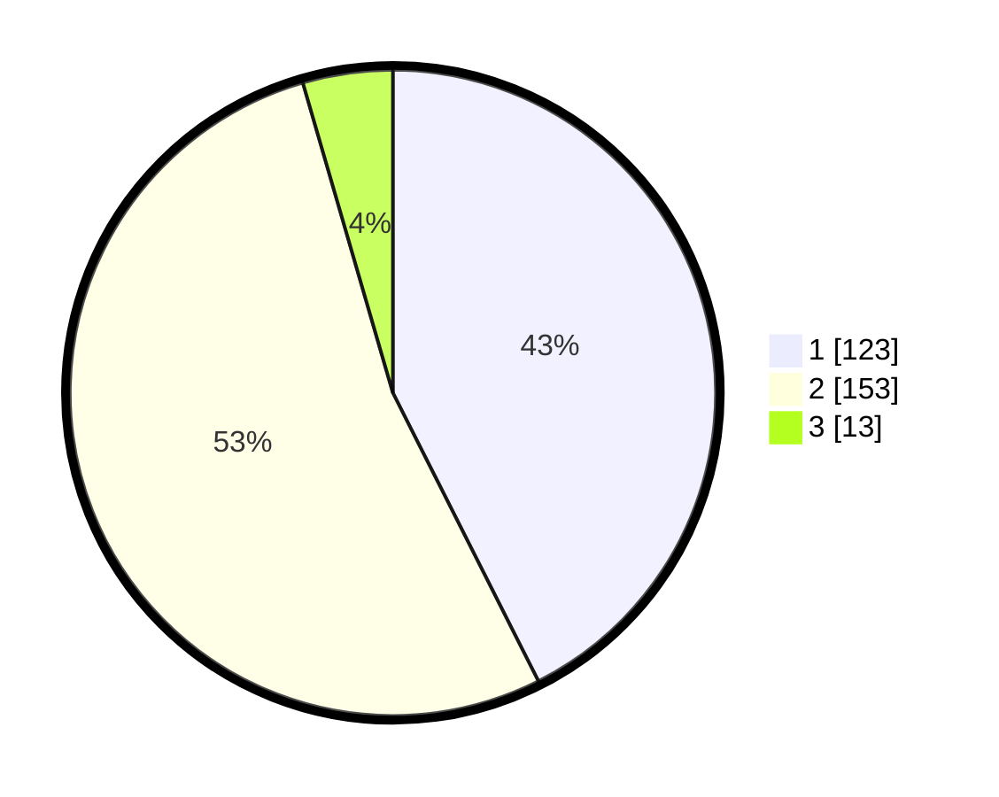

# Hasil

## Grafik

## Tabel

| No. | Nama Paslon    | Suara | Suara (raw) | Persentase |
|:--- |:-------------- | -----:| -----------:| ----------:|
| 1   | ANIES MUHAIMIN | 123   | [123][p-1]  | 42,56      |
| 2   | PRABOWO GIBRAN | 153   | [153][p-2]  | 52,94      |
| 3   | GANJAR MAHFUD  | 13    | [13][p-3]   | 4,50       |

[p-1]: https://github.com/gigit-pemilu/pemilu-2024/blob/main/pilpres/hitung-suara/sub/35-jawa-timur/sub/27-sampang/sub/11-sokobanah/sub/2011-tamberu-barat/sub/002-tps/sub/paslon-1.txt
[p-2]: https://github.com/gigit-pemilu/pemilu-2024/blob/main/pilpres/hitung-suara/sub/35-jawa-timur/sub/27-sampang/sub/11-sokobanah/sub/2011-tamberu-barat/sub/002-tps/sub/paslon-2.txt
[p-3]: https://github.com/gigit-pemilu/pemilu-2024/blob/main/pilpres/hitung-suara/sub/35-jawa-timur/sub/27-sampang/sub/11-sokobanah/sub/2011-tamberu-barat/sub/002-tps/sub/paslon-3.txt

## Foto C Plano

https://sirekap-obj-formc.kpu.go.id/0868/pemilu/ppwp/35/27/11/20/11/3527112011002-20240215-100612--d03e4c3f-86d9-40d7-a262-646789abf736.jpg

https://sirekap-obj-formc.kpu.go.id/0868/pemilu/ppwp/35/27/11/20/11/3527112011002-20240215-100745--25595e67-ce7c-419a-a50a-80baa8d48885.jpg

https://sirekap-obj-formc.kpu.go.id/0868/pemilu/ppwp/35/27/11/20/11/3527112011002-20240215-100846--1b2def6f-4ac9-4eba-9251-198233dc7c47.jpg

## Metadata

| Key        | Value               |
| ---------- | ------------------- |
| Time Stamp | 2024-02-17 01:00:00 |

