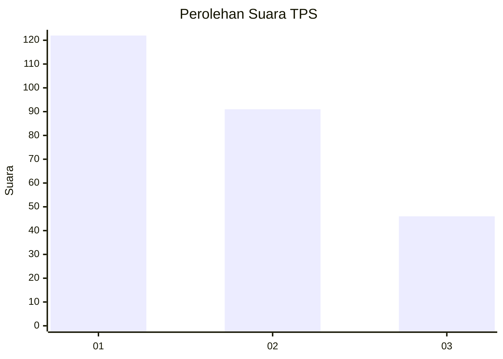
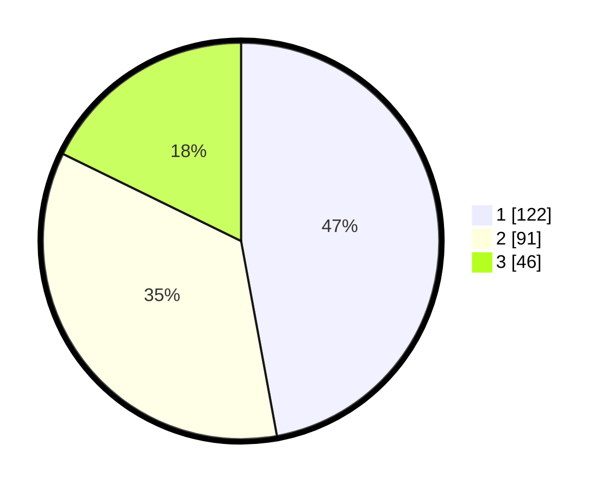

# Hasil

## Grafik

## Tabel

| No. | Nama Paslon    | Suara | Suara (raw) | Persentase |
|:--- |:-------------- | -----:| -----------:| ----------:|
| 1   | ANIES MUHAIMIN | 122   | [122][p-1]  | 47,10      |
| 2   | PRABOWO GIBRAN | 91    | [91][p-2]   | 35,14      |
| 3   | GANJAR MAHFUD  | 46    | [46][p-3]   | 17,76      |

[p-1]: https://github.com/gigit-pemilu/pemilu-2024/blob/main/pilpres/hitung-suara/sub/35-jawa-timur/sub/27-sampang/sub/11-sokobanah/sub/2011-tamberu-barat/sub/003-tps/sub/paslon-1.txt
[p-2]: https://github.com/gigit-pemilu/pemilu-2024/blob/main/pilpres/hitung-suara/sub/35-jawa-timur/sub/27-sampang/sub/11-sokobanah/sub/2011-tamberu-barat/sub/003-tps/sub/paslon-2.txt
[p-3]: https://github.com/gigit-pemilu/pemilu-2024/blob/main/pilpres/hitung-suara/sub/35-jawa-timur/sub/27-sampang/sub/11-sokobanah/sub/2011-tamberu-barat/sub/003-tps/sub/paslon-3.txt

## Foto C Plano

https://sirekap-obj-formc.kpu.go.id/14ce/pemilu/ppwp/35/27/11/20/11/3527112011003-20240215-054034--87471b7d-d8b7-4cd9-9c53-f28835d83ed5.jpg

https://sirekap-obj-formc.kpu.go.id/14ce/pemilu/ppwp/35/27/11/20/11/3527112011003-20240215-054141--fb4ecedf-5b54-471f-8961-aefe7000b180.jpg

https://sirekap-obj-formc.kpu.go.id/14ce/pemilu/ppwp/35/27/11/20/11/3527112011003-20240215-054255--3a347a8f-2f42-48af-87ac-ec5b403ba0c6.jpg

## Metadata

| Key        | Value               |
| ---------- | ------------------- |
| Time Stamp | 2024-02-17 01:00:00 |

