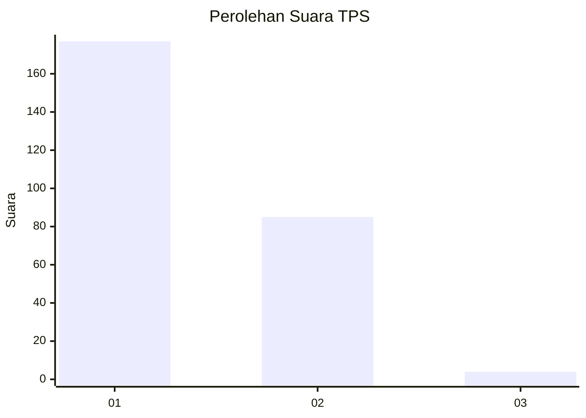
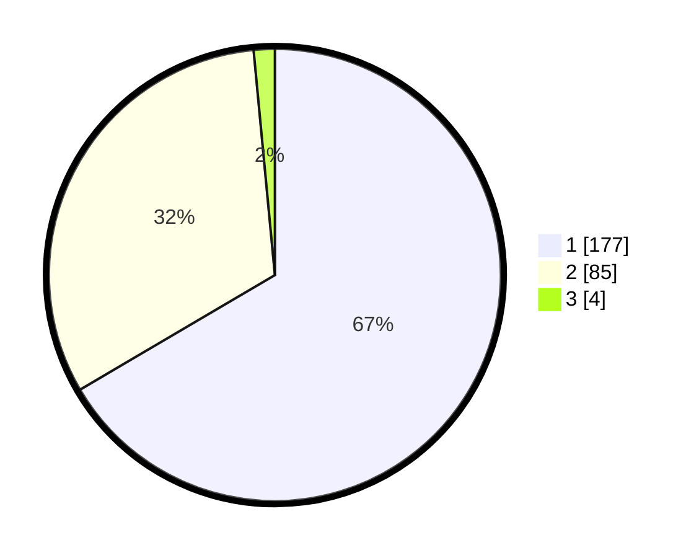

# Hasil

## Grafik

## Tabel

| No. | Nama Paslon    | Suara | Suara (raw) | Persentase |
|:--- |:-------------- | -----:| -----------:| ----------:|
| 1   | ANIES MUHAIMIN | 177   | [177][p-1]  | 66,54      |
| 2   | PRABOWO GIBRAN | 85    | [85][p-2]   | 31,95      |
| 3   | GANJAR MAHFUD  | 4     | [4][p-3]    | 1,50       |

[p-1]: https://github.com/gigit-pemilu/pemilu-2024-35-jawa-timur/blob/main/pilpres/hitung-suara/sub/35-jawa-timur/sub/27-sampang/sub/11-sokobanah/sub/2011-tamberu-barat/sub/004-tps/sub/paslon-1.txt
[p-2]: https://github.com/gigit-pemilu/pemilu-2024-35-jawa-timur/blob/main/pilpres/hitung-suara/sub/35-jawa-timur/sub/27-sampang/sub/11-sokobanah/sub/2011-tamberu-barat/sub/004-tps/sub/paslon-2.txt
[p-3]: https://github.com/gigit-pemilu/pemilu-2024-35-jawa-timur/blob/main/pilpres/hitung-suara/sub/35-jawa-timur/sub/27-sampang/sub/11-sokobanah/sub/2011-tamberu-barat/sub/004-tps/sub/paslon-3.txt

## Foto C Plano

https://sirekap-obj-formc.kpu.go.id/018f/pemilu/ppwp/35/27/11/20/11/3527112011004-20240214-212546--db4f0523-d7d0-4024-b476-89414d4f2b5d.jpg

https://sirekap-obj-formc.kpu.go.id/018f/pemilu/ppwp/35/27/11/20/11/3527112011004-20240214-213034--4ec266e3-afb8-432e-8ee4-47fec4ee2fcb.jpg

https://sirekap-obj-formc.kpu.go.id/018f/pemilu/ppwp/35/27/11/20/11/3527112011004-20240214-213416--d2484776-2955-4d55-833c-f26d9d087881.jpg

## Metadata

| Key        | Value               |
| ---------- | ------------------- |
| Time Stamp | 2024-02-17 01:00:00 |

