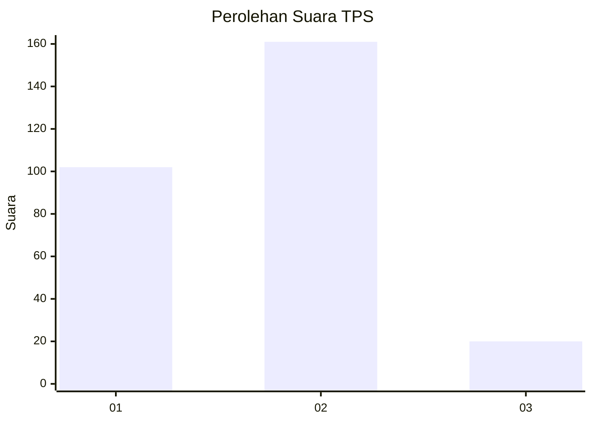
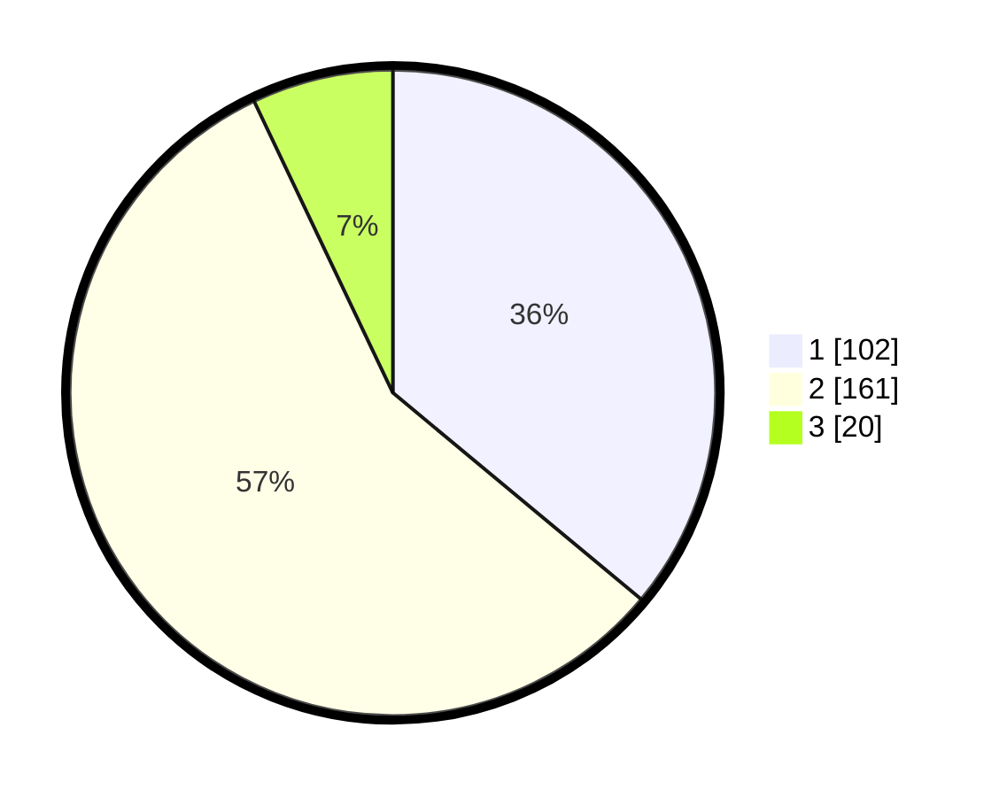

# Hasil

## Grafik

## Tabel

| No. | Nama Paslon    | Suara | Suara (raw) | Persentase |
|:--- |:-------------- | -----:| -----------:| ----------:|
| 1   | ANIES MUHAIMIN | 102   | [102][p-1]  | 36,04      |
| 2   | PRABOWO GIBRAN | 161   | [161][p-2]  | 56,89      |
| 3   | GANJAR MAHFUD  | 20    | [20][p-3]   | 7,07       |

[p-1]: https://github.com/gigit-pemilu/pemilu-2024-35-jawa-timur/blob/main/pilpres/hitung-suara/sub/35-jawa-timur/sub/27-sampang/sub/11-sokobanah/sub/2011-tamberu-barat/sub/005-tps/sub/paslon-1.txt
[p-2]: https://github.com/gigit-pemilu/pemilu-2024-35-jawa-timur/blob/main/pilpres/hitung-suara/sub/35-jawa-timur/sub/27-sampang/sub/11-sokobanah/sub/2011-tamberu-barat/sub/005-tps/sub/paslon-2.txt
[p-3]: https://github.com/gigit-pemilu/pemilu-2024-35-jawa-timur/blob/main/pilpres/hitung-suara/sub/35-jawa-timur/sub/27-sampang/sub/11-sokobanah/sub/2011-tamberu-barat/sub/005-tps/sub/paslon-3.txt

## Foto C Plano

https://sirekap-obj-formc.kpu.go.id/413d/pemilu/ppwp/35/27/11/20/11/3527112011005-20240215-013307--785b1784-8842-4040-acb8-2d189eb9b397.jpg

https://sirekap-obj-formc.kpu.go.id/413d/pemilu/ppwp/35/27/11/20/11/3527112011005-20240215-013525--38c6d259-de89-421b-941f-2b56db86683c.jpg

https://sirekap-obj-formc.kpu.go.id/413d/pemilu/ppwp/35/27/11/20/11/3527112011005-20240215-013621--e3344900-93be-4891-962c-c7a110aa5804.jpg

## Metadata

| Key        | Value               |
| ---------- | ------------------- |
| Time Stamp | 2024-02-17 01:00:00 |

