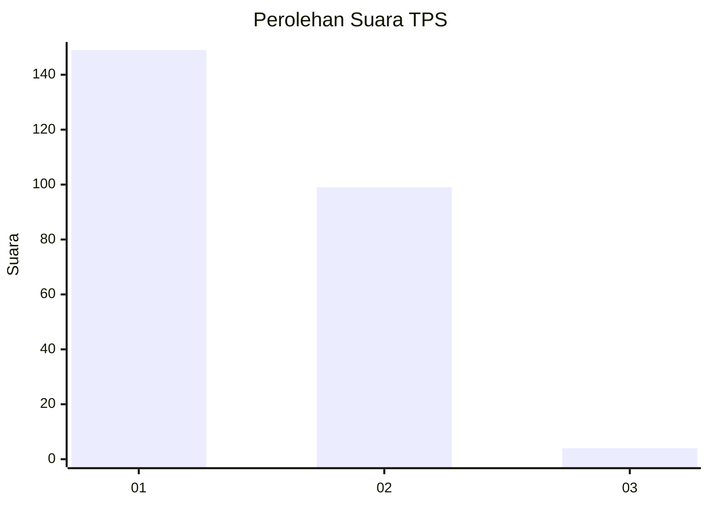
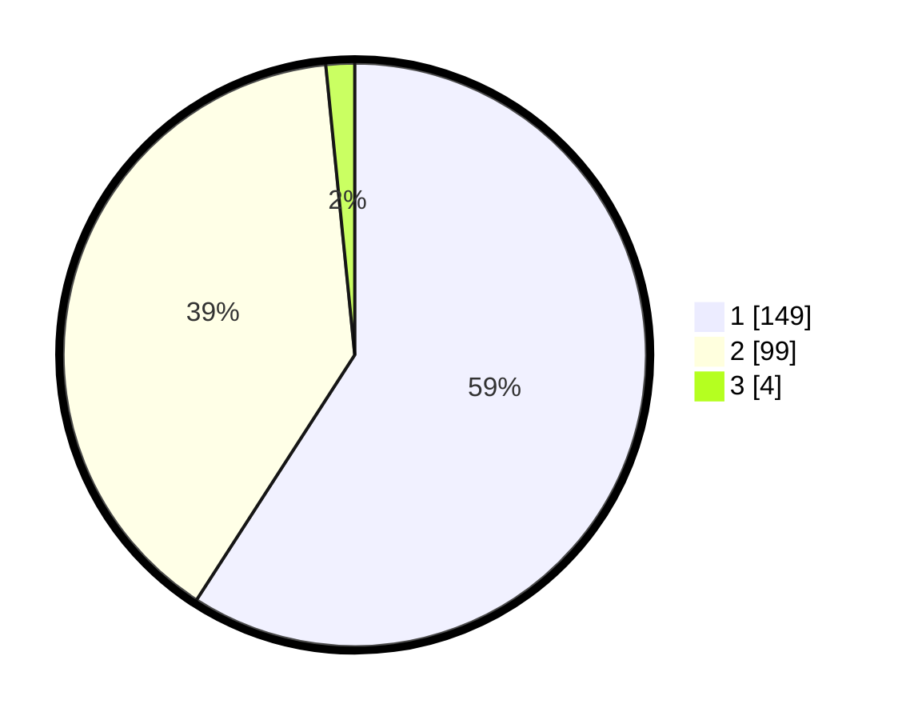

# Hasil

## Grafik

## Tabel

| No. | Nama Paslon    | Suara | Suara (raw) | Persentase |
|:--- |:-------------- | -----:| -----------:| ----------:|
| 1   | ANIES MUHAIMIN | 149   | [149][p-1]  | 59,13      |
| 2   | PRABOWO GIBRAN | 99    | [99][p-2]   | 39,29      |
| 3   | GANJAR MAHFUD  | 4     | [4][p-3]    | 1,59       |

[p-1]: https://github.com/gigit-pemilu/pemilu-2024-35-jawa-timur/blob/main/pilpres/hitung-suara/sub/35-jawa-timur/sub/27-sampang/sub/11-sokobanah/sub/2011-tamberu-barat/sub/007-tps/sub/paslon-1.txt
[p-2]: https://github.com/gigit-pemilu/pemilu-2024-35-jawa-timur/blob/main/pilpres/hitung-suara/sub/35-jawa-timur/sub/27-sampang/sub/11-sokobanah/sub/2011-tamberu-barat/sub/007-tps/sub/paslon-2.txt
[p-3]: https://github.com/gigit-pemilu/pemilu-2024-35-jawa-timur/blob/main/pilpres/hitung-suara/sub/35-jawa-timur/sub/27-sampang/sub/11-sokobanah/sub/2011-tamberu-barat/sub/007-tps/sub/paslon-3.txt

## Foto C Plano

https://sirekap-obj-formc.kpu.go.id/b335/pemilu/ppwp/35/27/11/20/11/3527112011007-20240215-083505--d0018a76-faaf-4323-bdeb-d1848abf1cfe.jpg

https://sirekap-obj-formc.kpu.go.id/b335/pemilu/ppwp/35/27/11/20/11/3527112011007-20240215-083613--725e12b2-74b8-4dec-9074-13b9eaa1685f.jpg

https://sirekap-obj-formc.kpu.go.id/b335/pemilu/ppwp/35/27/11/20/11/3527112011007-20240215-083707--d8f2848d-f37c-4193-b479-c65896efc0b1.jpg

## Metadata

| Key        | Value               |
| ---------- | ------------------- |
| Time Stamp | 2024-02-16 23:00:00 |

