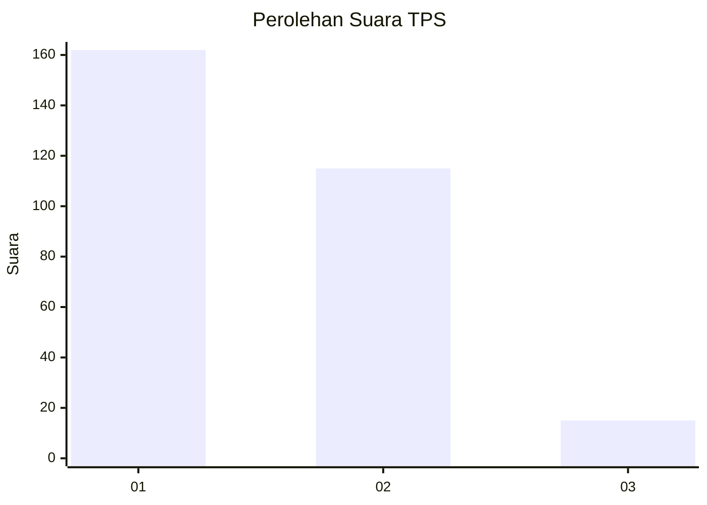
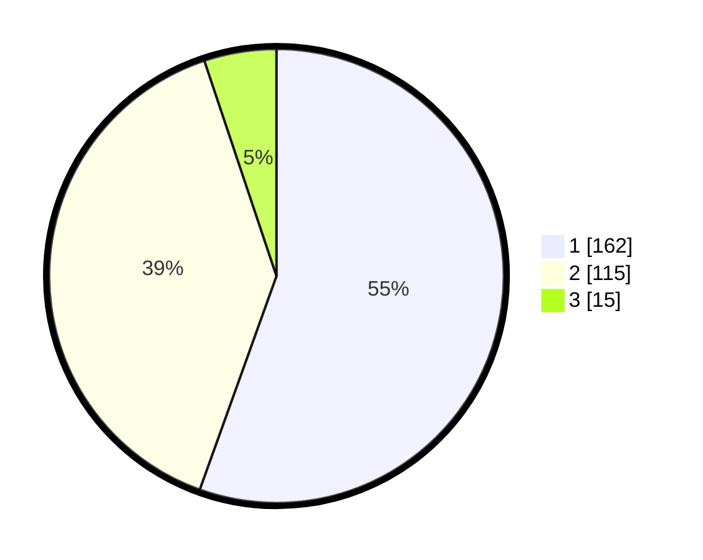

# Hasil

## Grafik

## Tabel

| No. | Nama Paslon    | Suara | Suara (raw) | Persentase |
|:--- |:-------------- | -----:| -----------:| ----------:|
| 1   | ANIES MUHAIMIN | 162   | [162][p-1]  | 55,48      |
| 2   | PRABOWO GIBRAN | 115   | [115][p-2]  | 39,38      |
| 3   | GANJAR MAHFUD  | 15    | [15][p-3]   | 5,14       |

[p-1]: https://github.com/gigit-pemilu/pemilu-2024-35-jawa-timur/blob/main/pilpres/hitung-suara/sub/35-jawa-timur/sub/27-sampang/sub/11-sokobanah/sub/2011-tamberu-barat/sub/009-tps/sub/paslon-1.txt
[p-2]: https://github.com/gigit-pemilu/pemilu-2024-35-jawa-timur/blob/main/pilpres/hitung-suara/sub/35-jawa-timur/sub/27-sampang/sub/11-sokobanah/sub/2011-tamberu-barat/sub/009-tps/sub/paslon-2.txt
[p-3]: https://github.com/gigit-pemilu/pemilu-2024-35-jawa-timur/blob/main/pilpres/hitung-suara/sub/35-jawa-timur/sub/27-sampang/sub/11-sokobanah/sub/2011-tamberu-barat/sub/009-tps/sub/paslon-3.txt

## Foto C Plano

https://sirekap-obj-formc.kpu.go.id/2c11/pemilu/ppwp/35/27/11/20/11/3527112011009-20240215-095428--7eb33100-1404-4a2b-a007-cb175e706e30.jpg

https://sirekap-obj-formc.kpu.go.id/2c11/pemilu/ppwp/35/27/11/20/11/3527112011009-20240215-100225--ddd1ec9d-875a-4b70-9cc6-aa37b46d4c5a.jpg

https://sirekap-obj-formc.kpu.go.id/2c11/pemilu/ppwp/35/27/11/20/11/3527112011009-20240215-100055--d343cbfe-1f5b-42fa-950f-91ee12b661fe.jpg

## Metadata

| Key        | Value               |
| ---------- | ------------------- |
| Time Stamp | 2024-02-17 10:00:02 |

