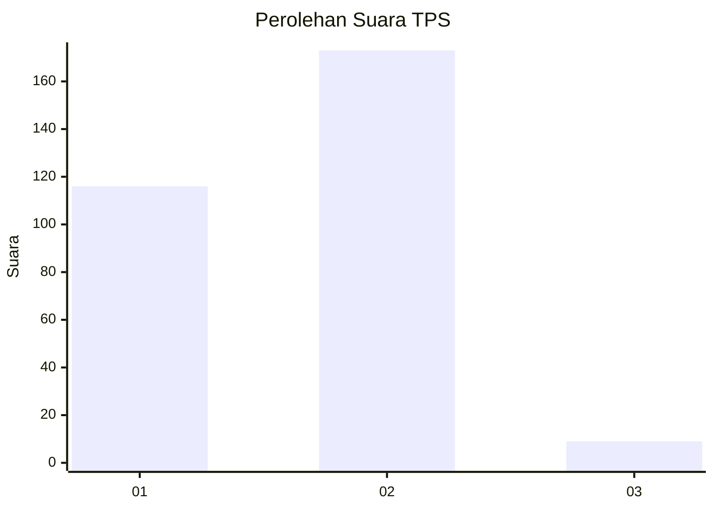
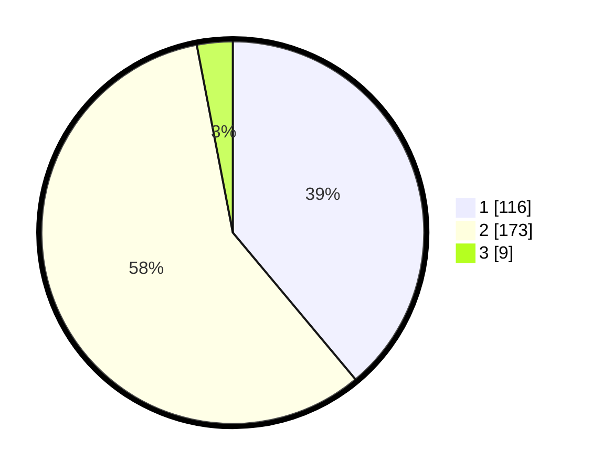

# Hasil

## Grafik

## Tabel

| No. | Nama Paslon    | Suara | Suara (raw) | Persentase |
|:--- |:-------------- | -----:| -----------:| ----------:|
| 1   | ANIES MUHAIMIN | 116   | [116][p-1]  | 38,93      |
| 2   | PRABOWO GIBRAN | 173   | [173][p-2]  | 58,05      |
| 3   | GANJAR MAHFUD  | 9     | [9][p-3]    | 3,02       |

[p-1]: https://github.com/gigit-pemilu/pemilu-2024-35-jawa-timur/blob/main/pilpres/hitung-suara/sub/35-jawa-timur/sub/27-sampang/sub/11-sokobanah/sub/2011-tamberu-barat/sub/011-tps/sub/paslon-1.txt
[p-2]: https://github.com/gigit-pemilu/pemilu-2024-35-jawa-timur/blob/main/pilpres/hitung-suara/sub/35-jawa-timur/sub/27-sampang/sub/11-sokobanah/sub/2011-tamberu-barat/sub/011-tps/sub/paslon-2.txt
[p-3]: https://github.com/gigit-pemilu/pemilu-2024-35-jawa-timur/blob/main/pilpres/hitung-suara/sub/35-jawa-timur/sub/27-sampang/sub/11-sokobanah/sub/2011-tamberu-barat/sub/011-tps/sub/paslon-3.txt

## Foto C Plano

https://sirekap-obj-formc.kpu.go.id/412c/pemilu/ppwp/35/27/11/20/11/3527112011011-20240215-090129--81454eb2-e3f9-4c23-a824-12a5a9378693.jpg

https://sirekap-obj-formc.kpu.go.id/412c/pemilu/ppwp/35/27/11/20/11/3527112011011-20240215-090221--cdaab15c-f781-4287-b7c3-4f419e0ec4c4.jpg

https://sirekap-obj-formc.kpu.go.id/412c/pemilu/ppwp/35/27/11/20/11/3527112011011-20240215-090315--a286dfe5-1253-4764-b5e8-50850224c805.jpg

## Metadata

| Key        | Value               |
| ---------- | ------------------- |
| Time Stamp | 2024-02-16 23:00:00 |

