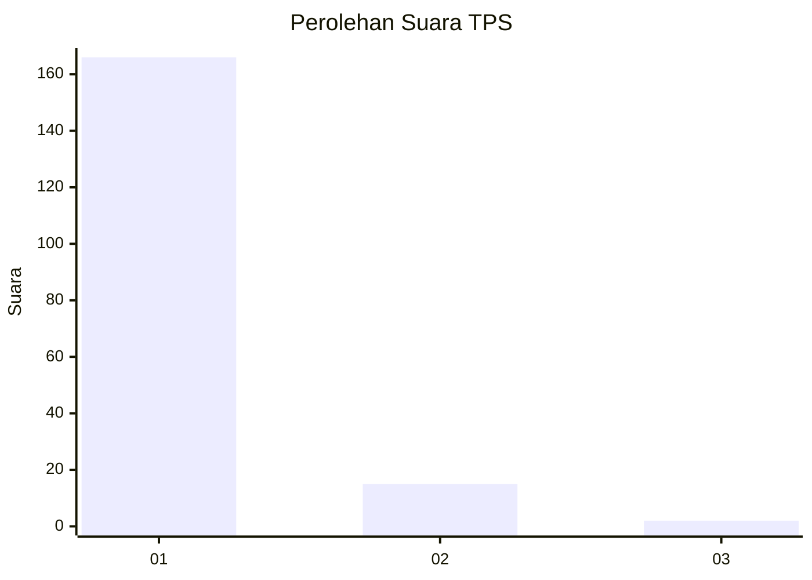
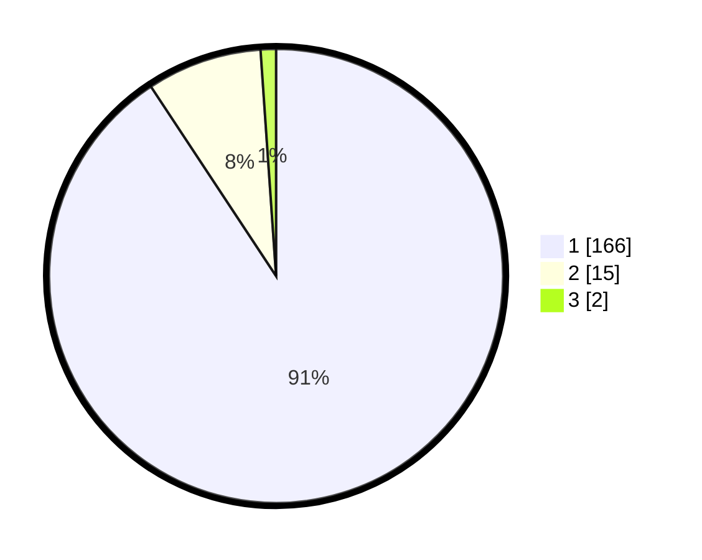

# Hasil

## Grafik

## Tabel

| No. | Nama Paslon    | Suara | Suara (raw) | Persentase |
|:--- |:-------------- | -----:| -----------:| ----------:|
| 1   | ANIES MUHAIMIN | 166   | [166][p-1]  | 90,71      |
| 2   | PRABOWO GIBRAN | 15    | [15][p-2]   | 8,20       |
| 3   | GANJAR MAHFUD  | 2     | [2][p-3]    | 1,09       |

[p-1]: https://github.com/gigit-pemilu/pemilu-2024-35-jawa-timur/blob/main/pilpres/hitung-suara/sub/35-jawa-timur/sub/27-sampang/sub/11-sokobanah/sub/2011-tamberu-barat/sub/012-tps/sub/paslon-1.txt
[p-2]: https://github.com/gigit-pemilu/pemilu-2024-35-jawa-timur/blob/main/pilpres/hitung-suara/sub/35-jawa-timur/sub/27-sampang/sub/11-sokobanah/sub/2011-tamberu-barat/sub/012-tps/sub/paslon-2.txt
[p-3]: https://github.com/gigit-pemilu/pemilu-2024-35-jawa-timur/blob/main/pilpres/hitung-suara/sub/35-jawa-timur/sub/27-sampang/sub/11-sokobanah/sub/2011-tamberu-barat/sub/012-tps/sub/paslon-3.txt

## Foto C Plano

https://sirekap-obj-formc.kpu.go.id/2e30/pemilu/ppwp/35/27/11/20/11/3527112011012-20240214-232609--8d9e7293-d19c-4cca-b5c8-5ba3960c1b00.jpg

https://sirekap-obj-formc.kpu.go.id/2e30/pemilu/ppwp/35/27/11/20/11/3527112011012-20240214-232758--48a996e0-ea92-4dcd-a3ff-2ed9e907f8a1.jpg

https://sirekap-obj-formc.kpu.go.id/2e30/pemilu/ppwp/35/27/11/20/11/3527112011012-20240214-232920--176c916d-8fe6-47c8-9f16-19f1dfb886fa.jpg

## Metadata

| Key        | Value               |
| ---------- | ------------------- |
| Time Stamp | 2024-02-25 14:00:00 |

