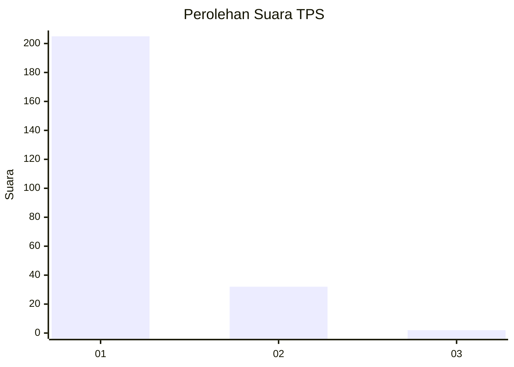
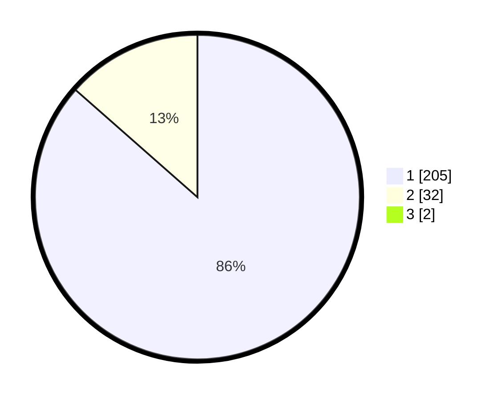

# Hasil

## Grafik

## Tabel

| No. | Nama Paslon    | Suara | Suara (raw) | Persentase |
|:--- |:-------------- | -----:| -----------:| ----------:|
| 1   | ANIES MUHAIMIN | 205   | [205][p-1]  | 85,77      |
| 2   | PRABOWO GIBRAN | 32    | [32][p-2]   | 13,39      |
| 3   | GANJAR MAHFUD  | 2     | [2][p-3]    | 0,84       |

[p-1]: https://github.com/gigit-pemilu/pemilu-2024/blob/main/pilpres/hitung-suara/sub/35-jawa-timur/sub/27-sampang/sub/12-ketapang/sub/2001-paopale-laok/sub/018-tps/sub/paslon-1.txt
[p-2]: https://github.com/gigit-pemilu/pemilu-2024/blob/main/pilpres/hitung-suara/sub/35-jawa-timur/sub/27-sampang/sub/12-ketapang/sub/2001-paopale-laok/sub/018-tps/sub/paslon-2.txt
[p-3]: https://github.com/gigit-pemilu/pemilu-2024/blob/main/pilpres/hitung-suara/sub/35-jawa-timur/sub/27-sampang/sub/12-ketapang/sub/2001-paopale-laok/sub/018-tps/sub/paslon-3.txt

## Foto C Plano

https://sirekap-obj-formc.kpu.go.id/913e/pemilu/ppwp/35/27/12/20/01/3527122001018-20240214-141338--c01f8f41-c70c-4ef9-aa54-2fe41367072c.jpg

https://sirekap-obj-formc.kpu.go.id/913e/pemilu/ppwp/35/27/12/20/01/3527122001018-20240214-141555--edfa6d4f-6e27-40b3-ba71-97634e051448.jpg

https://sirekap-obj-formc.kpu.go.id/913e/pemilu/ppwp/35/27/12/20/01/3527122001018-20240214-141750--42dc8d31-8139-42d4-96e2-13f3c97f9d01.jpg

## Metadata

| Key        | Value               |
| ---------- | ------------------- |
| Time Stamp | 2024-02-24 22:31:28 |

