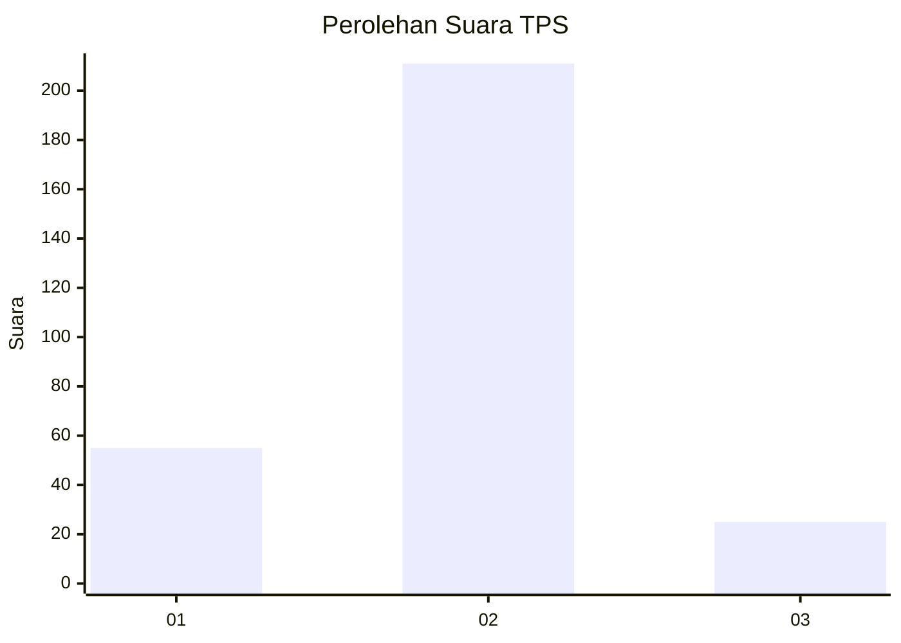
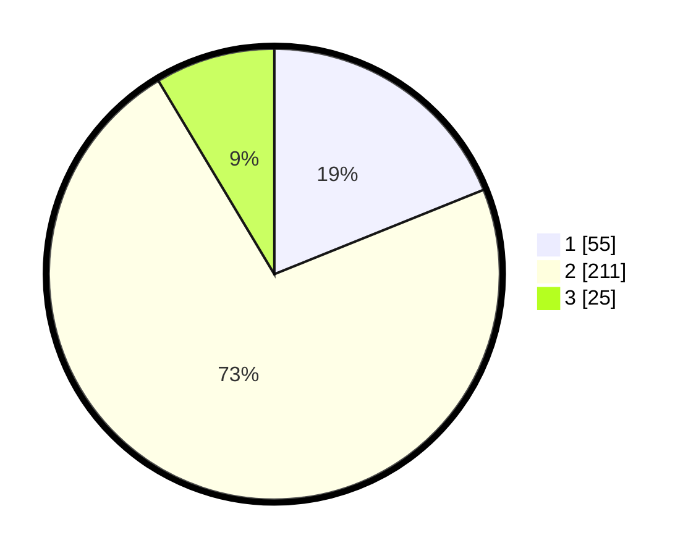

# Hasil

## Grafik

## Tabel

| No. | Nama Paslon    | Suara | Suara (raw) | Persentase |
|:--- |:-------------- | -----:| -----------:| ----------:|
| 1   | ANIES MUHAIMIN | 55    | [55][p-1]   | 18,90      |
| 2   | PRABOWO GIBRAN | 211   | [211][p-2]  | 72,51      |
| 3   | GANJAR MAHFUD  | 25    | [25][p-3]   | 8,59       |

[p-1]: https://github.com/gigit-pemilu/pemilu-2024-35-jawa-timur/blob/main/pilpres/hitung-suara/sub/35-jawa-timur/sub/27-sampang/sub/12-ketapang/sub/2002-bunten-barat/sub/004-tps/sub/paslon-1.txt
[p-2]: https://github.com/gigit-pemilu/pemilu-2024-35-jawa-timur/blob/main/pilpres/hitung-suara/sub/35-jawa-timur/sub/27-sampang/sub/12-ketapang/sub/2002-bunten-barat/sub/004-tps/sub/paslon-2.txt
[p-3]: https://github.com/gigit-pemilu/pemilu-2024-35-jawa-timur/blob/main/pilpres/hitung-suara/sub/35-jawa-timur/sub/27-sampang/sub/12-ketapang/sub/2002-bunten-barat/sub/004-tps/sub/paslon-3.txt

## Foto C Plano

https://sirekap-obj-formc.kpu.go.id/b81a/pemilu/ppwp/35/27/12/20/02/3527122002004-20240214-211012--f2798e0d-835c-4b33-9835-8aa5fca2bc24.jpg

https://sirekap-obj-formc.kpu.go.id/b81a/pemilu/ppwp/35/27/12/20/02/3527122002004-20240214-211125--8c73f2e4-e56a-422f-a419-fd39c5ecbc04.jpg

## Metadata

| Key        | Value               |
| ---------- | ------------------- |
| Time Stamp | 2024-02-25 15:00:00 |

