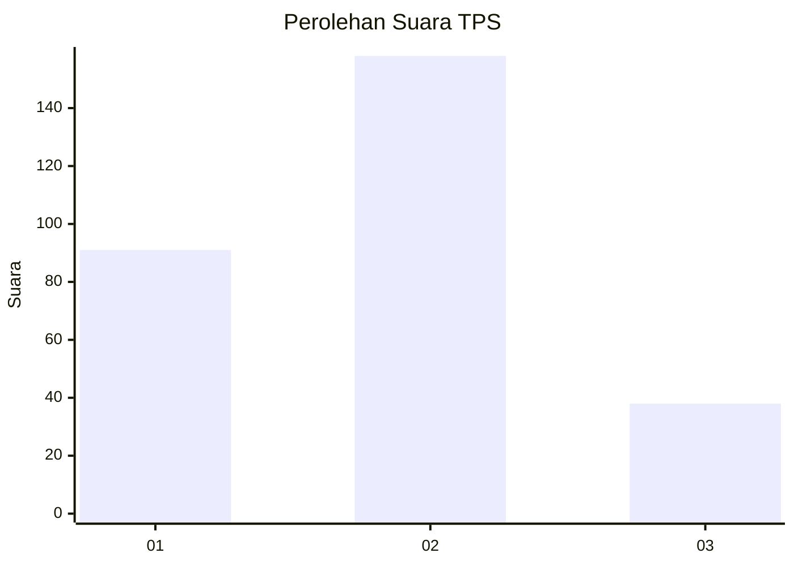
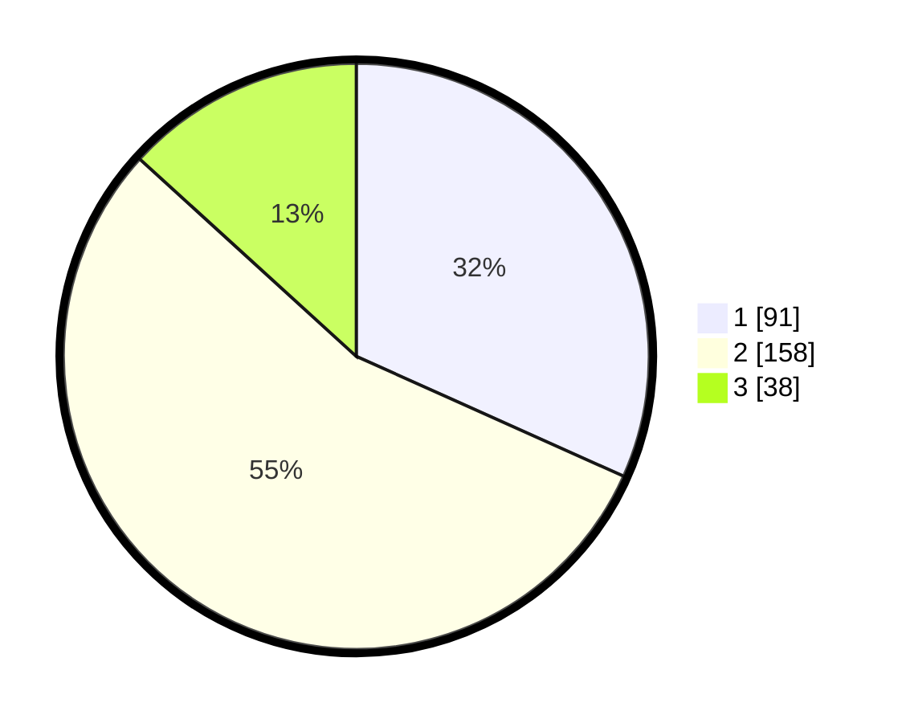

# Hasil

## Grafik

## Tabel

| No. | Nama Paslon    | Suara | Suara (raw) | Persentase |
|:--- |:-------------- | -----:| -----------:| ----------:|
| 1   | ANIES MUHAIMIN | 91    | [91][p-1]   | 31,71      |
| 2   | PRABOWO GIBRAN | 158   | [158][p-2]  | 55,05      |
| 3   | GANJAR MAHFUD  | 38    | [38][p-3]   | 13,24      |

[p-1]: https://github.com/gigit-pemilu/pemilu-2024-35-jawa-timur/blob/main/pilpres/hitung-suara/sub/35-jawa-timur/sub/27-sampang/sub/12-ketapang/sub/2002-bunten-barat/sub/007-tps/sub/paslon-1.txt
[p-2]: https://github.com/gigit-pemilu/pemilu-2024-35-jawa-timur/blob/main/pilpres/hitung-suara/sub/35-jawa-timur/sub/27-sampang/sub/12-ketapang/sub/2002-bunten-barat/sub/007-tps/sub/paslon-2.txt
[p-3]: https://github.com/gigit-pemilu/pemilu-2024-35-jawa-timur/blob/main/pilpres/hitung-suara/sub/35-jawa-timur/sub/27-sampang/sub/12-ketapang/sub/2002-bunten-barat/sub/007-tps/sub/paslon-3.txt

## Foto C Plano

https://sirekap-obj-formc.kpu.go.id/9c0e/pemilu/ppwp/35/27/12/20/02/3527122002007-20240214-223011--34b0e73b-86eb-43c3-b497-a83f81b1cd30.jpg

https://sirekap-obj-formc.kpu.go.id/9c0e/pemilu/ppwp/35/27/12/20/02/3527122002007-20240214-223137--f582ab97-b114-4ac3-8de8-105dafa23573.jpg

## Metadata

| Key        | Value               |
| ---------- | ------------------- |
| Time Stamp | 2024-02-25 12:00:00 |

