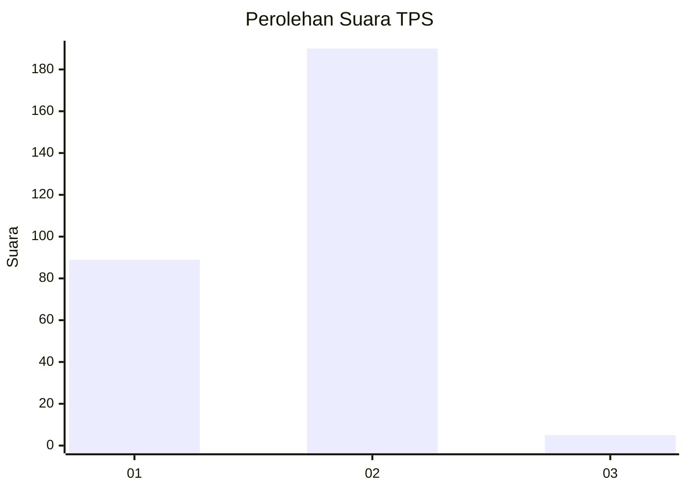
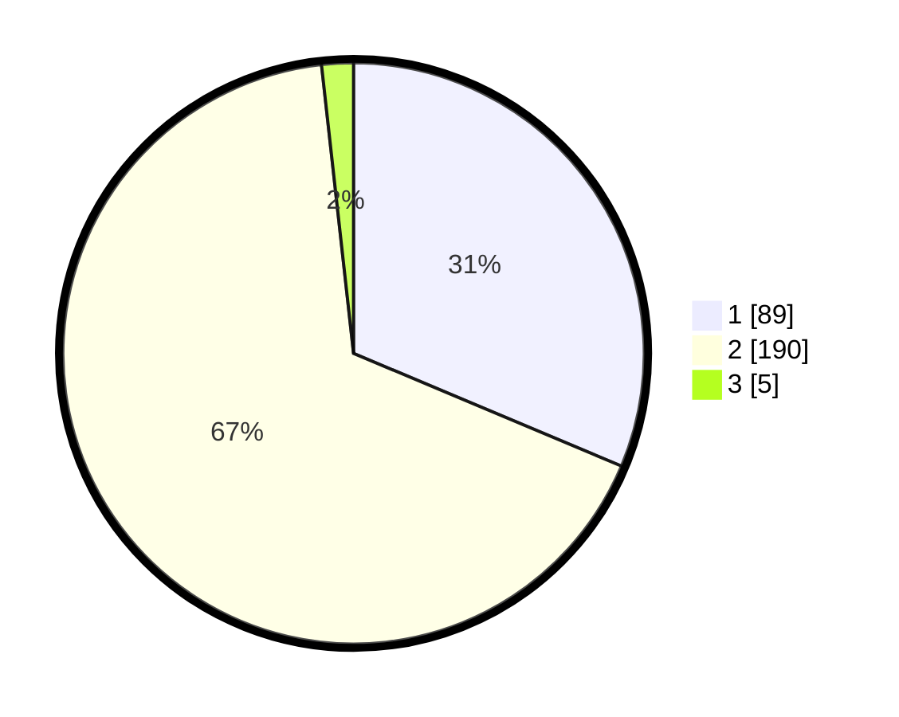

# Hasil

## Grafik

## Tabel

| No. | Nama Paslon    | Suara | Suara (raw) | Persentase |
|:--- |:-------------- | -----:| -----------:| ----------:|
| 1   | ANIES MUHAIMIN | 89    | [89][p-1]   | 31,34      |
| 2   | PRABOWO GIBRAN | 190   | [190][p-2]  | 66,90      |
| 3   | GANJAR MAHFUD  | 5     | [5][p-3]    | 1,76       |

[p-1]: https://github.com/gigit-pemilu/pemilu-2024/blob/main/pilpres/hitung-suara/sub/35-jawa-timur/sub/27-sampang/sub/12-ketapang/sub/2002-bunten-barat/sub/008-tps/sub/paslon-1.txt
[p-2]: https://github.com/gigit-pemilu/pemilu-2024/blob/main/pilpres/hitung-suara/sub/35-jawa-timur/sub/27-sampang/sub/12-ketapang/sub/2002-bunten-barat/sub/008-tps/sub/paslon-2.txt
[p-3]: https://github.com/gigit-pemilu/pemilu-2024/blob/main/pilpres/hitung-suara/sub/35-jawa-timur/sub/27-sampang/sub/12-ketapang/sub/2002-bunten-barat/sub/008-tps/sub/paslon-3.txt

## Foto C Plano

https://sirekap-obj-formc.kpu.go.id/bb26/pemilu/ppwp/35/27/12/20/02/3527122002008-20240214-222546--bdf4a978-431f-4235-a9d6-39364f5d5d66.jpg

https://sirekap-obj-formc.kpu.go.id/bb26/pemilu/ppwp/35/27/12/20/02/3527122002008-20240214-222636--99633ae7-1a75-400b-ae07-a6e2b3016765.jpg

## Metadata

| Key        | Value               |
| ---------- | ------------------- |
| Time Stamp | 2024-02-25 11:00:00 |

