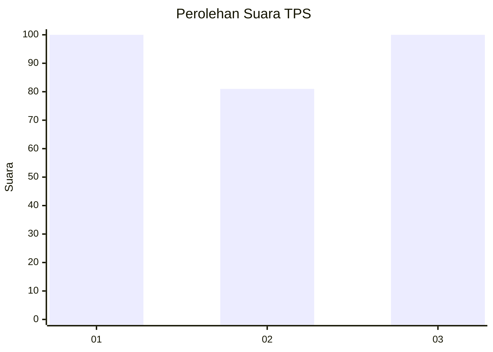
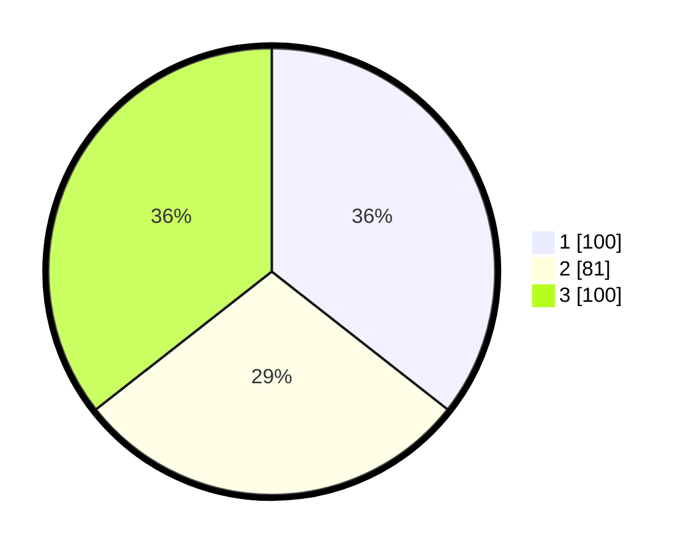

# Hasil

## Grafik

## Tabel

| No. | Nama Paslon    | Suara | Suara (raw) | Persentase |
|:--- |:-------------- | -----:| -----------:| ----------:|
| 1   | ANIES MUHAIMIN | 100   | [100][p-1]  | 35,59      |
| 2   | PRABOWO GIBRAN | 81    | [81][p-2]   | 28,83      |
| 3   | GANJAR MAHFUD  | 100   | [100][p-3]  | 35,59      |

[p-1]: https://github.com/gigit-pemilu/pemilu-2024/blob/main/pilpres/hitung-suara/sub/35-jawa-timur/sub/27-sampang/sub/12-ketapang/sub/2003-bunten-timur/sub/003-tps/sub/paslon-1.txt
[p-2]: https://github.com/gigit-pemilu/pemilu-2024/blob/main/pilpres/hitung-suara/sub/35-jawa-timur/sub/27-sampang/sub/12-ketapang/sub/2003-bunten-timur/sub/003-tps/sub/paslon-2.txt
[p-3]: https://github.com/gigit-pemilu/pemilu-2024/blob/main/pilpres/hitung-suara/sub/35-jawa-timur/sub/27-sampang/sub/12-ketapang/sub/2003-bunten-timur/sub/003-tps/sub/paslon-3.txt

## Foto C Plano

https://sirekap-obj-formc.kpu.go.id/f59b/pemilu/ppwp/35/27/12/20/03/3527122003003-20240214-184544--1e76bcdf-487b-4f22-ab2f-4ec1f6d2ae18.jpg

https://sirekap-obj-formc.kpu.go.id/f59b/pemilu/ppwp/35/27/12/20/03/3527122003003-20240214-184557--4419dd7d-4855-4824-ba66-966aa66d1a23.jpg

https://sirekap-obj-formc.kpu.go.id/f59b/pemilu/ppwp/35/27/12/20/03/3527122003003-20240214-184600--83300072-32bf-46a1-8028-ff4546d019f5.jpg

## Metadata

| Key        | Value               |
| ---------- | ------------------- |
| Time Stamp | 2024-02-17 09:00:02 |

