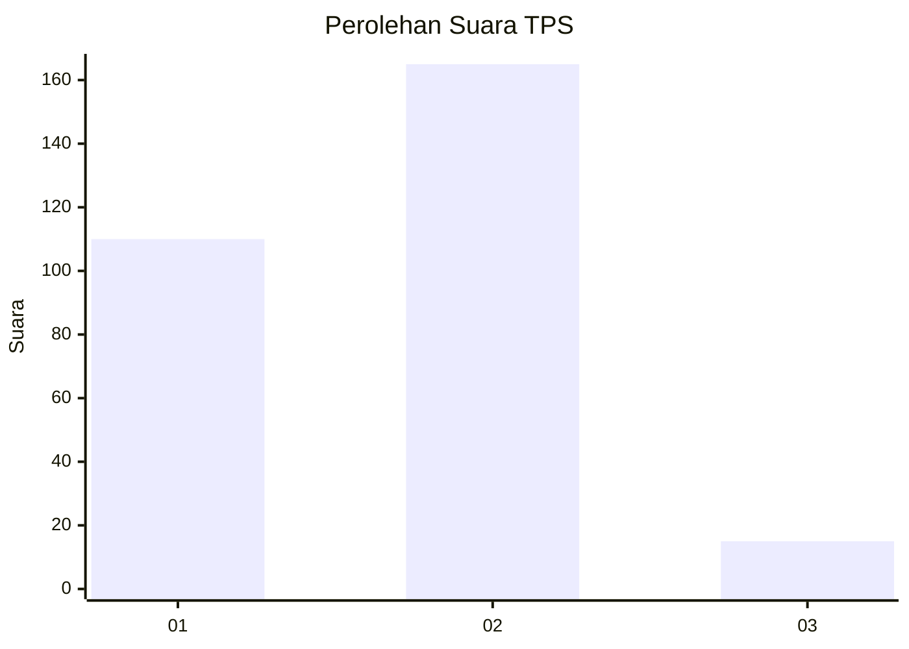
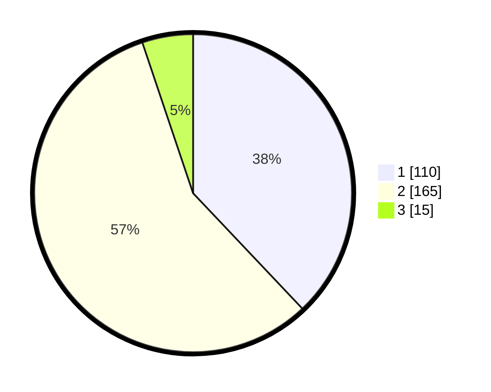

# Hasil

## Grafik

## Tabel

| No. | Nama Paslon    | Suara | Suara (raw) | Persentase |
|:--- |:-------------- | -----:| -----------:| ----------:|
| 1   | ANIES MUHAIMIN | 110   | [110][p-1]  | 37,93      |
| 2   | PRABOWO GIBRAN | 165   | [165][p-2]  | 56,90      |
| 3   | GANJAR MAHFUD  | 15    | [15][p-3]   | 5,17       |

[p-1]: https://github.com/gigit-pemilu/pemilu-2024-35-jawa-timur/blob/main/pilpres/hitung-suara/sub/35-jawa-timur/sub/27-sampang/sub/12-ketapang/sub/2003-bunten-timur/sub/006-tps/sub/paslon-1.txt
[p-2]: https://github.com/gigit-pemilu/pemilu-2024-35-jawa-timur/blob/main/pilpres/hitung-suara/sub/35-jawa-timur/sub/27-sampang/sub/12-ketapang/sub/2003-bunten-timur/sub/006-tps/sub/paslon-2.txt
[p-3]: https://github.com/gigit-pemilu/pemilu-2024-35-jawa-timur/blob/main/pilpres/hitung-suara/sub/35-jawa-timur/sub/27-sampang/sub/12-ketapang/sub/2003-bunten-timur/sub/006-tps/sub/paslon-3.txt

## Foto C Plano

https://sirekap-obj-formc.kpu.go.id/09e0/pemilu/ppwp/35/27/12/20/03/3527122003006-20240215-070926--19d95a30-0a22-4d63-a2bd-04d37c1b93c9.jpg

https://sirekap-obj-formc.kpu.go.id/09e0/pemilu/ppwp/35/27/12/20/03/3527122003006-20240214-193702--0f916a31-3f4d-48d8-b43c-d170a8f3f821.jpg

https://sirekap-obj-formc.kpu.go.id/09e0/pemilu/ppwp/35/27/12/20/03/3527122003006-20240215-071159--8cc23867-0772-4e07-883b-561da28fa440.jpg

## Metadata

| Key        | Value               |
| ---------- | ------------------- |
| Time Stamp | 2024-02-15 20:30:46 |

## DATA PEMILIH TETAP

Jumlah pemilih dalam DPT: **299**.
 * L: **147**.
 * P: **152**.

## DATA PENGGUNA HAK PILIH

Jumlah pengguna hak pilih dalam DPT: **294**.
 * L: **545**.
 * P: **149**.

Jumlah pengguna hak pilih dalam DPTb: **0**.
 * L: **200**.
 * P: **0**.

Jumlah pengguna hak pilih dalam DPK: **0**.
 * L: **200**.
 * P: **0**.

Jumlah pengguna hak pilih: **294**.
 * L: **145**.
 * P: **149**.

## JUMLAH SUARA SAH DAN TIDAK SAH

JUMLAH SELURUH SUARA SAH: **290**.

JUMLAH SUARA TIDAK SAH: **4**.

JUMLAH SELURUH SUARA SAH DAN SUARA TIDAK SAH: **294**.

