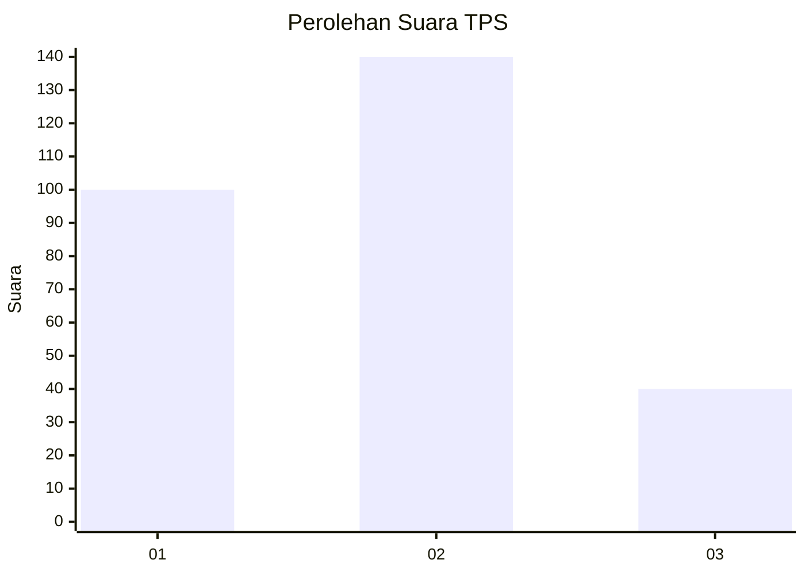
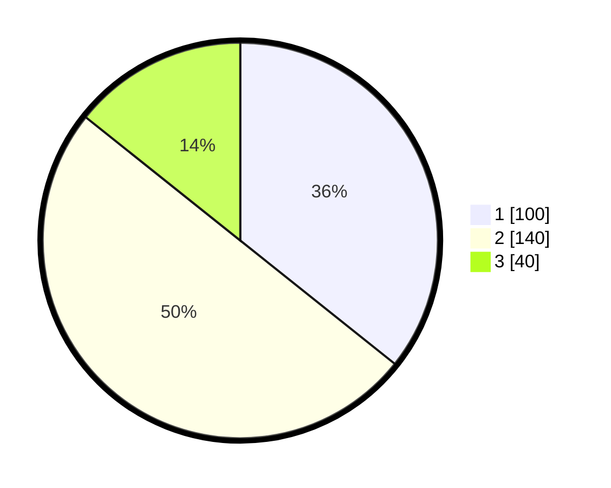

# Hasil

## Grafik

## Tabel

| No. | Nama Paslon    | Suara | Suara (raw) | Persentase |
|:--- |:-------------- | -----:| -----------:| ----------:|
| 1   | ANIES MUHAIMIN | 100   | [100][p-1]  | 35,71      |
| 2   | PRABOWO GIBRAN | 140   | [140][p-2]  | 50,00      |
| 3   | GANJAR MAHFUD  | 40    | [40][p-3]   | 14,29      |

[p-1]: https://github.com/gigit-pemilu/pemilu-2024/blob/main/pilpres/hitung-suara/sub/35-jawa-timur/sub/27-sampang/sub/12-ketapang/sub/2003-bunten-timur/sub/008-tps/sub/paslon-1.txt
[p-2]: https://github.com/gigit-pemilu/pemilu-2024/blob/main/pilpres/hitung-suara/sub/35-jawa-timur/sub/27-sampang/sub/12-ketapang/sub/2003-bunten-timur/sub/008-tps/sub/paslon-2.txt
[p-3]: https://github.com/gigit-pemilu/pemilu-2024/blob/main/pilpres/hitung-suara/sub/35-jawa-timur/sub/27-sampang/sub/12-ketapang/sub/2003-bunten-timur/sub/008-tps/sub/paslon-3.txt

## Foto C Plano

https://sirekap-obj-formc.kpu.go.id/cc75/pemilu/ppwp/35/27/12/20/03/3527122003008-20240214-220739--01036f84-2467-4f61-a81b-2c03edbd0d2e.jpg

https://sirekap-obj-formc.kpu.go.id/cc75/pemilu/ppwp/35/27/12/20/03/3527122003008-20240214-220940--7f930ea1-8bfb-4719-9682-8e5f904f40b6.jpg

https://sirekap-obj-formc.kpu.go.id/cc75/pemilu/ppwp/35/27/12/20/03/3527122003008-20240214-221218--0572abd2-251c-410e-9b74-e4f38c1bc7e7.jpg

## Metadata

| Key        | Value               |
| ---------- | ------------------- |
| Time Stamp | 2024-02-17 09:00:02 |

