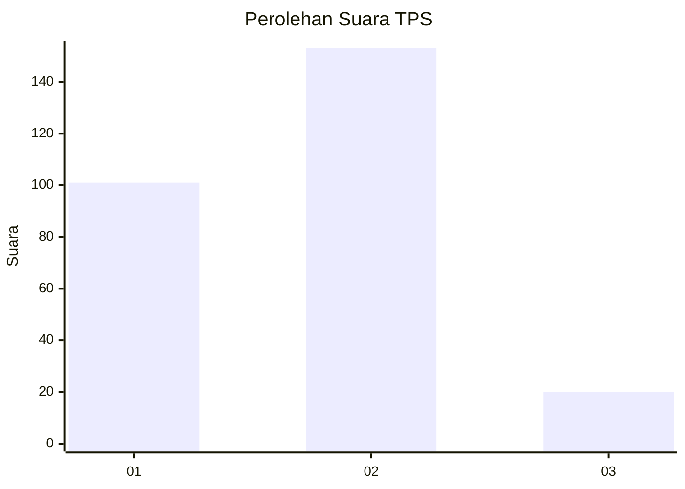

# Hasil

## Grafik

## Tabel

| No. | Nama Paslon    | Suara | Suara (raw) | Persentase |
|:--- |:-------------- | -----:| -----------:| ----------:|
| 1   | ANIES MUHAIMIN | 101   | [101][p-1]  | 36,86      |
| 2   | PRABOWO GIBRAN | 153   | [153][p-2]  | 55,84      |
| 3   | GANJAR MAHFUD  | 20    | [20][p-3]   | 7,30       |

[p-1]: https://github.com/gigit-pemilu/pemilu-2024/blob/main/pilpres/hitung-suara/sub/35-jawa-timur/sub/27-sampang/sub/12-ketapang/sub/2003-bunten-timur/sub/009-tps/sub/paslon-1.txt
[p-2]: https://github.com/gigit-pemilu/pemilu-2024/blob/main/pilpres/hitung-suara/sub/35-jawa-timur/sub/27-sampang/sub/12-ketapang/sub/2003-bunten-timur/sub/009-tps/sub/paslon-2.txt
[p-3]: https://github.com/gigit-pemilu/pemilu-2024/blob/main/pilpres/hitung-suara/sub/35-jawa-timur/sub/27-sampang/sub/12-ketapang/sub/2003-bunten-timur/sub/009-tps/sub/paslon-3.txt

## Foto C Plano

https://sirekap-obj-formc.kpu.go.id/ceee/pemilu/ppwp/35/27/12/20/03/3527122003009-20240215-054507--d60f766f-f0d8-4f74-a148-153ffb6b8f93.jpg

https://sirekap-obj-formc.kpu.go.id/ceee/pemilu/ppwp/35/27/12/20/03/3527122003009-20240215-054644--793b96d3-acba-4a21-a323-ac2c2a0cdd3c.jpg

https://sirekap-obj-formc.kpu.go.id/ceee/pemilu/ppwp/35/27/12/20/03/3527122003009-20240215-054800--90bb0861-7b64-4a6d-8bf9-56d4806527cc.jpg

## Metadata

| Key        | Value               |
| ---------- | ------------------- |
| Time Stamp | 2024-02-21 19:00:00 |

## DATA PEMILIH TETAP

Jumlah pemilih dalam DPT: **278**.
 * L: **132**.
 * P: **646**.

## DATA PENGGUNA HAK PILIH

Jumlah pengguna hak pilih dalam DPT: **774**.
 * L: **130**.
 * P: **544**.

Jumlah pengguna hak pilih dalam DPTb: **0**.
 * L: **700**.
 * P: **0**.

Jumlah pengguna hak pilih dalam DPK: **0**.
 * L: **0**.
 * P: **0**.

Jumlah pengguna hak pilih: **245**.
 * L: **150**.
 * P: **244**.

## JUMLAH SUARA SAH DAN TIDAK SAH

JUMLAH SELURUH SUARA SAH: **274**.

JUMLAH SUARA TIDAK SAH: **0**.

JUMLAH SELURUH SUARA SAH DAN SUARA TIDAK SAH: **274**.

