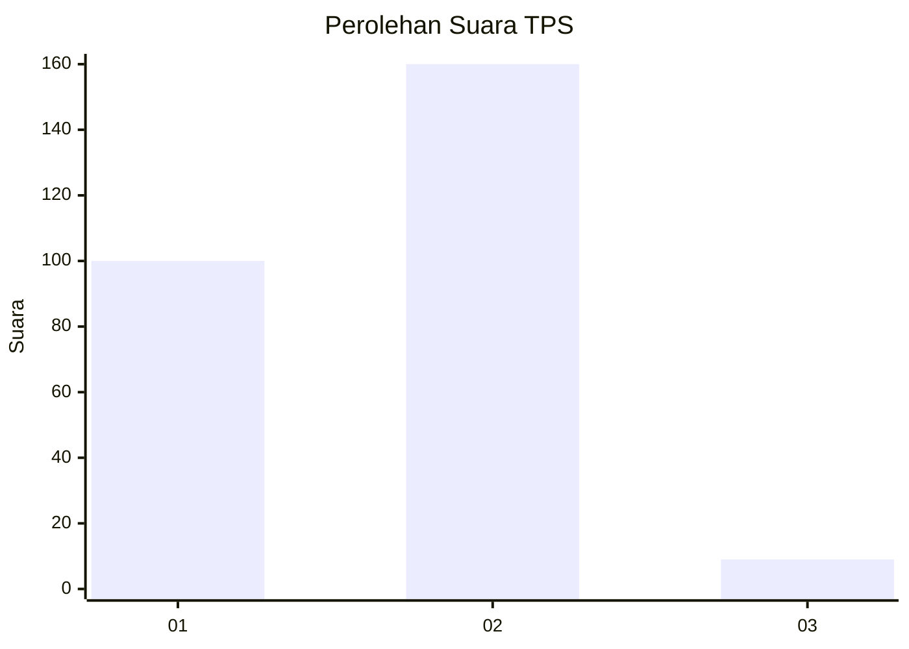
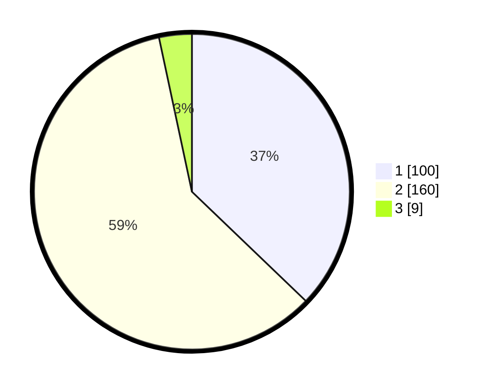

# Hasil

## Grafik

## Tabel

| No. | Nama Paslon    | Suara | Suara (raw) | Persentase |
|:--- |:-------------- | -----:| -----------:| ----------:|
| 1   | ANIES MUHAIMIN | 100   | [100][p-1]  | 37,17      |
| 2   | PRABOWO GIBRAN | 160   | [160][p-2]  | 59,48      |
| 3   | GANJAR MAHFUD  | 9     | [9][p-3]    | 3,35       |

[p-1]: https://github.com/gigit-pemilu/pemilu-2024/blob/main/pilpres/hitung-suara/sub/35-jawa-timur/sub/27-sampang/sub/12-ketapang/sub/2003-bunten-timur/sub/010-tps/sub/paslon-1.txt
[p-2]: https://github.com/gigit-pemilu/pemilu-2024/blob/main/pilpres/hitung-suara/sub/35-jawa-timur/sub/27-sampang/sub/12-ketapang/sub/2003-bunten-timur/sub/010-tps/sub/paslon-2.txt
[p-3]: https://github.com/gigit-pemilu/pemilu-2024/blob/main/pilpres/hitung-suara/sub/35-jawa-timur/sub/27-sampang/sub/12-ketapang/sub/2003-bunten-timur/sub/010-tps/sub/paslon-3.txt

## Foto C Plano

https://sirekap-obj-formc.kpu.go.id/f15e/pemilu/ppwp/35/27/12/20/03/3527122003010-20240214-235928--980615ce-c1ae-4a4f-9cc7-d9715a239fda.jpg

https://sirekap-obj-formc.kpu.go.id/f15e/pemilu/ppwp/35/27/12/20/03/3527122003010-20240215-000041--b27a43f6-4301-40b5-afbd-e60b56742283.jpg

https://sirekap-obj-formc.kpu.go.id/f15e/pemilu/ppwp/35/27/12/20/03/3527122003010-20240215-000039--f476ee55-2789-47e4-8d3e-26929172767a.jpg

## Metadata

| Key        | Value               |
| ---------- | ------------------- |
| Time Stamp | 2024-02-17 09:30:03 |

