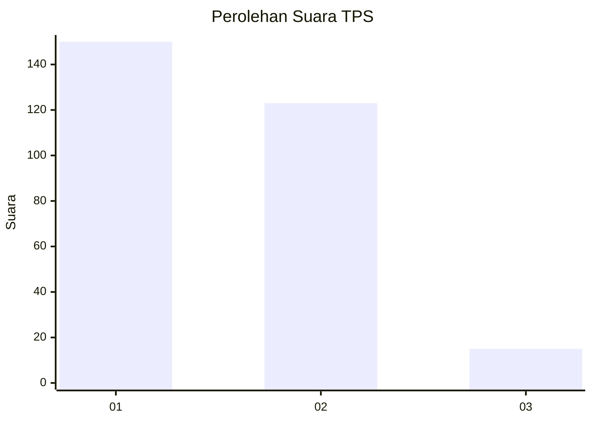
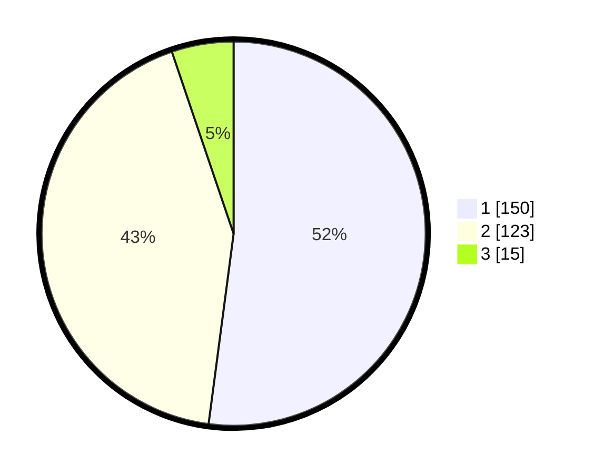

# Hasil

## Grafik

## Tabel

| No. | Nama Paslon    | Suara | Suara (raw) | Persentase |
|:--- |:-------------- | -----:| -----------:| ----------:|
| 1   | ANIES MUHAIMIN | 150   | [150][p-1]  | 52,08      |
| 2   | PRABOWO GIBRAN | 123   | [123][p-2]  | 42,71      |
| 3   | GANJAR MAHFUD  | 15    | [15][p-3]   | 5,21       |

[p-1]: https://github.com/gigit-pemilu/pemilu-2024/blob/main/pilpres/hitung-suara/sub/35-jawa-timur/sub/27-sampang/sub/12-ketapang/sub/2003-bunten-timur/sub/011-tps/sub/paslon-1.txt
[p-2]: https://github.com/gigit-pemilu/pemilu-2024/blob/main/pilpres/hitung-suara/sub/35-jawa-timur/sub/27-sampang/sub/12-ketapang/sub/2003-bunten-timur/sub/011-tps/sub/paslon-2.txt
[p-3]: https://github.com/gigit-pemilu/pemilu-2024/blob/main/pilpres/hitung-suara/sub/35-jawa-timur/sub/27-sampang/sub/12-ketapang/sub/2003-bunten-timur/sub/011-tps/sub/paslon-3.txt

## Foto C Plano

https://sirekap-obj-formc.kpu.go.id/d98e/pemilu/ppwp/35/27/12/20/03/3527122003011-20240214-233045--e3c700d0-52ea-4084-913c-e9411a8106eb.jpg

https://sirekap-obj-formc.kpu.go.id/d98e/pemilu/ppwp/35/27/12/20/03/3527122003011-20240214-233536--ddff5db8-c257-4765-80f4-d574014f90db.jpg

https://sirekap-obj-formc.kpu.go.id/d98e/pemilu/ppwp/35/27/12/20/03/3527122003011-20240214-233943--08b26596-ae1c-4bef-81d0-d515a17b42ac.jpg

## Metadata

| Key        | Value               |
| ---------- | ------------------- |
| Time Stamp | 2024-02-17 09:00:02 |

