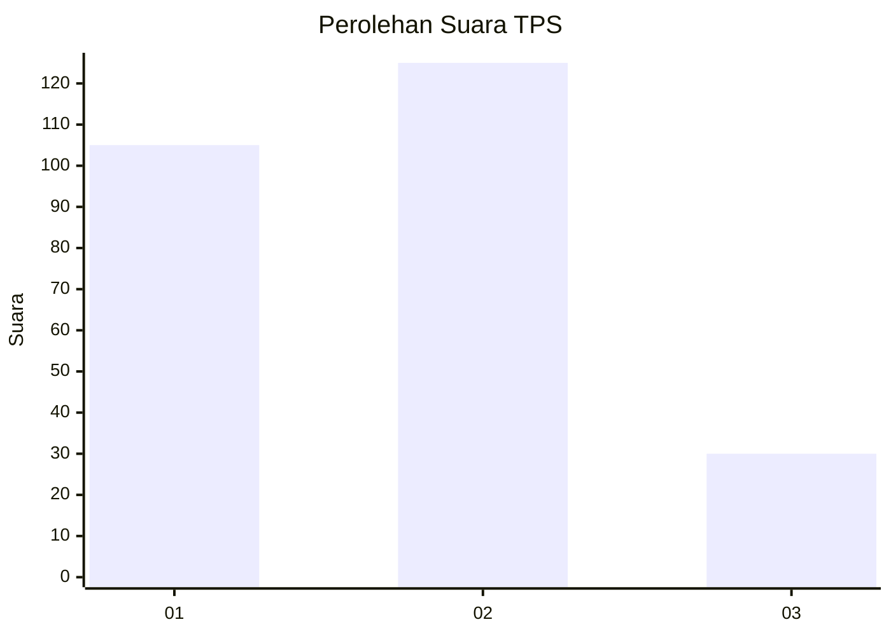
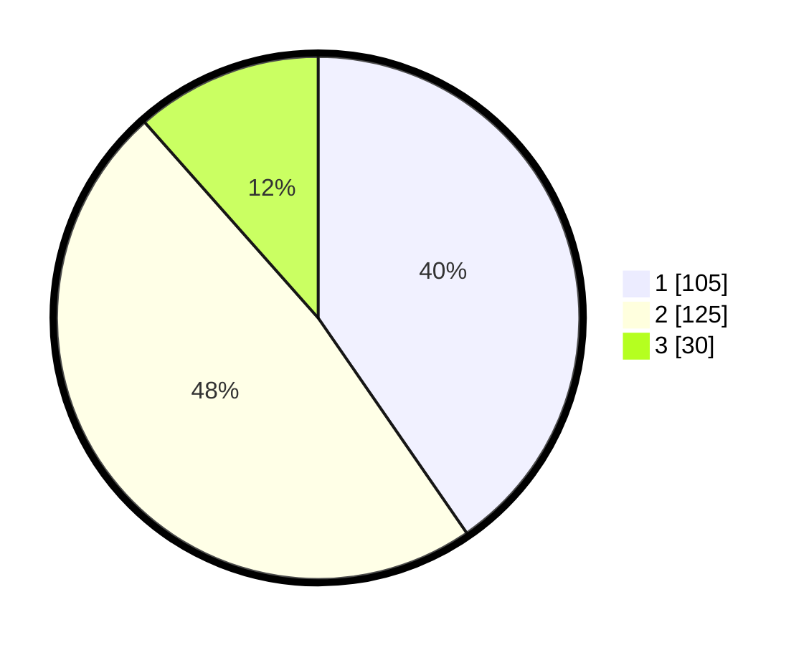

# Hasil

## Grafik

## Tabel

| No. | Nama Paslon    | Suara | Suara (raw) | Persentase |
|:--- |:-------------- | -----:| -----------:| ----------:|
| 1   | ANIES MUHAIMIN | 105   | [105][p-1]  | 40,38      |
| 2   | PRABOWO GIBRAN | 125   | [125][p-2]  | 48,08      |
| 3   | GANJAR MAHFUD  | 30    | [30][p-3]   | 11,54      |

[p-1]: https://github.com/gigit-pemilu/pemilu-2024/blob/main/pilpres/hitung-suara/sub/35-jawa-timur/sub/27-sampang/sub/12-ketapang/sub/2003-bunten-timur/sub/012-tps/sub/paslon-1.txt
[p-2]: https://github.com/gigit-pemilu/pemilu-2024/blob/main/pilpres/hitung-suara/sub/35-jawa-timur/sub/27-sampang/sub/12-ketapang/sub/2003-bunten-timur/sub/012-tps/sub/paslon-2.txt
[p-3]: https://github.com/gigit-pemilu/pemilu-2024/blob/main/pilpres/hitung-suara/sub/35-jawa-timur/sub/27-sampang/sub/12-ketapang/sub/2003-bunten-timur/sub/012-tps/sub/paslon-3.txt

## Foto C Plano

https://sirekap-obj-formc.kpu.go.id/3d9c/pemilu/ppwp/35/27/12/20/03/3527122003012-20240214-214439--d5ca46a4-f248-46e6-8811-6a2c23e53d64.jpg

https://sirekap-obj-formc.kpu.go.id/3d9c/pemilu/ppwp/35/27/12/20/03/3527122003012-20240214-212844--baab50a4-6675-4869-9334-50bbe86dc4f1.jpg

https://sirekap-obj-formc.kpu.go.id/3d9c/pemilu/ppwp/35/27/12/20/03/3527122003012-20240214-212851--107b8edc-8b52-4779-9222-cc68c74756e1.jpg

## Metadata

| Key        | Value               |
| ---------- | ------------------- |
| Time Stamp | 2024-02-16 12:51:22 |

