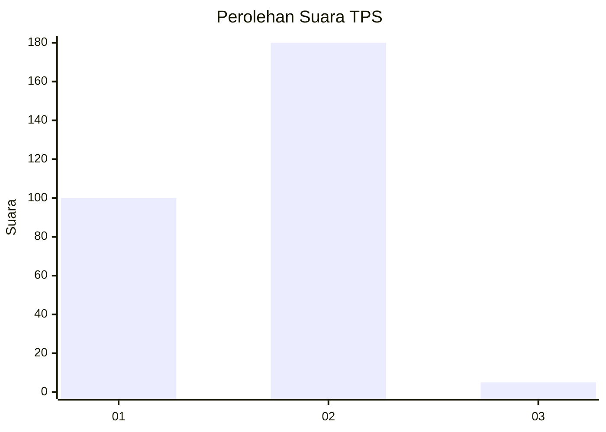
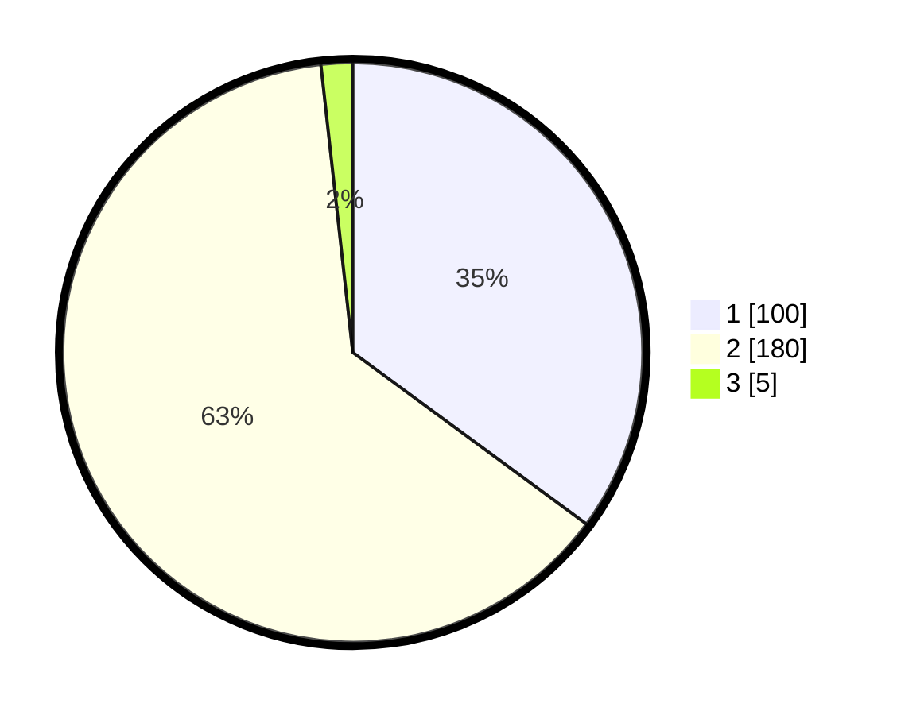

# Hasil

## Grafik

## Tabel

| No. | Nama Paslon    | Suara | Suara (raw) | Persentase |
|:--- |:-------------- | -----:| -----------:| ----------:|
| 1   | ANIES MUHAIMIN | 100   | [100][p-1]  | 35,09      |
| 2   | PRABOWO GIBRAN | 180   | [180][p-2]  | 63,16      |
| 3   | GANJAR MAHFUD  | 5     | [5][p-3]    | 1,75       |

[p-1]: https://github.com/gigit-pemilu/pemilu-2024/blob/main/pilpres/hitung-suara/sub/35-jawa-timur/sub/27-sampang/sub/12-ketapang/sub/2003-bunten-timur/sub/014-tps/sub/paslon-1.txt
[p-2]: https://github.com/gigit-pemilu/pemilu-2024/blob/main/pilpres/hitung-suara/sub/35-jawa-timur/sub/27-sampang/sub/12-ketapang/sub/2003-bunten-timur/sub/014-tps/sub/paslon-2.txt
[p-3]: https://github.com/gigit-pemilu/pemilu-2024/blob/main/pilpres/hitung-suara/sub/35-jawa-timur/sub/27-sampang/sub/12-ketapang/sub/2003-bunten-timur/sub/014-tps/sub/paslon-3.txt

## Foto C Plano

https://sirekap-obj-formc.kpu.go.id/0275/pemilu/ppwp/35/27/12/20/03/3527122003014-20240214-220839--9246378b-5edb-4215-a4c5-99e6dcc6d837.jpg

https://sirekap-obj-formc.kpu.go.id/0275/pemilu/ppwp/35/27/12/20/03/3527122003014-20240214-221002--f82972fd-20fe-4a2d-9481-92e92634fb98.jpg

https://sirekap-obj-formc.kpu.go.id/0275/pemilu/ppwp/35/27/12/20/03/3527122003014-20240214-221126--73e665a0-80ce-4769-9a89-557966d87739.jpg

## Metadata

| Key        | Value               |
| ---------- | ------------------- |
| Time Stamp | 2024-02-24 22:31:28 |

