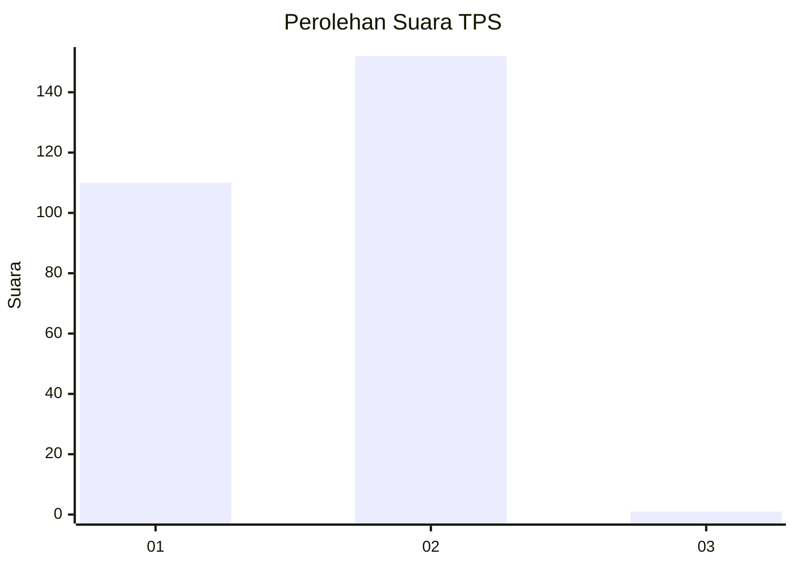
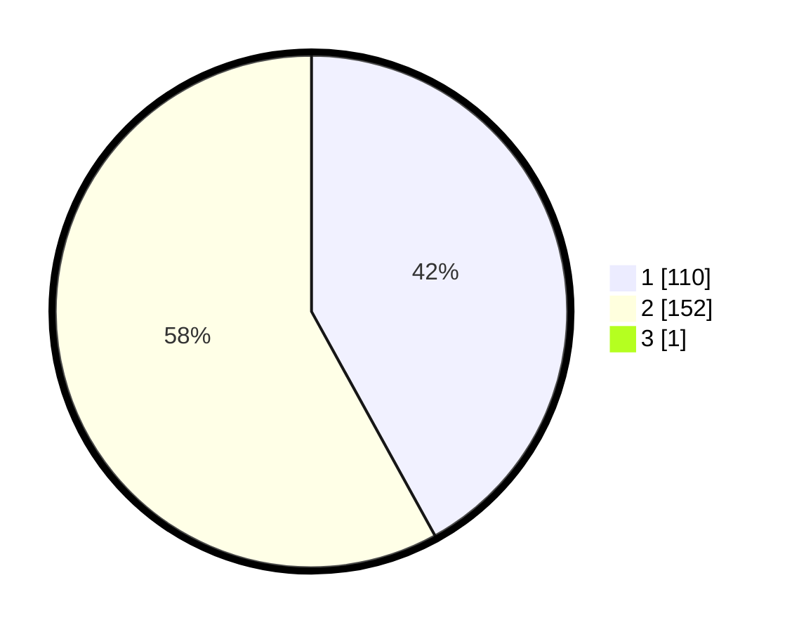

# Hasil

## Grafik

## Tabel

| No. | Nama Paslon    | Suara | Suara (raw) | Persentase |
|:--- |:-------------- | -----:| -----------:| ----------:|
| 1   | ANIES MUHAIMIN | 110   | [110][p-1]  | 41,83      |
| 2   | PRABOWO GIBRAN | 152   | [152][p-2]  | 57,79      |
| 3   | GANJAR MAHFUD  | 1     | [1][p-3]    | 0,38       |

[p-1]: https://github.com/gigit-pemilu/pemilu-2024-35-jawa-timur/blob/main/pilpres/hitung-suara/sub/35-jawa-timur/sub/27-sampang/sub/12-ketapang/sub/2004-pancor/sub/003-tps/sub/paslon-1.txt
[p-2]: https://github.com/gigit-pemilu/pemilu-2024-35-jawa-timur/blob/main/pilpres/hitung-suara/sub/35-jawa-timur/sub/27-sampang/sub/12-ketapang/sub/2004-pancor/sub/003-tps/sub/paslon-2.txt
[p-3]: https://github.com/gigit-pemilu/pemilu-2024-35-jawa-timur/blob/main/pilpres/hitung-suara/sub/35-jawa-timur/sub/27-sampang/sub/12-ketapang/sub/2004-pancor/sub/003-tps/sub/paslon-3.txt

## Foto C Plano

https://sirekap-obj-formc.kpu.go.id/762a/pemilu/ppwp/35/27/12/20/04/3527122004003-20240214-203242--14098d19-1923-41b3-8470-dbb02485f56d.jpg

https://sirekap-obj-formc.kpu.go.id/762a/pemilu/ppwp/35/27/12/20/04/3527122004003-20240214-234903--09396efb-3f76-490a-bd48-f079d01f82f9.jpg

https://sirekap-obj-formc.kpu.go.id/762a/pemilu/ppwp/35/27/12/20/04/3527122004003-20240214-234926--5cb2bcb8-65d5-44fd-b1bd-d2b79dbf846a.jpg

## Metadata

| Key        | Value               |
| ---------- | ------------------- |
| Time Stamp | 2024-02-17 09:30:03 |

