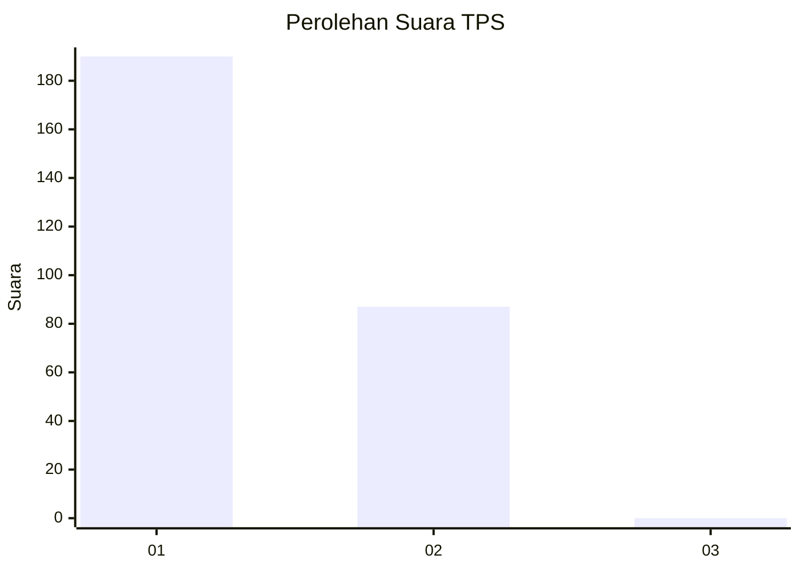
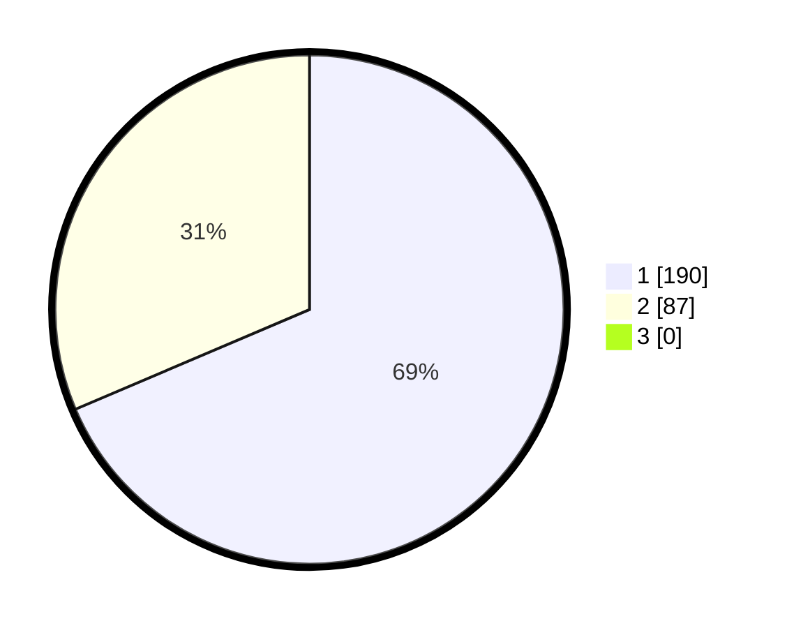

# Hasil

## Grafik

## Tabel

| No. | Nama Paslon    | Suara | Suara (raw) | Persentase |
|:--- |:-------------- | -----:| -----------:| ----------:|
| 1   | ANIES MUHAIMIN | 190   | [190][p-1]  | 68,59      |
| 2   | PRABOWO GIBRAN | 87    | [87][p-2]   | 31,41      |
| 3   | GANJAR MAHFUD  | 0     | [0][p-3]    | 0,00       |

[p-1]: https://github.com/gigit-pemilu/pemilu-2024-35-jawa-timur/blob/main/pilpres/hitung-suara/sub/35-jawa-timur/sub/27-sampang/sub/12-ketapang/sub/2006-pangereman/sub/003-tps/sub/paslon-1.txt
[p-2]: https://github.com/gigit-pemilu/pemilu-2024-35-jawa-timur/blob/main/pilpres/hitung-suara/sub/35-jawa-timur/sub/27-sampang/sub/12-ketapang/sub/2006-pangereman/sub/003-tps/sub/paslon-2.txt
[p-3]: https://github.com/gigit-pemilu/pemilu-2024-35-jawa-timur/blob/main/pilpres/hitung-suara/sub/35-jawa-timur/sub/27-sampang/sub/12-ketapang/sub/2006-pangereman/sub/003-tps/sub/paslon-3.txt

## Foto C Plano

https://sirekap-obj-formc.kpu.go.id/c271/pemilu/ppwp/35/27/12/20/06/3527122006003-20240215-081203--0c712762-6401-4712-b727-22202132fbad.jpg

https://sirekap-obj-formc.kpu.go.id/c271/pemilu/ppwp/35/27/12/20/06/3527122006003-20240215-081346--2c1d8683-0f98-4e12-8928-c6cc426eb013.jpg

https://sirekap-obj-formc.kpu.go.id/c271/pemilu/ppwp/35/27/12/20/06/3527122006003-20240215-083029--309c6e66-7b7a-403f-843e-0e1cb9faa448.jpg

## Metadata

| Key        | Value               |
| ---------- | ------------------- |
| Time Stamp | 2024-02-17 09:30:03 |

